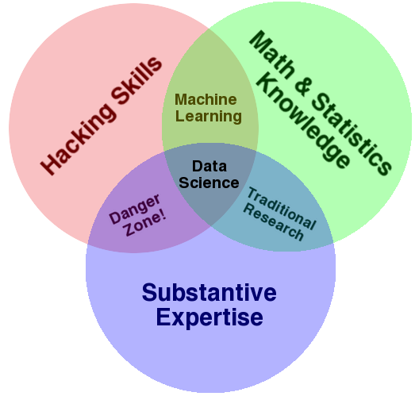
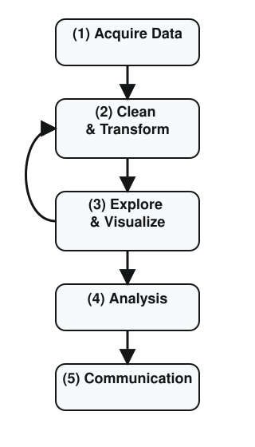

## Introduction

Welcome to *Data Science for Economic Analysis*.

::: fragment
*Who am I?*

- [Adam Altmejd Selder](https://adamaltmejd.se) --- [adam.altmejd@su.se](mailto:adam.altmejd@su.se)
- I study inequality, education, and health at IFAU
- But in practice I spend a large share of my time matching, merging, cleaning, checking, and visualizing data
:::

::: fragment
*Who are you?*

Let's use Menti to collect a little course data.
:::

## Introduction

:::: {.columns}
::: {.column width="40%"}
{fig-align="center" width=300}
:::
::: {.column width="60%"}
- This course adds practical data-work skills to your economist toolkit
- The focus is workflow, not just syntax
- I will focus on data collection, cleaning, checking, transformation, and communication
- The point is to make you more independent, more productive, and slightly less dependent on spreadsheet surgery
:::
::::
::: {.aside}
HT: Drew Conway
:::
::: notes
The course is not econometrics in disguise. The value added is everything that happens before and around formal analysis: collecting data, cleaning it, checking it, documenting it, and turning it into something that can actually be analyzed and shared.
:::

## The empirical research process

:::: {.columns}
::: {.column width="30%"}
{fig-align="center" width="100%"}
:::
::: {.column width="70%" .fragment}
- Most economics training focuses on step 4, and sometimes step 5.
- This course focuses on getting steps 1 to 3 right enough that step 4 is not built on garbage.
- The loop matters: exploration often sends you back to cleaning, checking, and rethinking the data.
:::
::::

::: notes
The diagram emphasizes that empirical work is a workflow rather than a straight line. Exploration often reveals data problems, missing documentation, or weak identifiers, which sends the process back to earlier cleaning and checking steps.
:::

## Why should you learn data science?

- Economists now work with more data, from more sources, than even a few years ago
- Sweden is unusually data-rich: registers, administrative data, municipality data, and public APIs
- That is a real comparative advantage, but only if you can actually get the data, clean it, join it, and check it
- Good econometrics on bad or badly handled data is still bad research

::: notes
The bottleneck is often not the statistical model but the ability to obtain, organize, and validate the underlying data. In a data-rich setting like Sweden, that practical bottleneck matters even more.
:::

## Why this course?

- A strong economics degree already gives you substantive knowledge and econometrics
- What it often does **not** give you is a practical workflow for turning raw data into something usable
- These skills complement econometrics rather than replacing it
- They matter in research, policy work, and private-sector data jobs
- I use these tools all the time; I have not estimated a DSGE model since 2013

::: notes
Economics training already spends substantial time on theory and identification. This course fills the gap between that training and the day-to-day work of building usable datasets and reproducible workflows.
:::

## Why code at all?

- Menus and spreadsheets can get you surprisingly far
- But code is reusable, reproducible, reviewable, and easier to debug
- If you need to do the same thing twice, you probably want code
- A script is also a record of what you actually did
- Sometimes Excel or Stata is still the right tool; the point is to pick the simplest tool that does the job well

::: notes
Code is useful because it doubles as both a tool and a record. A script can be rerun, inspected, reviewed, and modified in a way that manual clicking usually cannot.
:::

## Why `R` for this course?

- I will assess work in `R`
- `R` is strong for data acquisition, wrangling, and visualization
- It is much better suited than `Stata` for the kind of programming workflow this course teaches
- The skills transfer well to other languages, especially `Python`

::: notes
`R` is the course language because it handles the full workflow well: reading data, reshaping it, visualizing it, and connecting to external packages and APIs. The underlying workflow habits also transfer well to other programming languages.
:::

## And what about `Stata`?

- `Stata` is still useful for a lot of econometric analysis
- This is not a religious war
- But `Stata` is not the right core language for learning modern data-work habits, packages, and APIs
- I want you to learn the right tool for the job, not swear loyalty to one tool forever

::: {.aside}
For a concrete speed comparison, see <https://github.com/matthieugomez/benchmark-stata-r>.
:::

::: notes
This is not an argument that `Stata` is useless. It is an argument that `Stata` is a weaker environment for learning modern programming habits, package ecosystems, and more general data workflows.
:::

# Reproducibility and Work Habits

## Common data problems

- Invalid or inconsistent values
- Missing values coded in strange ways
- Messy or ambiguous names
- Duplicates
- Mixed date formats
- Missing or non-unique keys
- Encoding problems 😮‍💨

::: {.attribution}
<https://vdsbook.com/04-data_cleaning#sec-examine-clean>
:::

::: notes
These problems are ordinary rather than exceptional. Real datasets often contain inconsistent coding, broken identifiers, odd missing-value conventions, and small structural surprises that only become visible once the data are inspected carefully.
:::

## Programming habits that pay off

- Write code you can rerun from scratch
- Do not repeat yourself when one function or one script will do
- Name things so another human can read them
- Keep a sensible project structure and a short `README`
- Check your data early and often

::: notes
Good habits are mainly about reducing avoidable mistakes. Small decisions about naming, structure, and repeatability make debugging much cheaper later.
:::

## Readable beats clever

- Future-you is also a collaborator, and future-you is usually annoyed
- Prefer `unemployment_rate` to `u_rate2`
- Same for values: `sex = woman/man` is clearer than `Kon = 1/2`, even if that is how `SCB` codes it
- Prefer one clear transformation at a time
- A little verbosity is cheaper than silent confusion

::: notes
Readable code is part of reproducibility. Clear names and explicit steps make it easier to review logic, locate mistakes, and return to a project after time has passed.
:::

## Check, do not just trust

- Print summaries
- Check keys and duplicates
- Look for missingness and weird categories
- Make quick plots before you estimate anything
- Most bad results look "reasonable" until you inspect the data properly

::: notes
Many damaging errors produce outputs that look plausible on first inspection. That is why simple checks such as counts, summaries, duplicate tests, and quick plots are a normal part of analysis rather than an optional extra.
:::

## Frustration is normal

- Coding is hard even for experienced people
- Getting stuck is not a sign that you are bad at this
- The right response is usually to slow down, inspect the objects, and change one thing at a time
- I will spend a lot of time on debugging and workflow discipline in this course

::: notes
Debugging is a central part of programming rather than a side issue. Productive workflow usually means isolating one assumption at a time and checking it directly instead of making several random changes at once.
:::

# Our Working Environment = VS Code

## VS Code for this course

- A text editor with useful extras:
  - file navigation
  - terminal integration
  - Git integration
  - extensions for `R`
  - AI support tools
- I use it because it is flexible and works well with the workflow I want to teach

::: {.aside}
Good alternatives exist: [RStudio](https://posit.co/download/rstudio-desktop/), [Positron](https://positron.posit.co/), [Cursor](https://www.cursor.com/), and [Zed](https://zed.dev). For this course I am standardizing on `VS Code`.
:::

::: notes
Standardizing on one editor reduces setup friction and makes troubleshooting easier. The point is not that VS Code is uniquely superior, but that a shared environment makes the course workflow easier to teach and support.
:::

## AI assistants in VS Code

- GitHub Copilot is available for free for many students through GitHub Education
- Useful for:
  - explaining errors
  - suggesting code
  - helping you search documentation faster
- Treat it like a fast assistant, not an autopilot
- If you cannot explain what the tool produced, you should not submit it

## VS Code and `R`

- To work comfortably in `R`, you will need the `vscode-R` extension
- `PS0` will walk you through the required setup
- The point of `PS0` is not "read some instructions"
- The point is to prove that your environment actually works

# Let's Do Some Data Science

## A tiny live demo

- In class I will run a short script that talks to the `SCB` API
- The script only pulls what it needs: municipality code, year, and unemployment rate
- Then it downloads a municipality-name key from a second API, merges it in, and makes two quick plots
- The script saves the resulting dataset in this lecture folder, and these slides load that saved file

## What the demo produces

```{r}
#| echo: false
#| output-location: default
library(data.table)
library(tinytable)

options(tinytable_tt_theme = \(x) theme_tt(x, "revealjs", fontsize = 0.8))

panel <- fread(
  "lecture_1_demo_panel.csv",
  colClasses = list(character = "municipality_code")
)

preview <- panel[1:8, .(
  municipality_code,
  municipality_name,
  year,
  unemployment_rate
)]

tt(preview)
```

## And one quick plot

```{r}
#| echo: false
#| output-location: default
library(data.table)
library(ggplot2)

panel <- fread(
  "lecture_1_demo_panel.csv",
  colClasses = list(character = "municipality_code")
)

unemployment_summary <- panel[
  ,
  .(unemployment_rate = mean(unemployment_rate, na.rm = TRUE)),
  by = year
]

ggplot(unemployment_summary, aes(x = year, y = unemployment_rate)) +
  geom_line(linewidth = 1.1, color = "#0d3b66") +
  geom_point(size = 2.4, color = "#0d3b66") +
  scale_x_continuous(breaks = sort(unique(unemployment_summary$year))) +
  labs(
    title = "Average municipal unemployment rate",
    subtitle = "Simple national mean from the saved lecture demo dataset",
    x = NULL,
    y = NULL
  ) +
  theme_minimal(base_size = 20) +
  theme(panel.grid.minor = element_blank())
```

## Same data, one line per municipality

```{r}
#| echo: false
#| output-location: default
library(data.table)
library(ggplot2)

panel <- fread(
  "lecture_1_demo_panel.csv",
  colClasses = list(character = "municipality_code")
)

ggplot(
  panel,
  aes(
    x = year,
    y = unemployment_rate,
    group = municipality_code,
    color = municipality_name
  )
) +
  geom_line(alpha = 0.35, linewidth = 0.5, show.legend = FALSE) +
  scale_color_grey(start = 0.25, end = 0.75) +
  scale_x_continuous(breaks = sort(unique(panel$year))) +
  labs(
    title = "Municipal unemployment rates",
    subtitle = "Each grey line is one municipality",
    x = NULL,
    y = NULL
  ) +
  theme_minimal(base_size = 20) +
  theme(
    legend.position = "none",
    panel.grid.minor = element_blank()
  )
```

## What this tiny demo already teaches

- The interesting part is not the plot itself. It is the path from source to plot.
- Names often come from a separate lookup table rather than the main measurement data
- The key is `municipality_code` plus `year`
- `municipality_name` is useful for humans, but `municipality_code` is still the actual identifier
- `municipality_code` should be read as text, or leading zeroes can disappear
- Even a simple series may need multiple source tables because official data definitions change
- Later lectures will show how to inspect, clean, validate, and extend this into the full course backbone

::: notes
Even this toy example already depends on identifiers, lookup tables, storage types, and careful joins. Those details are not side issues; they are the basic mechanics of reliable empirical data work.
:::

# Concluding Remarks

## Course Preview

:::: {.columns}
::: {.column width="50%"}
1. Introduction to Data Science for Economists
2. Project Workflows and Version Control
3. `R` Basics I
4. `R` Basics II: Tabular Data and Tidy Thinking
5. Independent Workflows, Debugging, and AI Support
:::
::: {.column width="50%"}
6. Data Wrangling I
7. Data Wrangling II
8. APIs and External Data
9. `LLMs` for Data Processing
10. Visualization and Communication
:::
::::

::: notes
The sequence is deliberate: workflow and tooling first, then programming basics, then data wrangling, external data sources, and communication. The later lectures assume the earlier habits are already in place.
:::

## Problem sets

- `PS0`: readiness checkpoint, due before lecture 2
- `PS1`: released after lecture 2
- `PS2`: released after lecture 5
- `PS3`: released after lecture 8
- The regular problem sets are pass/fail

::: notes
The assignments are designed as workflow checkpoints rather than polished showcase exercises. Passing requires being able to run, inspect, verify, and explain the work, not just produce something that looks finished.
:::

## Problem Set 0: Getting Set Up

- Install `R`, Git, and VS Code
- Create or fix your GitHub setup
- Get the required extensions and packages in place
- Open the course project correctly
- Run one script successfully
- Make one Git commit
- Submit proof that your environment actually works

::: notes
`PS0` is a readiness test. Its job is to surface software and setup problems early, before the course depends on a working editor, interpreter, and Git workflow every week.
:::

## Concluding remarks

- Learning data science gives you a very useful practical toolkit
- The course will be most useful if you bring your computer and actually try things yourself
- Please tell me when I am going too fast or when something is too implicit
- Next time I will make the assignment workflow concrete

::: notes
This course is skill-heavy, so passive reading is usually not enough. The payoff comes from running code, inspecting outputs, and building the habit of fixing small workflow problems as they appear.
:::

## Next lecture: Project Workflows and Version Control
