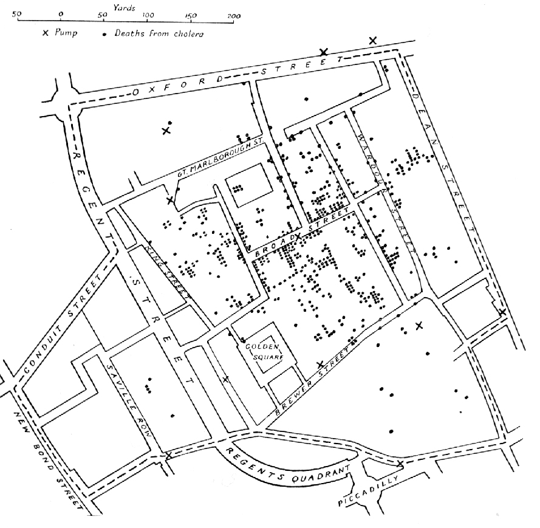
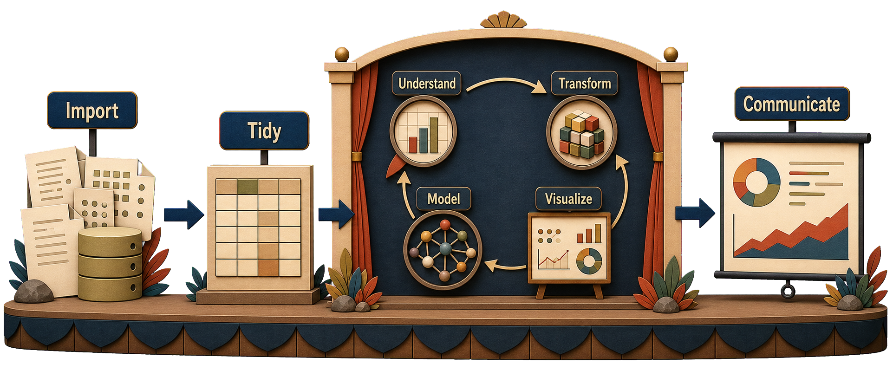
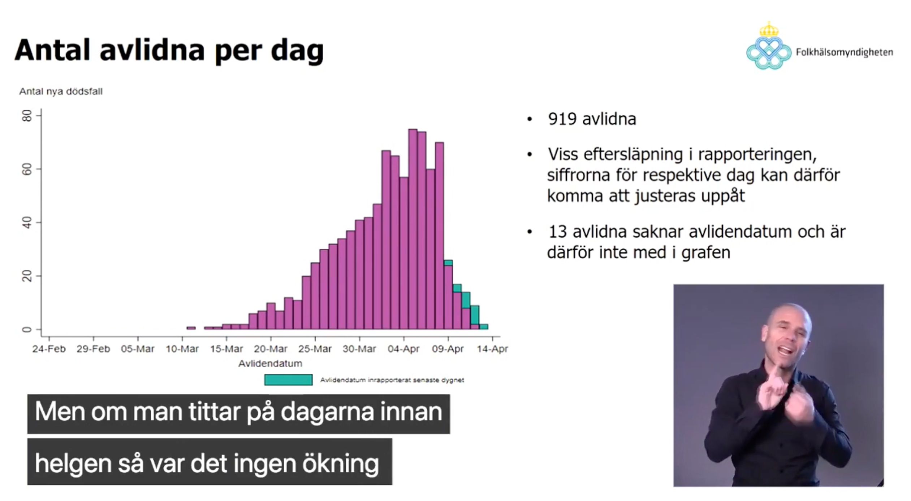
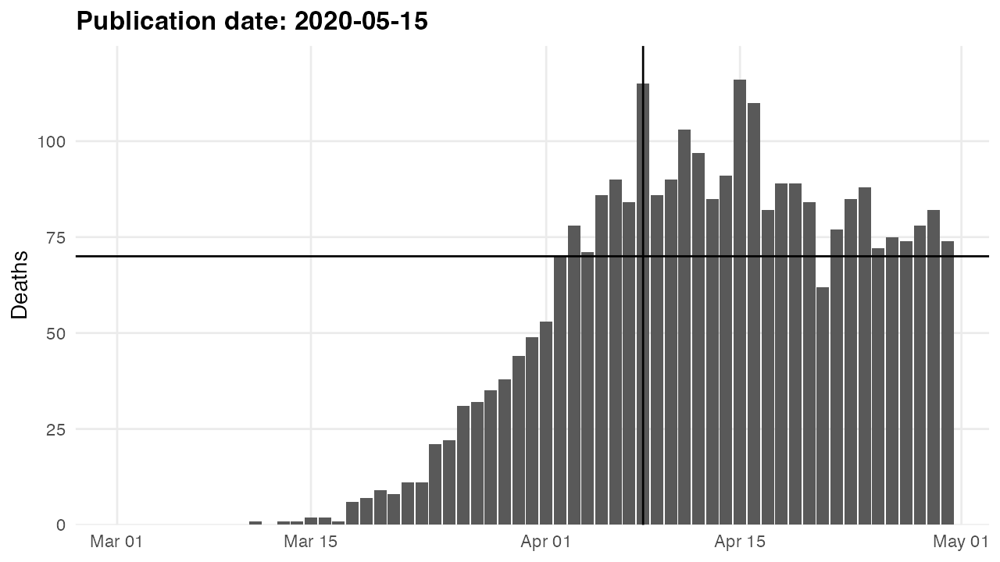
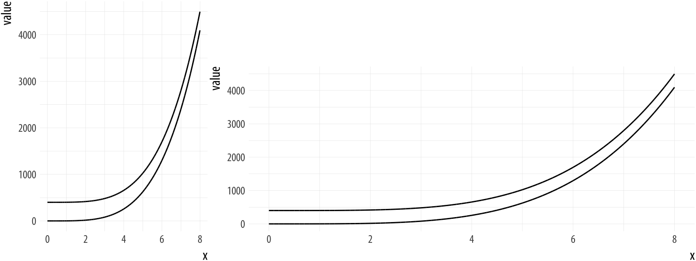
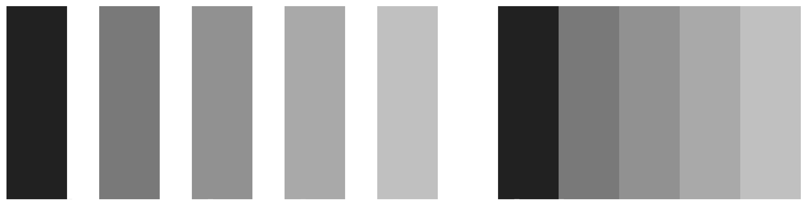
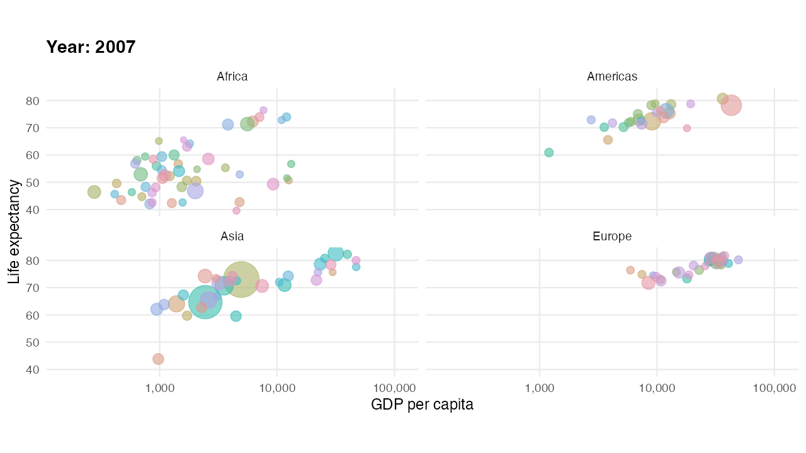
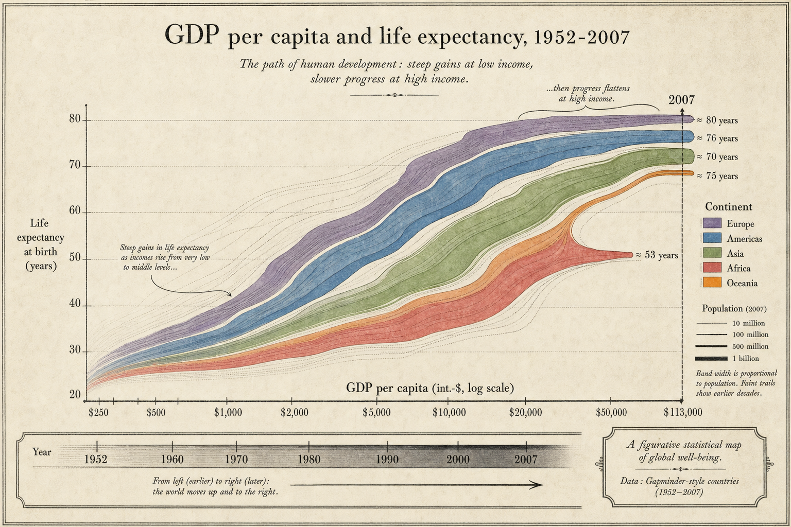
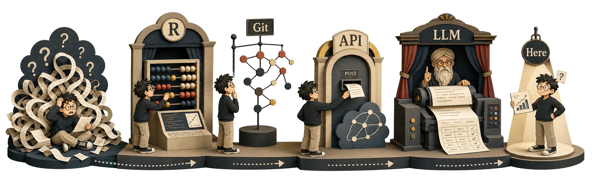

```{r}
#| echo: false
#| output-location: default
library(here)
library(data.table)
library(ggplot2)
library(modelsummary)
library(tinytable)
# NOTE gganimate is intentionally local-only; the deck embeds generated videos.
knitr::opts_knit$set(root.dir = here())
options(width = 90)
options(datatable.print.nrows = 8)
options(datatable.print.topn = 3)
theme_set(
  theme_bw(base_size = 12, base_family = "Inter") %+replace%
    theme(
      plot.background = element_rect(fill='transparent', color=NA),
      legend.background = element_rect(fill='transparent', color=NA),
      legend.key = element_rect(fill='transparent', color=NA)
    )
)
options(tinytable_tt_theme = \(x) theme_tt(x, "revealjs", fontsize = 0.8))
options("modelsummary_factory_default" = "tinytable")
```

## Why visualize?

> The greatest value of a picture is when it forces us to notice what we never expected to see.

John Tukey, *The Future of Data Analysis* (1962)

::: {.attribution}
Quote popularised via @Tufte1983_visual_display
:::

## Why visualize? (cont.)

- In 1854, a horrible cholera epidemic was ravaging London
- Doctors believed "miasma" (bad air) had caused the disease
- John Snow ("father of epidemiology") argued it was transmitted through water
- But it wasn't the study's identification strategy that convinced people, it was its visualization

::: {.aside}
- Crazy as it sounds, people were still generally not believing in the germ theory of disease.
- Snow had many intellectual children: he is sometimes also called the father of causal inference. His water-company comparison is arguably the first DiD.
:::

::: {.attribution}
@Snow1855_mode_communication
:::

## Snow's cholera map



::: {.attribution}
@Snow1855_mode_communication
:::

## Anscombe's quartet

```{r}
#| output-location: default
dt = as.data.table(datasets::anscombe)
modelsummary::datasummary(All(dt) ~ N + mean + SD, data = dt)
```

::: {.attribution}
@Anscombe1973_graphs_statistical
:::

## Anscombe's quartet

```{r}
#| echo: false
#| output-location: default
ggplot(data = melt(dt,
                   measure.vars = patterns("^x", "^y"),
                   value.name = c("x", "y")),
       mapping = aes(x, y)) +
  facet_wrap(vars(variable), scales = "free") +
  geom_point() +
  geom_smooth(method = "lm",
              formula = y~x,
              se = FALSE)
```

::: {.attribution}
@Anscombe1973_graphs_statistical
:::

## What visualization is for

- Summary statistics are not enough! They can hide critical patterns and differences in data.
- Visualization helps us:
  - **Explore** for patterns, trends, outliers, and relationships
  - **Understand** complex datasets more intuitively
  - **Analyze** insights missed by numerical methods
  - **Evaluate** models (e.g., residual plots)
  - **Communicate** findings clearly and effectively

## Two modes of plotting

:::: {.columns}
::: {.column width="50%"}
**Exploration**

- You are the audience
- Many quick plots, made fast
- Defaults are usually fine
- One question per plot is fine
- Iteration beats polish
:::
::: {.column width="50%"}
**Communication**

- Someone else is the audience
- A few plots, made carefully
- Defaults rarely are
- Each plot should make one clear point
- Polish: titles, captions, framing
:::
::::

Same grammar, different goals. Most of this lecture is about communication.

## Summary statistics hide patterns

```{r}
#| echo: false
#| output-location: default
cannonball::plot_r(r = 0.5, n = 50)
```


::: {.aside}
Test your correlation-guessing skills on <https://www.guessthecorrelation.com/>
:::

::: {.attribution}
<https://janhove.github.io/posts/2016-11-21-what-correlations-look-like/>
:::

::: {.notes}
Examples: (14) is Simpson's paradox, (15) extreme value sampling inflates r.
:::

## Datasaurus: same stats, different shapes


::: {.attribution}
@Matejka2017_same_stats
:::

::: notes
This is an animation of various data scatter patterns with identical summary statistics.
:::

## Wrangling ↔ Visualization

{fig-align="center" width="90%"}

::: {.attribution}
Workflow adapted from @Wickham2023_data_science
:::

::: aside
Exploring data visually is often the best way to understand it and to discover issues.
:::

## Data verification

- Some of your data will be wrong
- Finding out which and how early saves lots of time and energy
  - You don't want to realize halfway through a project that an important category has been coded as missing.

Verification tasks:

::: {.incremental}
- Browse data (using `View()` or just print it)
- Check descriptives: missing, unique values, mean/median/min/max
- **Plot data: scatters, histograms, densities**
:::

## Internal consistency: Is the data represented correctly?

- Potential sources of problems:
  - Incomplete or duplicated data
  - Missing or incorrectly coded values
  - Encoding problems

Verifying the variable `wage`, we might ask:

::: {.incremental}
- Do the values make sense?
- Is there bunching at high-frequency values?
- Are zeros and missing coded separately?
- Does everyone classified as not working have 0 wage?
:::

## External consistency: What does the data represent?

- Potential sources of problems:
  - Bad survey questions
  - Measurement error
  - Sampling bias

Verifying the variable `wage`, we might ask:

::: {.incremental}
- Are any government transfers included?
- How do population means compare to official statistics?
- Do correlations with related variables make sense?
:::

## External consistency example

- Researchers use health records to study public health
- Can you see the external consistency problem?

::: {.fragment}
> I want to study health. Health records are a (reasonably) accurate measure of health **care**, but a biased measure of health.
:::

## Visualization is also communication

- Figures are often the most effective way to communicate results
- Much of what you learn will be just as useful for communication

## Tufte: Graphical excellence

> [Graphical excellence] is that which gives to the viewer the greatest number of ideas in the shortest time with the least ink in the smallest space

Edward Tufte

## Charles Minard’s Infographic of Napoleon’s Invasion of Russia (1869)


::: {.notes}
- "Tells a rich, coherent story with multivariate data"
- Six plotted variables: size of army, two-dimensional location, direction, temperature.
:::

::: {.attribution}
@Tufte1983_visual_display
:::

## Bad graphs: Pandemic TV edition



## Let's plot the FOHM data ourselves

```{r}
#| output-location: default
fohm_dt <- fread(here("lectures", "lecture_10", "fohm_c19_death_data.csv"))[!is.na(date)]

ggplot(data = fohm_dt[publication_date == "2020-04-13"],
       aes(x = date, y = N)) +
  geom_col() + scale_x_date() +
  geom_vline(xintercept = as.Date("2020-04-08")) + geom_hline(yintercept = 70) + 
  coord_cartesian(xlim = as.Date(c("2020-03-01", "2020-04-30")), ylim = c(0, 120)) +
  labs(title = "Publication date: 2020-04-13", x = NULL, y = "Deaths")
```

## What happened then?

<!-- Generated locally with build_animated_figures.sh; not part of rv or CI. -->
```r

ggplot(data = fohm_dt[publication_date %between% list("2020-04-13", "2020-05-15")],
       aes(x = date, y = N, group = date)) +
  geom_col() + scale_x_date() +
  geom_vline(xintercept = as.Date("2020-04-08")) + geom_hline(yintercept = 70) +
  coord_cartesian(xlim = as.Date(c("2020-03-01", "2020-04-30")), ylim = c(0, 120)) +
  labs(title = "Publication date: {frame_time}", x = NULL, y = "Deaths") +
  transition_time(publication_date) + ease_aes('linear')
```

```{=html}
<div style="display: flex; align-items: center; justify-content: center; height: 380px; margin-top: 20px;">
  <video src="fohm-deaths-by-publication-date.mp4" poster="fohm-deaths-by-publication-date-poster.png" autoplay loop muted playsinline controls style="max-width: 100%; max-height: 100%; object-fit: contain;">
    
  </video>
</div>
```

## Same lesson, course data: spaghetti

```{r}
#| output-location: default
panel_dt <- fread(here("lectures", "lecture_1", "lecture_1_demo_panel.csv"))

ggplot(panel_dt, aes(x = year, y = unemployment_rate, group = municipality_code)) +
  geom_line(alpha = 0.4) +
  labs(x = NULL, y = "Unemployment rate (%)")
```

290 municipalities. You can tell rates fell, but not much else.

## Same data, better figure

```{r}
#| output-location: default
highlighted <- c("Danderyd", "Stockholm", "Malmö", "Pajala")

ggplot(panel_dt, aes(x = year, y = unemployment_rate, group = municipality_code)) +
  geom_line(color = "grey80", linewidth = 0.4) +
  geom_line(data = panel_dt[municipality_name %in% highlighted],
            aes(color = municipality_name), linewidth = 1.2) +
  scale_color_brewer(palette = "Dark2", name = NULL) +
  labs(x = NULL, y = "Unemployment rate (%)")
```

Background keeps the distribution. Foreground tells a story.

## Good visualization leverages human perception

- We are good at comparing:
  - Position along a common scale
  - Length
- We are less accurate at judging:
  - Angle
  - Area/volume
  - Color intensity/shade (relative comparisons dominate)

## Aspect ratios and scale



::: {.attribution}
@Healy2018_data_visualization
:::

::: notes
These two curves are identical, but they do not look it. The different aspect ratios of the plot affect our visual perception of how quickly the curve is changing.
:::

## Color perception is relative



::: {.attribution}
Mach bands, adapted from @Healy2018_data_visualization
:::

::: notes
The brightness or luminance of the corresponding bars is the same. However, when the bars touch, the dark areas seem darker and the light areas lighter.
:::

# ggplot intro

## Grammar of graphics

- We will learn how to make plots in R using the popular `ggplot2` package
- ggplot2 implements the "grammar of graphics" graph-building paradigm
- Builds plots layer by layer, adding geometries ("geoms")

## A basic ggplot template

```r
ggplot(data = <DATA_FRAME>,
       mapping = aes(<MAPPINGS>)) +
  <GEOM_FUNCTION>() +
  # Add more layers (optional)
  <SCALE_FUNCTION>() +
  <THEME_FUNCTION>() +
  <LABS_FUNCTION>()
```

## Using the gapminder data

```{r}
#| output-location: default
set.seed(2026)
gapminder_dt <- as.data.table(gapminder::gapminder)
tt(gapminder_dt[sample.int(nrow(gapminder_dt), 10), ])
```

## Creating the ggplot object (cont.)

```{r}
ggplot(data = gapminder_dt)
```

## Creating the ggplot object (cont.)

```{r}
p_box <- ggplot(data = gapminder_dt,
                mapping = aes(x = continent,
                              y = lifeExp))
p_box
```

We set the **aesthetic mapping** of the ggplot object to columns of the `gapminder` data frame.

::: {.aside}
- Notice how `continent` and `lifeExp` are not in quotes. ggplot looks inside the object given by the `data` argument.
- Try running `str(p_box)` to look at the structure of the ggplot object.
:::

## Adding a layer

```{r}
p_box + geom_point()
```

To draw something on the canvas we need to add a geometry layer. For example a scatter with `geom_point()`.

## Adding a layer (cont.)

```{r}
p_box + layer(
  mapping = NULL,
  data = NULL,
  geom = "point",
  stat = "identity",
  position = "identity"
)
```

`geom_point()` is a shortcut for `layer(...)`. Setting `mapping` and `data` to `NULL` means they are inherited from `p_box`.

## Adding a boxplot

```{r}
p_box + geom_boxplot()
```

Let's add a boxplot instead to study the distribution of continuous variables across multiple groups.

::: {.aside}
Boxplots show: median (center line), interquartile range (IQR, the box), whiskers (extending to the most extreme point within 1.5 × IQR of the box), outliers (points beyond the whiskers).
:::

## Adding another geom

```{r}
p_box +
  geom_boxplot() +
  geom_jitter()
```

To get a more visual sense of where the data is located we can re-add the actual data points.

::: {.aside}
`geom_jitter` is short for `geom_point(position = "jitter")`. It adds a tiny bit of noise to each point so they do not overlap.
:::

## Styling geoms

```{r}
p_box +
  geom_boxplot(outlier.color = "red") +
  geom_jitter(position = position_jitter(width = 0.1, height = 0),
              alpha = 0.25)
```

Highlighting outliers and making the points less prominent. Alpha means transparency.

::: {.aside}
Remember you can read about available function arguments by running `?geom_jitter`.
:::

## Styling scales and labels

```{r}
p_box +
  geom_boxplot(outlier.color = "red") +
  geom_jitter(position = position_jitter(width = 0.1, height = 0),
              alpha = 0.25) +
  scale_y_continuous(n.breaks = 5,
                     limits = c(0, 100),
                     expand = expansion(c(0,0.05))) +
  labs(y = "Life expectancy (years)",
       x = "Continent") +
  theme_bw()
```

Starting the y-axis at zero usually good. Here, I also added a simple theme and formatted the axis labels.

## Flagging outliers

```{r}
#| output-location: default
library(ggrepel)
is_outlier <- function(x) {
  x < quantile(x, 0.25) - 1.5 * IQR(x) | x > quantile(x, 0.75) + 1.5 * IQR(x)
}

plotdata <- copy(gapminder_dt)[, outlier := is_outlier(lifeExp), by = "continent"]
```

Tag points outside `Q1 − 1.5·IQR` or `Q3 + 1.5·IQR` per continent, then split inliers and outliers when we plot.

## Labelling the outliers

```{r}
p_box +
  geom_boxplot(outlier.color = "red") +
  geom_jitter(data = plotdata[outlier == FALSE],
              position = position_jitter(width = 0.1, height = 0),
              alpha = 0.25) +
  scale_y_continuous(n.breaks = 5,
                     limits = c(0, 100),
                     expand = expansion(c(0,0.05))) +
  labs(y = "Life expectancy",
       x = "Continent") +
  theme_bw() +
  geom_text_repel(data = unique(plotdata[outlier == TRUE], by = "country"),
                  aes(label = country))
```

## A truly powerful plotting package

- What if we want
  - To plot the relationship between GDP and life expectancy
  - Divided by countries and continents
  - To see how countries have developed over time
  - Take population size into account
- 6 dimensions 🤯
- Hans Rosling managed!

<!-- Generated locally with build_animated_figures.sh; not part of rv or CI. -->
## Rosling's famous animated plot

```r
library(gganimate)

ggplot(copy(gapminder_dt)[continent != "Oceania", ],
       aes(x = gdpPercap, y = lifeExp, size = pop, color = country)) +
  geom_point(alpha = 0.6, show.legend = FALSE) +
  scale_size(range = c(2, 13)) +
  scale_x_log10(limits = c(150, 115000),
                labels = scales::comma) +
  facet_wrap(vars(continent)) +
  coord_fixed(ratio = 1 / 43) +
  labs(title = 'Year: {frame_time}',
       x = 'GDP per capita', y = 'Life expectancy') +
  theme_minimal() +
  transition_time(year) +
  ease_aes('linear')
```

## Rosling's famous animated plot

```{=html}
<div style="display: flex; align-items: center; justify-content: center; height: 520px; margin-top: 20px;">
  <video src="rosling-gapminder.mp4" poster="rosling-gapminder-poster.png" autoplay loop muted playsinline controls style="max-width: 100%; max-height: 100%; object-fit: contain;">
    
  </video>
</div>
```

# Plot types

## Common plots

- Scatter Plots (`geom_point`): relationships
- Line Charts (`geom_line`): time series
- Bar Charts (`geom_col`): comparisons
- Histograms & Density Plots (`geom_histogram`, `geom_density`): distributions
- Box Plots (`geom_boxplot`): grouped distributions
- Statistical summaries (`geom_smooth`, `geom_errorbar`): presenting results

## An example dataset

Lets start by working with a really simple dataset with two groups:

```{r}
#| output-location: default
df <- data.frame(
  x = c(1, 3, 4, 10, 8, 9, 3, 1, 5, 2),
  y = c(2, 6, 1, -4, 5, 1, 2, 3, 0, 4),
  gr = c(rep("a", 5), rep("b", 5))
)
df
p_xy <- ggplot(data = df,
               mapping = aes(x=x, y=y))
```

## Individual geoms: `geom_point()`

```{r}
p_xy + geom_point()
```

## Individual geoms: `geom_col()`

```{r}
p_xy + geom_col()
```

This does not look right...

::: {.aside}
You might have tried `geom_bar()` and gotten an error. `geom_bar()` counts the number of cases for each `x` in the data set and should not be supplied a `y` aesthetic mapping.
:::

## Individual geoms: `geom_col()`

```{r}
p_xy + geom_col(
  position =
    position_dodge2(preserve = "single")
)
```

Default is `position = "stack"`, this puts same `x` values on top of each other. Setting it to dodge separates overlapping values.

## Collective geoms

:::: {.columns}
::: {.column width="50%"}
```{r}
#| output-location: default
p_xy + geom_line(aes(group = gr))
```
:::
::: {.column width="50%"}
```{r}
#| output-location: default
p_xy + geom_line(aes(linetype = gr))
```
:::
::::

Collective geoms are plots with connected observations. `group` tells ggplot how to connect the data.

::: {.aside}
When assigning an aesthetic (`color`, `fill`, `linetype`, `shape`, `size`) to the group ggplot adds a legend.
:::

## Statistical summaries: `geom_histogram()`

```{r}
#| output-location: default
ggplot(data=df, aes(x=x)) +
  geom_histogram()
```

::: {.aside}
`geom_histogram()`, like `geom_bar()` and `geom_density()` counts `x` values. It would error if we supplied a `y`.
:::

## Statistical summaries: `geom_smooth()`

```{r}
#| output-location: default
p_xy + geom_point() + geom_smooth()
```

By default `geom_smooth()` fits a loess curve. Pass `method = "lm"` for a straight line.

## Statistical summaries: `geom_errorbar()`

```{r}
#| output-location: default
p_xy + geom_errorbar(aes(ymin = y - 1, ymax = y + 1))
```

Useful for reporting e.g., coefficient plots, but requires `ymin` and `ymax` aesthetics.

# Grouping and summarizing 
## Grouping and summarizing

What if we wanted to plot how GDP per capita has developed for each country over time. A line plot should do this well.

```{r}
ggplot(
  gapminder_dt,
  aes(x = year,
      y = gdpPercap)
) +
  geom_line()
```

Any idea what's wrong?

## The `group` aesthetic

We need to tell ggplot to group the data by country.

```{r}
#| code-line-numbers: "5"
ggplot(
  gapminder_dt,
  aes(x = year,
      y = gdpPercap,
      group = country)
) +
  geom_line()
```

Still quite hard to see what's going on!

## Making things clearer

Let's color lines by continent.

```{r}
#| code-line-numbers: "6,9"
ggplot(
  gapminder_dt,
  aes(x = year,
      y = gdpPercap,
      group = country,
      color = continent)
) +
  geom_line()
```

Still looks cluttered.

::: {.aside}
`color` sets the color of lines and points, `fill` configures color of areas, e.g. bar plots. And for you brits out there, `colour` is also allowed.
:::

## Faceting

Instead we could split the plot into subplots by continent.

```{r}
#| code-line-numbers: "9"
ggplot(
  gapminder_dt,
  aes(x = year,
      y = gdpPercap,
      group = country)
) +
  geom_line() +
  facet_wrap(vars(continent))
```


By default `facet_wrap()` keeps the x and y scales identical across panels. Pass `scales = "free_y"`, `"free_x"`, or `"free"` to let them vary.

# Styling

## A plot to work on

```{r}
p <- ggplot(
  gapminder_dt,
  aes(x = gdpPercap,
      y = lifeExp)
)
p + geom_point()
```

How can we increase readability?

## Configuring scales: color

```{r}
#| code-line-numbers: "7"
ggplot(gapminder_dt,
       aes(x = gdpPercap,
           y = lifeExp)) +
  geom_point(aes(color = continent))
```

## Configuring scales: size

```{r}
#| code-line-numbers: "5-8"
ggplot(gapminder_dt,
       aes(x = gdpPercap,
           y = lifeExp)) +
  geom_point(aes(color = continent,
                 size = pop),
             shape = 1, alpha = 0.75) +
  scale_size(labels = scales::comma)
```

- Makes point size vary with population size,
- with semi-transparent hollow circles
- Change size scale to non-scientific

## Configuring scales: logarithmic x-scale

```{r}
#| code-line-numbers: "8"
ggplot(gapminder_dt,
       aes(x = gdpPercap,
           y = lifeExp)) +
  geom_point(aes(color = continent,
                 size = pop),
             shape = 1, alpha = 0.75) +
  scale_size(labels = scales::comma) +
  scale_x_log10(labels = scales::dollar)
```

::: {.aside}
`scale_y_log10()` is short for `scale_y_continuous(transform = transform_log10())`.
:::

## Adding (population weighted) regression lines

```{r}
#| code-line-numbers: "9-11"
p <- ggplot(gapminder_dt,
       aes(x = gdpPercap,
           y = lifeExp,
           color = continent)) +
  geom_point(aes(size = pop),
             shape = 1, alpha = 0.75) +
  scale_size(labels = scales::comma) +
  scale_x_log10(labels = scales::dollar) +
  geom_smooth(aes(weight = pop),
              linewidth = 0.8,
              method = "lm", se = FALSE)
p
```

::: {.aside}
Note how I moved the color aesthetic to the main `ggplot()` call so it applies to both geoms.
:::

## Writing for the reader

A figure that needs explaining is half-finished. Titles, captions, and a line of narrative do the rest.

- **Title**: state the point, not the chart type. "Unemployment converged across municipalities" beats "Unemployment by year".
- **Subtitle**: scope, e.g. "290 Swedish municipalities, 2016–2023".
- **Axis labels**: human-readable, with units. No raw variable names.
- **Caption**: source, sample, and caveats the reader cannot infer from the panel.

## Adding plot labels

```{r}
p <- p +
  labs(
    x = "Log GDP per capita",
    y = "Life expectancy",
    color = "Continent",
    size = "Population size",
    title = "Prosperity brings health, or is it the other way around?",
    subtitle = "1952-2007",
    caption = "Data from Gapminder"
  )
p
```

## `theme()` sets look and feel

:::: {.columns}
::: {.column width="50%"}
```{r}
#| output-location: default
p + theme_bw() +
  theme(plot.title = element_text(size=16))
```
:::
::: {.column width="50%"}
```{r}
#| output-location: default
p + theme(legend.position = "bottom",
          legend.box = "vertical")
```
:::
::::

::: {.aside}
See `?theme` for all the things you can edit!
:::

## Aside on colors: three palette types

- We do not perceive all colors the same.
- When plotting, try to use palettes designed for perceptual uniformity.
- Three types of palettes, depending on data structure:
  - **Sequential**: for ordered data (e.g., income)
  - **Diverging**: ordered with midpoint (correlation, temperature)
  - **Qualitative**: unordered, categorical, data (countries, species)

## Color blindness: a simulator function

8% of men and 0.5% of women have some form of color blindness. Let's create a function to evaluate how different palettes look for people who are color blind.

```{r}
#| output-location: default
library(dichromat)
library(paletteer)
colorblind_palette = function(palette) {
  melt(as.data.table(
    append(
      list(x = seq_along(palette),
           "Trichromacy (Original)" = palette),
      lapply(c("Protanopia"="protan", "Deutanopia"="deutan", "Tritanopia"="tritan"),
             dichromat, colours = palette)
    )
  ), id.vars = "x") |>
    ggplot(aes(x=x, y = 0, fill = value)) +
    geom_raster() + facet_wrap(vars(variable), nrow=4) +
    scale_fill_identity() + theme_void() + theme(legend.position = "none")
}
```


## Color blindness: ggplot2 default hue

```{r}
#| output-location: default
colorblind_palette(scales::hue_pal()(5))
```

## Color blindness: RColorBrewer RdYlGn

```{r}
#| output-location: default
colorblind_palette(paletteer_d("RColorBrewer::RdYlGn", 10))
```

## Color blindness: Wes Anderson Darjeeling 2

```{r}
#| output-location: default
colorblind_palette(paletteer_d("wesanderson::Darjeeling2", 5))
```

Let's go with this one for our plot!

## Final result

```{r}
#| echo: false
#| output-location: default
p <- p +
  scale_color_paletteer_d("wesanderson::Darjeeling2")
p
```

## Saving figures with `ggsave()`

- It sounds easy, but saving a figure can quite messy, even if it looked great in the viewer.
- `ggsave(<filename>, p)` saves the `p` plot object to a file
- The file ending determines the graphics device:
  - Vector formats (.pdf, .svg) look much nicer
  - Raster formats (.png, .jpg) are easier to work with
- Use arguments `width`, `height`, and `scale` to get the size right

::: {.aside}
It can be quite hard to get custom fonts looking the way you want with vector formats. With rasterized formats the [ragg package](https://ragg.r-lib.org/) makes it super easy. For vectors, use [svglite](https://svglite.r-lib.org/) and make sure the font is installed on the system.
:::

# Wrapping up

## Best practices

- Choose the right plot for your data and question
- Use labels to explain your plot
- Keep it clean, don't plot too much on the same chart
- Use colors sparingly, effectively, accounting for colorblindness

## Common pitfalls to avoid

- Misleading axes (bar charts not starting at zero 🫢)
- Overplotting (too much data)
- Chartjunk (prominent gridlines, backgrounds)
- 3D plots, pie charts (hard to read)

## What changes, what doesn't

Tools that will move fast before next year:

- IDE assistants and agents
- LLMs as data tools, not just as callers
- Visualization libraries (more interactive, more declarative)

Habits that move slowly:

- Knowing your data and its provenance
- Validating before trusting a number
- Asking the right question
- Communicating a result so someone else can act on it

## LLMs as plot generators

{fig-align="center" width="70%"}

::: aside
I've been experimenting with gpt-image-2 to generate slide infographics. Image generation has gotten good enough to get text right, but representing data truthfully is still a challenge. Although it does generate beatiful figures with the right prompt.
:::

## Course arc, looking back

{.r-stretch fig-align="center"}

- Every block has the same shape: real data, a small toolkit, a validation step
- The tools will keep changing; the workflow shape does not

## The end

- Written exam: **Thursday, June 4, 2026, 08:00–11:00**
- Re-exam: Friday, August 28, 2026
- Code reading, workflow judgment, debugging logic, data-source judgment — not syntax memorization
- Advice: lecture handouts include notes that could give useful context.
- Good luck!

## Visualization Resources

- [Data Visualization: A practical introduction by Kieran Healy](https://socviz.co/index.html#preface)
- Chapters 1,9,10 of [R4DS](https://r4ds.hadley.nz/data-visualize.html)
- The 3rd edition [ggplot book](https://ggplot2-book.org/) (advanced, WIP)

## References
