## Today

- How to keep a project self-contained
- How to stop breaking your own file paths
- Meet the shell
- How `Git`, `GitHub`, and `VS Code` fit together
- The basic `Git` cycle: `status`, `add`, `commit`, `push`
- Digging a bit deeper: branches, pull requests, merge conflicts
- Recovery habits for when things go wrong

## Software install check (Problem set 0)

Did you...

- Install [R](https://www.r-project.org/)?
- Install [VS Code](https://code.visualstudio.com/) and the [vscode-R extension](https://marketplace.visualstudio.com/items?itemName=REditorSupport.r)?
- Install and configure [Git](https://git-scm.com/downloads)?
- Creat an account on [GitHub](https://github.com/) and [GitHub Education](https://github.com/education)?

::: {.aside}
Great Git+R setup guide if you want to learn more: <http://happygitwithr.com>
:::

## If so...

- You have already edited a file, made a commit, and pushed it
- Today is about understanding that workflow

## Why this matters

- Reproducible work is easier to debug
- Clean projects are easier to share
- `Git` gives you history with more than just timestamps

## Warning signs

- You can't find the file you are looking for
- You're not sure which data is raw and which one is cleaned
  - Have outliers been removed?
- You have data/script files in `Downloads`, `Desktop`
  - What project is `summarize_earnings.R` for?
- You have scripts called `final.R`, `final_v2.R`, and `final_final_REALLY.R` - but which is the latest?
- You and your colleagues are working in different versions

# Project Hygiene {background-color="#40666e"}

## **Self-contained** projects

- Give each project its own folder
- Keep code, documentation, and project-specific outputs together
- Avoid reaching out to random files elsewhere on your computer
- Portable projects are easier to rerun, archive, and share

## A sensible project tree

```text
municipality-project/
├── README.md
├── .gitignore
├── data/
│   ├── raw/
│   └── processed/
├── src/
└── output/
    ├── figures/
    └── tables/
```

## What goes where?

- `data/raw/`: untouched source files
- `data/processed/`: cleaned or reshaped data created by your code
- `src/`: code/scripts that do the work
- `output/`: things your code produces for humans to inspect or submit
- `README.md`: what the project is and how to run it

## `src/` is for your code

```text
src/
├── 00_run_pipeline.R   | runs the project in the intended order
├── 01_clean_data.R     | cleans and standardizes inputs
├── 02_merge_data.R     | joins tables and checks keys
├── 03_make_figures.R   | produces human-facing output
└── utils.R             | reusable helper functions, if you really need them
```

- Put code in `src/`, not in random top-level files
- Numbers are fine for ordering, but never let them replace descriptive names
- A good test: could another person (or agent) guess where to look for a specific step?

## Split code by job, not by mood

- Better: one (or several) script for cleaning, merging, figures
- Worse: `final.R`, `misc.R`, `functions.R`, `new_final.R`
- Split by function

::: notes
Separating data-manipulation and data-analysis is an example of modularity. The logic
for this is simple. Lots of things can go wrong. You want to be able to isolate what went wrong.
:::

## Use relative paths

Many do-files start like this:

```stata
clear all
cd "C:/my_project/analysis"
use "mydata.dta"
```

or even worse: 

```stata
clear all
use "C:/my_project/analysis/mydata.dta"
```

::: {.incremental}
Don't do this!

- Absolute paths hard-code your own machine
- Use **relative paths** that travel with the project

::: {.fragment}
All you need is:
```stata
use "mydata.dta"
```
:::
:::

## Use relative paths (cont.)

- The **working directory** is the folder your code is running from 
- `fread("mydata.csv")` looks for `mydata.csv` in the working directory

## To set working directory: open the folder, not the file

- In `VS Code`, open the project root folder
- Then the file tree, working directory, terminal, and `Git` repo all line up
- You should see your folder and files in the sidebar

## Use relative paths (cont.)

To reach a subfolder, navigate with `/`:

- `source("src/script.R")` runs `script.R` in the `src` folder

::: {.aside}
On windows, `R` translates `/` to `\` automatically, so you can use forward slashes even on Windows.
:::

## Use relative paths (cont.)

To reach a parent folder, navigate with `..`:

- `fread("../../data_outside_project.csv")`
- Each `..` navigating one level "up"

But you should never need to do this if you keep your projects self-contained! Why?

## Start new sessions
- Don't put `clear all` or `rm(list = ls())` at the top of scripts
- Instead, make it a habit to always start new sessions!
  - More robust/reproducible
  - Forces self-contained code
  - Avoid bugs from leftover objects and settings

## Raw is raw

- Put untouched source data in `data/raw`
- Do not edit raw data by hand
- Write cleaned outputs to new files
- If you overwrite raw data, you have deleted evidence

::: {.aside}
For extra points: **write-protect** your raw data. To write-protect in Windows you can right-click on the folder, select "Properties", then "Security" then select deny write for your user. On Linux/Mac you can run the terminal command:

```bash
sudo chmod -R ugo-w data/raw
```
:::

## Naming is part of analysis

- Name folders, files, variables so anyone can understand
- Long names are better than abbreviations you will forget
- Figures: `scatter_income_by_gender.png` not `figure_3.png`
- Variables: `log_family_income` not `inc4`

::: {.aside}
Stata makes this hard by limiting names to 32 characters unfortunately.
:::

## `README.md`

:::: {.columns}
::: {.column width="60%"}
- Every project root needs one
- What is this project?
- What data does it use?
- How do I run it?
- What output does it create?
:::
::: {.column width="40%" .center-h}
](readme.png)
:::
::::

## `.gitignore` tells `Git` what to ignore

:::: {.columns}
::: {.column width="55%"}
- `Git` should mainly track code and small text files
- Usually ignore:
  - Data (especially proprietary/sensitive)
  - large files
  - generated output / process artifacts
  - secrets and `.env` files
:::
::: {.column width="45%"}
{width="100%"}
:::
::::

## Example `.gitignore` lines

```gitignore
data/raw/**
output/**
.env
*.zip
```

- Ignore patterns are just text lines
- Prefer ignoring folders or generated artifacts you can recreate
- Be careful with broad patterns like `*.csv`
- The point is to track source and logic, not every disposable by-product

# Short shell intro {background-color="#40666e"}

## The Unix shell


## The Unix shell (cont.)

Hackers in movies are often portrayed working in terminals.

In reality, developers use shell commands because they offer efficient ways to interact with computers and files. We will work in a shell originating in the [Unix](https://en.wikipedia.org/wiki/Unix) family of operating systems.

The [Unix philosophy](https://en.wikipedia.org/wiki/Unix_philosophy) is for tools to be "minimalist and modular" to:

> **Do One Thing And Do It Well**

## Terminology

- *Terminal, command prompt, tty*: wrapper that runs the shell
- *Shell, Bash, zsh*: programs that run commands and return output
- *Console*: your computer

We will use [**Bash**](https://www.gnu.org/software/bash/) which is a *shell variant*

- Included by default on Linux and MacOS^[Recent versions of MacOS actually run `zsh` by default which is a slightly different variant of bash.]
- Windows users should install [Git Bash](https://git-scm.com/downloads)

::: {.attribution}
[Stack overflow explains the difference well](https://unix.stackexchange.com/questions/4126/what-is-the-exact-difference-between-a-terminal-a-shell-a-tty-and-a-con)
:::

## The Terminal

:::: {.columns}
::: {.column width="50%"}
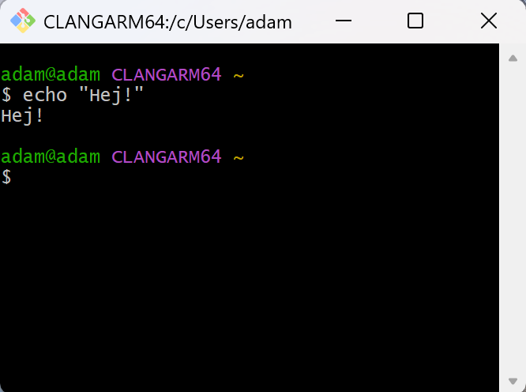{height=220}
:::
::: {.column width="50%"}
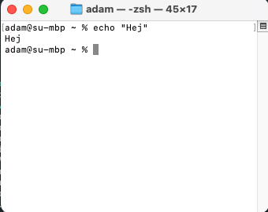{height=220}
:::
::::

**In VS Code**:

- Open it from `Terminal -> New Terminal`
- Same project, same folder tree, same repo

::: {.aside}
To change the default shell in VSCode press Ctrl/Cmd+Shift+P and chose *Change default profile*. Change it to Git Bash on Windows.
:::

## The `shell`

- Mac and Linux are Unix-like OS with Unix-style shells
- Git for Windows provides Bash emulation
- Why?
  - Almost all servers speak shell
  - To know what goes on "under the hood"
  - Automation
  - Reproducibility (again!)

::: {.aside}
If you want to practice shell skills [cmdchallenge.com](https://cmdchallenge.com/) is fun! For more dedicated Windows users, [Windows Subsystem for Linux](https://learn.microsoft.com/en-us/windows/wsl/install) is a great way to get a real Linux terminal on Windows.
:::

## Things I use the shell for

- Git
- Renaming and moving files
- Installing and updating programs
- Interacting with servers
- Scheduling tasks
- Manipulating large sets of files:

```bash
find "raw_data" -name "*.csv" -type f -exec \
  perl -i -0pe 's/Vet ej\/\nVill ej svara/Vet ej\/Vill ej svara/g' {} \;
```

## First look

```bash
username@hostname:~$
```

- `username`: who you are
- `hostname`: which computer you are on
- `~`: your home folder
- `$`: the prompt where you type commands

## Path symbols

- `.` = current directory
- `..` = parent directory
- `~` = home directory
- `/` = sub folder
- Relative paths use these symbols instead of hard-coding your whole machine

## Commands have a simple structure

```bash
command flags argument
```

- command = what to do
- flag = how to do it
- argument = what to do it to

## Commands and flags

- Flags always start with one or two dashes
- Example command `ls`:
  - `-l` = output a list
  - `-a` = show all, also hidden
  - `-h` = human readable file sizes
  - `../` = look in parent folder (`argument`, not a flag)

::: {.fragment}
```{bash}
#| output-location: default
ls -lah ../
```
:::

## Seven commands are enough for now

```bash
pwd
ls
cd path/to/project
find . -name "*.R"
mkdir output/figures
mv notes.txt old_notes.txt
git status
```

- `pwd`: where am I?
- `ls`: what is here?
- `cd`: go somewhere else
- `find`: locate files
- `mkdir`: create a directory
- `mv`: move or rename a file
- `git status`: what changed?

## A tiny navigation example

```bash
pwd
ls
cd data
ls
cd ..
```

## Small file tasks

```bash
mkdir output/figures
cp README.md README_backup.md
mv notes.txt old_notes.txt
```

- `mkdir`: create a directory
- `cp`: copy a file
- `mv`: move or rename a file

## Tab completion is free speed

- Start typing a path, then hit `Tab`
- Use the up-arrow to repeat old commands
- This reduces typos and makes long paths tolerable

## `man` for manual

```bash
man ls
```

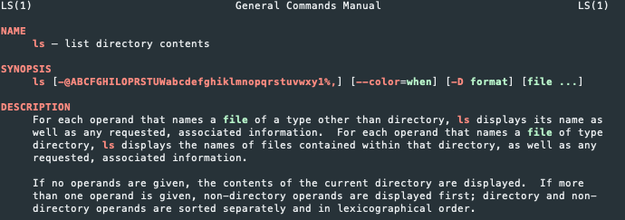{.nostretch width=600}

Use `space` to browse, press `h` for help and `q` to quit.

## Short shell intro

- This was just a very basic introduction
- Hopefully the sight of a command line will be a bit less scary
- Resources at the end for those who want more!

# Version Control in Git {background-color="#40666e"}

## Why version control?

:::: {.columns}
::: {.column width="42%"}
{width="100%"}
:::
::: {.column width="58%"}
- It records what changed
- It lets you go back
- It makes collaboration less chaotic
- It is much better than emailing `.zip` files around like it is 2007
:::
::::

## `Git`, GitHub, `VS Code`

- `Git`: the version-control system on your computer
- GitHub: a remote home for repositories—uses `Git`
- `VS Code`: the editor that lets you work with files and `Git` in one place
- Keep the roles separate in your head and life gets easier

::: {.notes}
GitHub is not needed to use Git. Great for open science. Stuff like DOI's, licenses, etc. I have a repo for each project, host my website on GitHub, and lots more.
:::

## How does Git work?

- A project = a Git repository
- Each user works in their own *local* copy
- Labelled history with **commits**
- **Branches** enable multi-feature development
- Changes syncted to GitHub on demand (unlike Dropbox)
- Facilitates collaboration with branching, conflict management, pull requests

::: {.notes}
Any folder can be made into a repo.
:::

## A repository is just a folder with memory

- Your working tree = files as they look right now
- The staging area = what will go into the next commit
- The commit history = saved snapshots with messages
- The remote = the GitHub copy

## The four operations to remember

- `git add`: stage changes for the next snapshot
- `git commit`: record staged changes in your local history
- `git pull`: bring remote changes down to your machine
- `git push`: send your local commits up to GitHub

## The basic cycle

1. Edit files
2. Check `git status`
3. Stage what belongs in the next commit
4. Commit with a useful message
5. Pull if the remote may have changed
6. Push to GitHub

## The core commands

```bash
git status
git add README.md src/01_build_panel.R
git commit -m "Add first cleaning step"
git pull
git push
```

## Stage and commit in two steps, why?

- `git commit` just commits staged files
- We use `git add <file>` to chose what to commit
  - Can even `git add --patch <file>` to stage parts
- This allows to divide up changes into multiple commits based on features/components

## Pull and push are not the same

- `git pull` brings remote changes to you
- `git push` sends your committed changes to the remote

::: {.aside}
If you work with others, or across multiple computers, pulling before pushing is a good habit. On a quiet solo repo it often changes nothing, which is fine.
:::

## `git status` is your friend

- Am I in a repo?
- What changed?
- What is staged?
- Am I ahead or behind?
- When confused, start here

## Initialize a repository (on GitHub)

:::: {.columns}
::: {.column width="60%"}
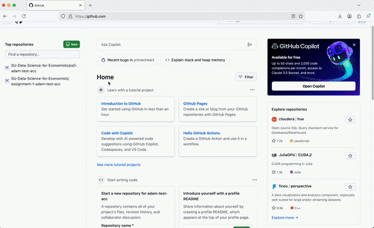
:::
::: {.column width="40%"}
```bash
git init test-repo
```
:::
::::

::: {.aside}
`git init` initializes local repo on your own machine. Normally better to start from GitHub.com to avoid problems later.
:::

::: {.notes}
Creating the repo on GitHub configures upstream correctly. Even if you are moving an existing project to GitHub, better to init on GitHub.com and then move your files into the repo.
:::

## Clone a repo in `VS Code`

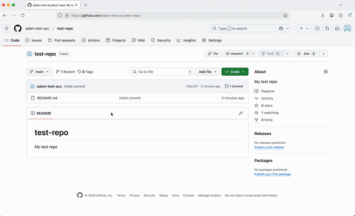{width="90%"}

```bash
git clone https://github.com/adam-test-acc/test-repo.git
```

## Stage, commit, and push changes

:::: {.columns}
::: {.column width="60%"}
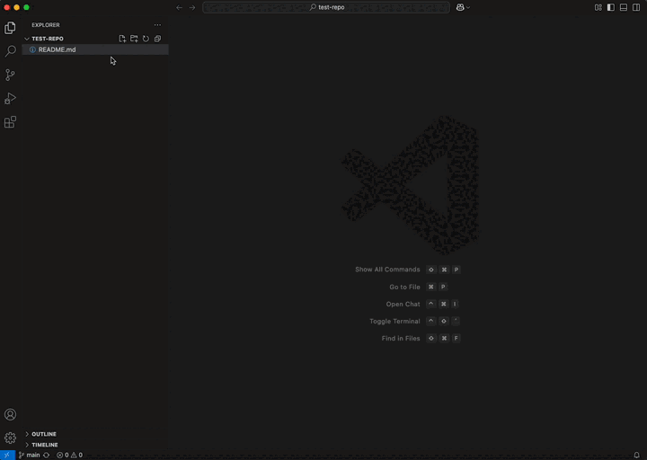
:::
::: {.column width="40%"}
```bash
git add README.md
git commit -m "Readme change"
git push
```
:::
::::

Follow the instructions in Problem set 0 to set up your Git `user.name` and `user.email`. Otherwise you will get an error when pressing "Commit".

## Good commits are small and legible

- Bad: `update`, `changes`, `stuff`
- Better: `Add README setup section`
- Better: `Clean municipality names before merge`
- Commit early and often
- Commit when one small idea is done

## `Git` is **not backup**

- `Git` tracks changes
- It does not protect you from deleting the wrong folder
- It does not make giant raw files pleasant to manage
- Keep a real backup too (Box/Dropbox, external drive, etc.)

# Git Branches {background-color="#40666e"}

## Branches

- Want to test a large change, but unsure it will work?
- Create a new branch to try it out, then just revert to main if it fails.
- Keep track of your changes (with commits) without disturbing your collaborators with unfinished code.
- If you are happy with your changes, merge them to the main branch.
- Branching is awesome, use it!

::: {.notes}
This is how modern software is developed. A new feature is built in a branch, then merged to main with a pull request after testing. In research, we can use it to test new data processing strategies, or to try out new analyses.
:::

## Creating a new branch in VS Code

:::: {.columns}
::: {.column width="60%"}
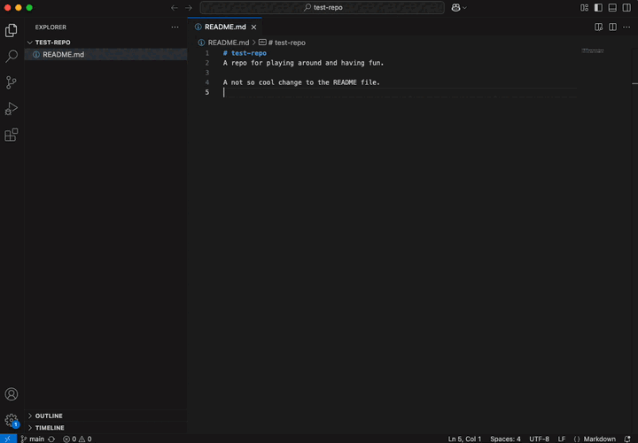
:::
::: {.column width="40%"}
```bash
git switch --create test-branch
```
:::
::::

## Merging branches locally

:::: {.columns}
::: {.column width="60%"}
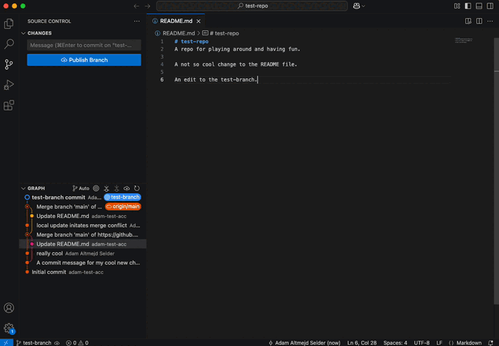
:::
::: {.column width="40%"}
```bash
git switch main
git merge test-branch
```
:::
::::

::: {.notes}
If no review is needed.
:::

## Pull requests (GitHub feature)

:::: {.columns}
::: {.column width="58%"}
- A pull request is a proposal to merge one branch into another
- Useful in team projects (code review), overkill for solo work
:::
::: {.column width="42%"}
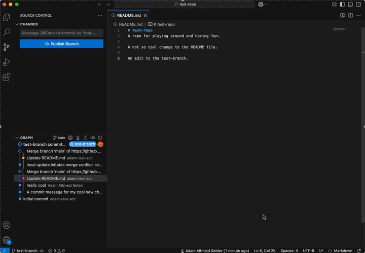{width="100%"}
:::
::::

::: {.notes}
If you want your collaborators to review/discuss the changes before they are merged. You write a summary of changes and assign code reviewers.
:::

# Git Merge conflicts {background-color="#40666e"}

## Merge conflicts

- A conflict happens when `Git` sees competing edits
- `Git` stops because it does not want to guess
- Annoying, yes
- Still better than silent overwriting

::: {.notes}
Let students try. Pair up and edit neighbors repo (after invite).
:::

## Merge conflicts in VS Code

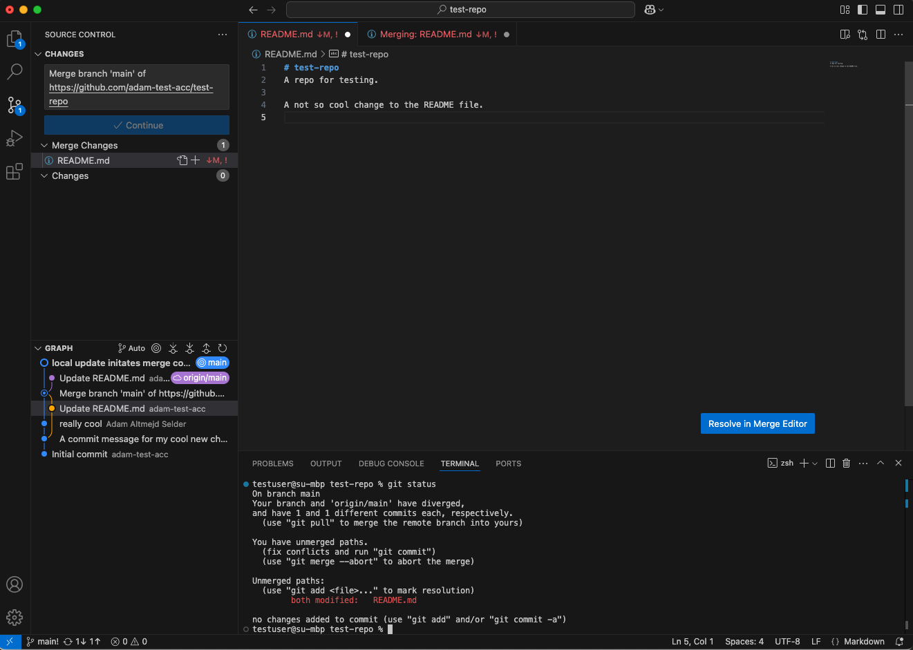

## Resolving conflicts using the merge editor

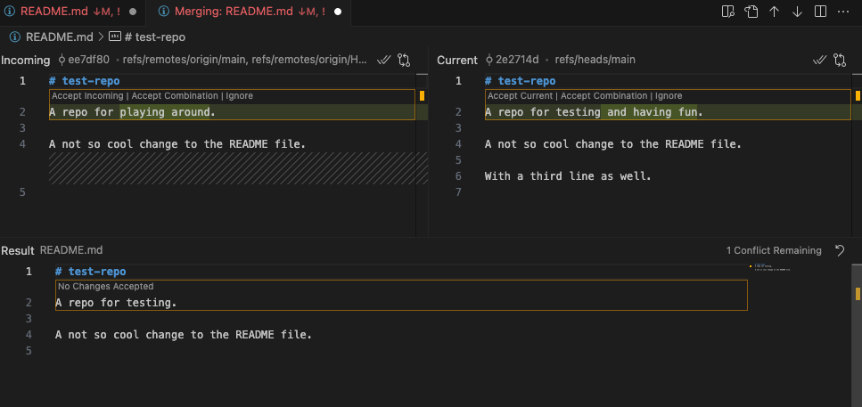

## Resolving conflicts using the merge editor

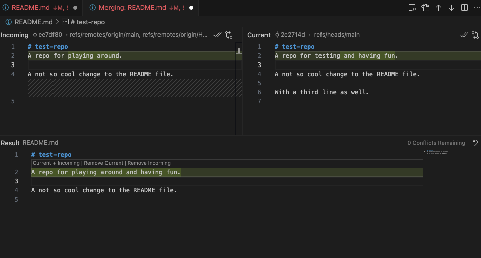

## Example: Code change by multiple sources

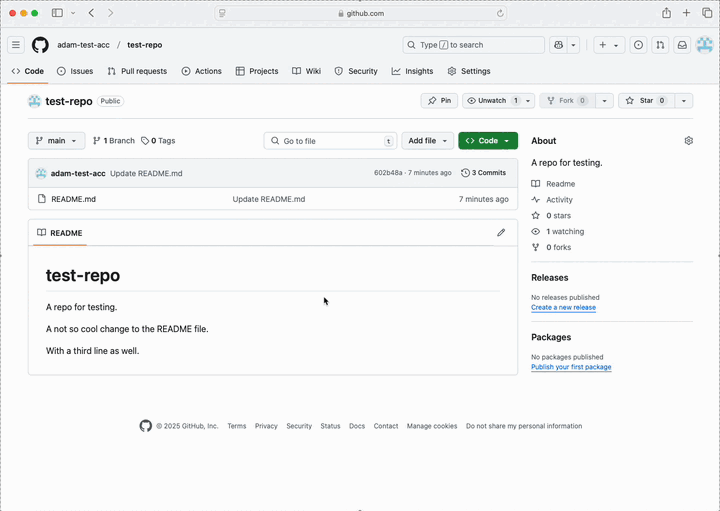

Two contributors have made changes to the same file. Git stops merge to not overwrite changes. Requires manual conflict resolution.

::: {.notes}
The person who resolves the conflict gets to decide. Unfair? Working in branches with pull requests might be more clear and fair.
:::

## Manual edits

VS Code provides a great UI for resolving merge conflicts, but you can also do it manually by editing the conflicting files. If you open the file you will see something like this. The strange characters are Git's way of highlighting the merge conflict.

```bash
# test-repo
<<<<<<< HEAD
A repo for testing and having fun.
=======
A repo for playing around.
>>>>>>> 814e09178910383c128045ce67a58c9c1df3f558.
A not so cool change to the README file.
```

You fix the conflict manually by simply removing the characters and chosing the text you prefer.

::: {.notes}
HEAD is the start of the merge conflict (current change). Then the === is a marking for where the two parts divide, and below that is the incoming change (from GitHub).
:::

## You do not need all of `Git` today

- Need now: repo, `status`, `add`, `commit`, `push`
- Useful soon: `pull`, branches, pull requests, conflict awareness
- Useful later: `SSH`, rebasing, tags, more careful collaboration workflows

# Git Failure Modes {background-color="#40666e"}

## Boring failure modes

- Opened the wrong folder
- Edited a file outside the repo
- Forgot to save before committing
- Tried to commit generated junk
- Saw an error and started guessing

## First recovery habits

- Read the error message
- Check what folder you are in
- Run `git status`
- Look at the file tree
- Change one thing at a time

## If `Git` says "nothing to commit"

- Maybe you changed nothing
- Maybe you changed a file outside the repo
- Maybe the file is ignored by `.gitignore`
- Maybe you forgot to save

## If push is rejected

- Usually authentication failed, or the remote moved
- Read the message before clicking random buttons
- Do not delete the `.git` folder
- Do not start over unless you understand why

## If you get stuck

- Stop making random changes
- Figure out what state the project is in
- Ask for help before you dig deeper
- Most workflow problems are fixable if you stop early enough

## What I want you to be able to do after today

- Organize a project sanely
- Use relative paths
- Open a repo in `VS Code`
- Make and explain a commit
- Push work without panic
- Understand what branches, pull requests, merge conflicts are for

## Git advice

- Commit often, work in small features
  - Don't: "New data processing script"
  - Do: "Removed duplicates from survey data"
- Push changes when you want your collaborators to see
- Git is not backup!
- Branches are useful even when solo

## When all else fails... :shrug:


::: {.aside}
But first, ask your AI or check [Oh Shit, Git!?](https://ohshitgit.com)
:::

## Next Time: `R` Basics

- Running code
- Objects and vectors
- Missing values
- Functions
- Reading simple errors without immediately spiraling

# Extras {.title-slide background-color="#40666e"}

## SSH=Secure shell

- Logs in to server over remote channel
- Really useful but setup requires some work
- Uses *public key cryptography*
  - Private key - stored on your computer
  - Public key - stored on the server
  - When connecting the private key encrypts a message that can only be validated by the corresponding public key

## `SSH` and GitHub

- `SSH` is another way to authenticate with GitHub
- `HTTPS` is fine for beginners
- `SSH` becomes convenient if you use `Git` a lot

## Generating a key pair

To generate an SSH key pair and register the public key with GitHub, follow these steps. For detailed instructions, see [GitHub Docs](https://docs.github.com/en/authentication/connecting-to-github-with-ssh/adding-a-new-ssh-key-to-your-github-account).

```bash
ssh-keygen -t ed25519 -C "your_email@example.com"
```

Press Enter to accept the default file location. When prompted, enter a secure passphrase (your terminal will not show characters as you type).

## Storing the passphrase using ssh-agent

You should secure your keys with a passphrase. But it might become annoying having to type the passphrase each time you use the SSH key. Instead, you can use a `ssh-agent` to store the passphrase for you. On Mac/Linux this is easy:

```bash
eval "$(ssh-agent -s)"
ssh-add ~/.ssh/id_ed25519
```

On Windows, it's more complicated. I've included the instructions in Problem Set 0 but let's go through them together now.

## Connecting to Github over SSH

To use SSH with Github you first need to add your public key to your [GitHub profile](https://github.com/settings/keys). Go to settings and "SSH and GPG keys" to add it.

Afterwards, run:

```bash
#| error: TRUE
ssh -T git@github.com
```

Now you can clone repositories using SSH rather than https.

We will get back to how to use SSH to connect to servers later in the course.


## Resources

- When Git is not working: <https://ohshitgit.com>
- Practicing shell commands: <https://cmdchallenge.com>
- Everything you need about Git+R: <https://happygitwithr.com>
- Basic shell <https://swcarpentry.github.io/shell-novice>
- Intermediate shell <https://seankross.com/the-unix-workbench>
- Advanced shell <https://jeroenjanssens.com/dsatcl>