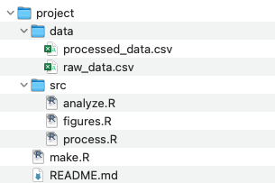

# Project management {background-color="#40666e"}

## Software install check (Problem set 0)

Did you...

- Install [R](https://www.r-project.org/)
- Install [VS Code](https://code.visualstudio.com/) and the [vscode-R extension](https://marketplace.visualstudio.com/items?itemName=REditorSupport.r)?
- Install and configure [Git](https://git-scm.com/downloads)?
- Creat an account on [GitHub](https://github.com/) and [GitHub Education](https://github.com/education)?

You will need it to follow along today

::: {.aside}
Great Git+R setup guide if you want to learn more: <http://happygitwithr.com>
:::

## Why?

- Replication is key
- Running code should give same results, now and later
- Without replication, results are not credible
- Much easier if considered from the start
- Your collaborators (and future self) will thank you!

## Warning signs

- You can't find the file you are looking for
- You're not sure if your data has been processed
  - Have outliers been removed?
- You have data/script files in your home/download folder
  - What project is `summarize_earnings.R` for?
- You don't know if you working with the latest version (of a script or text)
- You and your colleagues are working on different versions

## Good code makes replication straight forward

- Like math (but unlike words) good code provides exact documentation
- How was income calculated, were outliers removed, what was done with missing or invalid observations
- Needs to be in the back of your mind constantly

## File and folder structure

:::: {.columns}
::: {.column width="60%"}
- One (self-contained) folder per project
- Use **relative** paths
- Never change raw data, process data to new file(s)
- Consistent and careful naming
- Split code into multiple files by feature
- Document everything, describe project in `README.md` file
- Have a backup strategy
:::
::: {.column width="40%"}

:::
::::

::: notes
Strömberg: Separating data-manipulation and data-analysis is an example of modularity. ... The logic
for this is simple. Lots of things can go wrong. You want to be able to isolate what went
wrong. You also want to be able to isolate what went right. (Jonathan Nagler of NYU)
:::

## Use self-contained project folders

- Each project has its own folder (named "project_name")
- Perhaps in a parent folder called "projects"
- **All** project files are in this folder
- *Self-contained*: does not reference any files outside folder

::: {.incremental}
Why?

- Portable
- Easy to back up
- Easy to share
:::

## Use relative paths and start new sessions

Many do-files start like this:

```stata
clear all
cd "C:/my_project/analysis"
use "mydata.dta"
```

```stata
clear all
use "C:/my_project/analysis/mydata.dta"
```

::: {.incremental}
Don't do this!

- use *relative paths*
- start new sessions for each script

::: {.fragment}
```stata
use "mydata.dta"
```
:::
:::


## Use relative paths and start new sessions (cont.)

- The **working directory** is the folder your code is running from
- Commands like `fread("mydata.csv")` look for `mydata.csv` *in the current working directory*
- This means the code will work no matter where it is run from


- It is common to see `clear all` or `rm(list = ls())` at the top of scripts.
- Presumes script is run in old session
- Instead, make it a habit to always start new sessions!

## Use relative paths and start new sessions (cont.)

What if the file you are referencing is not in the working directory?

- *Relative paths* use `..` and `/` to navigate *relative* to the wd
- Set the working directory to the root project folder
  - This is automatic if you open the folder in VS Code
- To run script, do `source("src/script.R")``
- To get data from parent folder do `fread("../../data_outside_project.csv")`, with each `..` navigating one level "up"

## Data management

- Keep raw data in `data/raw` folder
- Never edit it, use *write-protection*
- Save processed data to new files
- Processed data should be:
  - Tidy
  - Deduplicated
  - Carefully named

::: {.aside}
To write-protect in Windows you can right-click on the folder, select "Properties", then "Security" then select deny write for your user. On Linux/Mac you can run the shell command:

```bash
sudo chmod -R ugo-w data/raw
```
:::

## Consistent and careful naming

- Name folders, files, variables so anyone can understand
- Long names are better than abbreviations you will forget
- Figures: `scatter_income_by_gender.png` not `figure_3.png`
- Variables: `log_family_income` not `inc4`


::: {.aside}
Stata makes this hard by limiting names to 32 characters unfortunately.
:::

## Split code into multiple files by feature

- You should be splitting your code into functions by feature,
- Put these functions into different files
- Instead of `functions.R`, maybe you have `simulation.R`, `arithmetic.R`, `robustness_checks.R`, etc.

## Document everything, describe project in `README.md`

- Place a file called `README.md` in your project root
- Use this file to describe the project, explain how to run your code, etc.
- For your future self and those you share the project with.

## Have a backup strategy

- Make sure your data is backed up
- Recommended: use a cloud sync service, like OneDrive
- Remember: Git is not backup

# Short shell intro {background-color="#40666e"}

## The Unix shell


## The Unix shell (cont.)

Hackers in movies are often portrayed working in terminals.

In reality, developers use shell commands because they offer efficient ways to interact with computers and files. We will work in a shell originating in the [Unix](https://en.wikipedia.org/wiki/Unix) family of operating systems.

The [Unix philosophy](https://en.wikipedia.org/wiki/Unix_philosophy) is for tools to be "minimalist and modular" to

> **Do One Thing And Do It Well**

## Terminology

- *Terminal, command prompt, tty*: wrapper that runs the shell
- *Shell, Bash, zsh*: programs that run commands and return output
- *Console*: your computer

We will use [**Bash**](https://www.gnu.org/software/bash/) which is a *shell variant*

- Included by default on Linux and MacOS^[Recent versions of MacOS actually run `zsh` by default which is a slightly different variant of bash.]
- Windows users should install [Git Bash](https://git-scm.com/downloads)

::: {.attribution}
[Stack overflow explains the difference well](https://unix.stackexchange.com/questions/4126/what-is-the-exact-difference-between-a-terminal-a-shell-a-tty-and-a-con)
:::

## Short shell intro

- Mac and Linux are both Unix OS and have Linux shells
- Git for Windows provides Bash emulation
- Why?
  - Almost all servers speak shell
  - To know what goes on "under the hood"
  - Automation
  - Reproducibility (again!)

::: {.aside}
If you want to practice shell skills [cmdchallenge.com](https://cmdchallenge.com/) is fun!
:::

## Things I use the shell for

- Git
- Renaming and moving files
- Installing and updating programs
- Interacting with servers
- Scheduling tasks
- Manipulating large sets of files:

```bash
find "raw_data" -name "*.csv" -type f -exec \
  perl -i -0pe 's/Vet ej\/\nVill ej svara/Vet ej\/Vill ej svara/g' {} \;
```

## Short shell intro (cont.)

:::: {.columns}
::: {.column width="50%"}
{height=200}
:::
::: {.column width="50%"}
{height=200}
:::
::::

- You can also open a shell from VS Code by going to "Terminal->New Terminal"
- In VS Code on Windows, the terminal defaults to Powershell. I recommend you change it to Git Bash

::: {.aside}
To change the default terminal press Ctrl/Cmd+Shift+P and chose *Change default profile*.
:::

## Opening a shell

When you open a shell you see:

```bash
username@hostname:~$
```

This denotes **who** you are and **where** you are.

- `username` is your username
- `@hostname` is the name of the computer
- `:~` is the path (`~` means home)
- `$` means you can start typing a command

## Basic shell commands: navigation

```{bash}
# pwd prints working directory
pwd
```

```{bash}
# cd changes directory
# ".." means up one level
cd ..
pwd
```

## Basic shell commands: listing files

```{bash}
# ls lists files in folder
ls
```

## Commands and flags

- Shell commands often have options (flags)
- Flags always start with one or two dashes
- Example ls:
  - `-l` = list
  - `-a` = show all, also hidden
  - `-h` = human readable file sizes

```{bash}
#| output-location: default
ls -lah
```

## More commands

- `mv <source> <destination>` moves
- `cp <source> <destination>` copies
- `rm <file>` removes
- `mkdir <directory>` creates a directory, `rmdir` removes
- `find` searches

## `man` for manual

```bash
man ls
```

{.nostretch width=600}

Use `space` to browse, press `h` for help and `q` to quit.

## Short shell intro

- This was just a very basic introduction
- Hopefully the sight of a command line will be a bit less scary
- Check out the resources at the end of today's talk if you want to learn more!

# Version control {background-color="#40666e"}

## Why?


## Git + GitHub + VS Code

- Git: (distributed) version control system
- File history, track changes, cloud sync, collaboration
- Works best for code (text files)
- **GitHub** is a platform to host Git repositories.
   - Extremely popular in software development
   - Getting popular in academia, great for open science
- Seamless integration with VS Code

::: {.notes}
GitHub is not needed to use Git. Great for open science. Stuff like DOI's, licenses, etc. I have a repo for each project, host my website on GitHub, and lots more.
:::

## How does Git work?

- A project = a Git repository
- Each user works in *local* copy of project
- Labelled versioning with **commits**
- **Branches** enable multi-feature development
- Changes sent to GitHub on demand (unlike Dropbox)
- Facilitates collaboration with branching, conflict management, pull requests

::: {.notes}
Any folder can be made into a repo.
:::

# Basic Git workflow {background-color="#40666e"}

## Creating your first Git repository

Let's go through how to set up and work in a simple Git repository:

1. Initialize a repository on GitHub with a README file
2. Clone (download) the repository to our computer using VS Code
3. Make a change to the codebase
4. *Stage* the change
5. *Commit* the change
6. *Push* the change to GitHub

Slides will have screen casts and shell commands.

## Initialize a repository

:::: {.columns}
::: {.column width="60%"}

:::
::: {.column width="40%"}
```bash
git init test-repo
```
:::
::::

::: {.aside}
Shell command iniates local repo, which can create problems later. Better to start from GitHub.com.
:::

::: {.notes}
Creating the repo on GitHub configures upstream correctly. Even if you are moving an existing project to GitHub, better to init on GitHub.com and then move your files into the repo.
:::

## Clone a repo using VS Code


```bash
git clone https://github.com/adam-test-acc/test-repo.git
```

## Stage, commit, and push changes

:::: {.columns}
::: {.column width="60%"}

:::
::: {.column width="40%"}
```bash
git stage README.md
git commit -m "Readme change"
git push
```
:::
::::

Follow the instructions in Problem set 0 to set up your Git `user.name` and `user.email`. Otherwise you will get an error when pressing "Commit".


## Stage and commit in two steps, why?

- `git commit` just commits staged files
- We use `git add <file>` to chose what to commit
  - Can even `git add --patch <file>` to stage parts
- This allows to divide up changes into multiple commits based on features/components

## What we just did

- Initialized repo on GitHub, **cloned** to local machine
- Edited the README file in the repo
- **Staged** the edit: told Git we *want to* record the change we just made
- **Committed** (= recorded) the edit into the repo history with a helpful message
- **Pushed** the edited repo to the *upstream remote* (=GitHub).

## Credentials

- Locally, Git uses information stored in `user.name` and `user.email` to tell others who you are.
- When Pulling/pushing changes to/from GitHub, VS Code needs your login. Anyone can clone a *public* repository, but only you (and those you invite) can push changes to your repo.

::: {.aside}
An alternative to connecting to GitHub via HTTPS is using SSH. While not recommended for beginners it usually works smoother once set up. [This guide is helpful](https://happygitwithr.com/ssh-keys).
:::

## README=GitHub landing page

:::: {.columns}
::: {.column width="60%"}
- Should explain purpose
- Requirements to run code
- Can also be in subdirectories
- Should be written in `Markdown` syntax
:::
::: {.column width="40%" .center-h}
](readme.png)
:::
::::

## .gitignore file

:::: {.columns}
::: {.column width="50%"}
- What file patterns to ignore
- You should ignore:
  - Data (especially sensitive!)
  - Very large files
  - Binary files (e.g. `pdf`)
  - Output files (maybe)
:::
::: {.column width="50%"}
{.nostretch width=300}
:::
::::

- Remember: Git is not backup. You should have a backup solution too.

# Merge conflicts {background-color="#40666e"}

## Code change by multiple sources


Two contributors have made changes to the same file. Git stops merge to not overwrite changes. Requires manual conflict resolution.

::: {.notes}
Let students try. Pair up and edit neighbors repo (after invite).
:::

## Merge conflicts


## Resolving conflicts using the merge editor


## Resolving conflicts using the merge editor


::: {.notes}
The person who resolves the conflict gets to decide. Unfair? Working in branches with pull requests might be more clear and fair.
:::

## Manual edits

VS Code provides a great UI for resolving merge conflicts, but you can also do it manually by editing the conflicting files. If you open the file you will see something like this. The strange characters are Git's way of highlighting the merge conflict.

```bash
# test-repo
<<<<<<< HEAD
A repo for testing and having fun.
=======
A repo for playing around.
>>>>>>> 814e09178910383c128045ce67a58c9c1df3f558.
A not so cool change to the README file.
```

You fix the conflict manually by simply removing the characters and chosing the text you prefer.

::: {.notes}
HEAD is the start of the merge conflict (current change). Then the === is a marking for where the two parts divide, and below that is the incoming change (from GitHub).
:::

# Branches {background-color="#40666e"}

## Branches

- Want to test a large change, but unsure it will work?
- Create a new branch to try it out, then just revert to main if it fails.
- Keep track of your changes (with commits) without disturbing your collaborators with unfinished code.
- If you are happy with your changes, merge them to the main branch.
- Branching is awesome, use it!

::: {.notes}
This is how modern software is developed. A new feature is built in a branch, then merged to main with a pull request after testing. In research, we can use it to test new data processing strategies, or to try out new analyses.
:::

## Creating a new branch in VS Code

:::: {.columns}
::: {.column width="60%"}

:::
::: {.column width="40%"}
```bash
git switch --create test-branch
```
:::
::::

## Merging branches locally

:::: {.columns}
::: {.column width="60%"}

:::
::: {.column width="40%"}
```bash
git switch master
git merge test-branch
```
:::
::::

::: {.notes}
If no review is needed.
:::

## Merging branches with pull requests


::: {.notes}
If you want your collaborators to review/discuss the changes before they are merged. You write a summary of changes and assign code reviewers.
:::

## Git advice

- Commit often, work in small features
  - Don't: "New data processing script"
  - Do: "Removed duplicates from survey data"
- Push changes when you want your collaborators to see
- Git is not backup!
- Branches are useful even when solo

## When all else fails... :shrug:


::: {.aside}
But first, check Stack overflow and [Oh Shit, Git!?](https://ohshitgit.com)
:::

## SSH {.title-slide background-color="#40666e"}

## SSH=Secure shell

- Logs in to server over remote channel
- Really useful but setup requires some work
- Uses *public key cryptography*
  - Private key - stored on your computer
  - Public key - stored on the server
  - When connecting the private key encrypts a message that can only be validated by the corresponding public key

## Generating a key pair

To generate an SSH key pair and register the public key with GitHub, follow these steps. For detailed instructions, see [GitHub Docs](https://docs.github.com/en/authentication/connecting-to-github-with-ssh/adding-a-new-ssh-key-to-your-github-account).

```bash
ssh-keygen -t ed25519 -C "your_email@example.com"
```

Press Enter to accept the default file location. When prompted, enter a secure passphrase (your terminal will not show characters as you type).

## Storing the passphrase using ssh-agent

You should secure your keys with a passphrase. But it might become annoying having to type the passphrase each time you use the SSH key. Instead, you can use a `ssh-agent` to store the passphrase for you. On Mac/Linux this is easy:

```bash
eval "$(ssh-agent -s)"
ssh-add ~/.ssh/id_ed25519
```

On Windows, it's more complicated. I've included the instructions in Problem Set 0 but let's go through them together now.

## Connecting to Github over SSH

To use SSH with Github you first need to add your public key to your [GitHub profile](https://github.com/settings/keys). Go to settings and "SSH and GPG keys" to add it.

Afterwards, run:

```{bash}
#| error: TRUE
ssh -T git@github.com
```

Now you can clone repositories using SSH rather than https.

We will get back to how to use SSH to connect to servers later in the course.

## Next lecture: R basics {.title-slide background-color="#40666e"}

## Resources

- When Git is not working: <https://ohshitgit.com>
- Practicing shell commands: <https://cmdchallenge.com>
- Everything you need about Git+R: <https://happygitwithr.com>
- Basic shell <https://swcarpentry.github.io/shell-novice>
- Intermediate shell <https://seankross.com/the-unix-workbench>
- Advanced shell <https://jeroenjanssens.com/dsatcl>