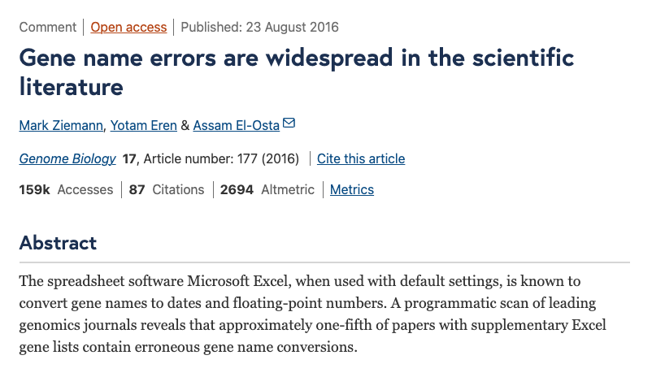
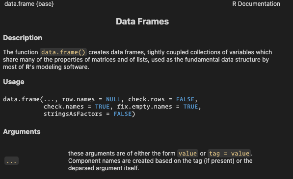

## Why code instead of spreadsheet surgery?



::: notes
[The paper](https://doi.org/10.1186/s13059-016-1044-7) captures a common problem with spreadsheet workflows: once many manual edits accumulate, the data pipeline becomes hard to inspect, explain, and reproduce. In this case, Excel rewrote certain gene codes into dates without warnings, which led to widespread errors in the genetic literature.
:::

## Programming fundamentals

Most languages revolve around a small set of ideas:

- Expressions return values
- Operators combine values
- Assignment binds names
- Types shape behavior
- Logic builds conditions
- Control flow directs execution
- Functions package reusable code

::: notes
These ideas recur across most programming languages. The syntax changes, but the underlying concepts around values, names, types, logic, and functions are broadly transferable.
:::

## Setup check

- VSCode `R` interpreter running
- `R` Script file open
- `Ctrl/cmd+enter` sends line to interpreter

::: aside
I've been testing out Positron and it seems to work well enough by now that I actually want to recommend you to try it. Lots of R features will "just work".
:::

::: notes
The key distinction is conceptual: code is written in the script editor and sent to the `R` interpreter. In VS Code, the interpreter may run inside a terminal pane, but that pane is only the interface, not the shell itself.
:::

## Moving from `Stata` to `R`

Some habits carry over; some do not:

- Not limited to one dataset in memory
- Stata commands = R functions
- Less "hand-holding", need to be more mindful about what you run
- More dependent on external packages

::: notes
The main transfer from `Stata` is conceptual rather than syntactic. Many familiar tasks still exist, but `R` makes objects, function calls, scripts, and packages much more explicit.
:::

## R fundamentals

> "Everything that exists is an object. Everything that happens is a function call."

All objects can be named, inspected, and reused.

::: notes
This slogan, attributed to John Chambers (the creator of the S language), is informal, but useful. In `R`, values, tables, functions, and model results are all objects that can be named, inspected, stored, and passed to other functions.
:::

# Expressions, Operators, And Assignment

## Arithmetic with operators

Type these in the `R` interpreter:

```{r}
#| output-location: column-fragment
12 + 3
```

```{r}
#| output-location: column-fragment
8 - 33
```

```{r}
#| output-location: column-fragment
20 / 3
```

```{r}
#| output-location: column-fragment
10^(2 + 1) - 1
```

`+`, `-`, `/`, and `^` are arithmetic operators.

::: notes
The `R` interpreter evaluates each expression and prints the resulting value. At this stage, the value is visible, but not stored under a reusable name.
:::

## Evaluation in the interpreter

- The code is an expression
- The interpreter evaluates it
- The printed result is a value
- Nothing saved yet

::: notes
This is the basic rhythm of interactive work in `R`: type an expression, let the interpreter evaluate it, inspect the result, and decide whether it is worth storing under a name.
:::

## Assignment

`<-` stores an object in memory and binds a name to it

```{r}
coffee_cups <- 3
price_per_cup <- 25
```

We can then run operations on those names:

```{r}
#| output-location: column-fragment
coffee_cups * price_per_cup
```

::: aside
You can also use `=` for assignment in R, but `<-` is the [convention](https://style.tidyverse.org/). The main reason is that `=` is also used for naming function arguments, so `<-` keeps the two uses visually distinct. However, `<-` for assignment can also cause confusion: `a < -5` (comparison to `-5`) and `a <- 5` (assignment) look similar but do very different things.
:::

::: notes
The key idea is that values exist independently of names. Assignment connects a name to the current value in memory.
:::

## Naming rules

- Must start with a letter
- Are case sensitive (`income` and `Income` are different)
- Descriptive beats short (no character limit!)

```{r}
v1 <- 100 # valid but not descriptive
annual_income <- 100 # valid and descriptive
```

```{r}
#| error: true
1a <- 1 # invalid
```

## Names can be rebound / overwritten

```{r}
#| output-location: column-fragment
result <- 3
result
```

```{r}
#| output-location: column-fragment
result <- "pass"
result
```

::: notes
Rebinding changes what the name points to; it does not mutate some permanent meaning attached to the name itself. That is why the same name can later refer to a number, a string, a table, or a function.
:::

## Reserved words

Assigning a value to these names will not work:

```R
if
else 
while 
for
TRUE 
FALSE 
NULL 
Inf 
NaN 
NA 
```

or:

```{r}
#| output-location: column-fragment
#| error: true
function <- 1
```

::: aside
For a full list of reserved names, see [here](http://stat.ethz.ch/R-manual/R-devel/library/base/html/Reserved.html).
:::

## Predefined words

Some words are in use, but not strictly reserved:

```{r}
#| output-location: column-fragment
pi
```

```{r}
#| output-location: column-fragment
pi <- 20
pi
```

```{r}
#| echo: false
rm(pi)
```

Lots of names are already taken by built-in objects and functions.

```{r}
#| output-location: column-fragment
if (T) "yes" else "no"
T <- 0
if (T) "yes" else "no"
```

Don't overwrite them.

::: notes
`T` is short for `TRUE`, but unlike `TRUE` it is not reserved. If you assign `T <- 0`, then `T` no longer means `TRUE`, which can lead to very confusing bugs. The same goes for `F` and `FALSE`.
:::

## Session memory is temporary

- Objects live in session memory
- Restart `R` -> gone
- Scripts recreate state

::: notes
This is one reason scripts matter. A script records how objects are created so the session can be rebuilt from code rather than from memory.
:::

# Objects And Types

## Objects, names, functions

Much `R` code can be read as a sequence of steps:

- Create or retrieve an object
- Bind it to a name
- Pass it to a function
- Get back another object
- Inspect when unsure

::: notes
This is a compact reading rule rather than a complete theory of `R`. It is useful because many lines can be understood as: create an object, bind it to a name, pass it to a function, and get another object back.
:::

## Example

```{r}
score <- 62
sqrt(score)
```

- `score` is a name
- `62` creates a numeric object (a `double`)
- `<-` binds that object to the name `score`
- `sqrt` is a function object
- `sqrt(score)` calls that function

::: notes
This is the recurring pattern for the course. In `R`, a function name like `mean` refers to an object. Adding parentheses, as in `mean(x)`, calls that function with an input (the object named `x`).
:::

## How is an object stored in memory?

- `typeof()` tells us

```{r}
#| output-location: column-fragment
typeof(1.0)
```

```{r}
#| output-location: column-fragment
typeof(1L)
```

```{r}
#| output-location: column-fragment
typeof(TRUE)
```

```{r}
#| output-location: column-fragment
typeof("text")
```

::: {.fragment}

Remember: everything is an object!

```{r}
#| output-location: column-fragment
typeof(typeof)
```

:::

::: notes
`typeof()` reports the underlying storage mode of an object. This matters because the storage type influences which operations are possible and how coercion behaves later.
:::


## Basic atomic types

Most beginner examples use a few basic storage types:

- `double` numbers with decimals
- `integer` whole numbers
- `logical` true / false
- `character` text

::: notes
These storage types matter because they determine which operations are valid and how values behave in vectors and tables.
:::

## `typeof()` is storage, `class()` is behavior

Storage type and class often overlap, but not always:

```{r}
#| output-location: column-fragment
today <- as.Date("2026-04-07")
typeof(today)
```

```{r}
#| output-location: column-fragment
class(today)
```

- `typeof()` = how it's stored in memory
- `class()` = what it does

::: notes
The storage type tells how the object is represented internally, while the class tells which methods and behaviors are attached to it. Dates are a good example: stored as numbers underneath, but treated as dates by many functions.
:::

## Function methods depend on class

The same function name can behave differently for different object classes:

```{r}
#| output-location: column-fragment
mean(c(1, 2, 3, 4))
```

```{r}
#| output-location: column-fragment
mean(as.Date(c("2024-01-01", "2025-01-01")))
```

- Same function name
- Different object classes
- Different methods behind the scenes

::: notes
This is one reason class matters in `R`. Many functions are generic: the printed name stays the same, but the method used depends on the class of the object supplied. Check with `methods(mean)` to see which methods are available for `mean`. Here we used `mean.default()` for the numeric vector and `mean.Date()` for the date vector.
:::

# Logic And Missingness

## Logic uses operators

We often need conditions, not just calculations:

```{r}
#| output-location: column-fragment
1 == 2
```

```{r}
#| output-location: column-fragment
1 < 2
```

```{r}
#| output-location: column-fragment
1 == 2 & 1 < 2
```

```{r}
#| output-location: column-fragment
1 == 2 | 1 < 2
```

- `==`, `<`, `>` compare
- `&`, `|` combine conditions

::: notes
Assignment is different from comparison although the symbols look similar. `=` assigns an object to a name, `==` compares two objects. Logical operators like `&` and `|` combine logical values, not numbers. The result of a logical expression is always `TRUE` or `FALSE`.
:::

## Precedence

Let's say we want to check if a variable is larger than two other variables:

```{r}
#| output-location: column-fragment
x <- 3; y <- 1; z <- 4
x > y & z
```

::: {.fragment}
Logical operators (`>`, `==`, etc) are evaluated before Boolean (`&` and `|`).

```{r}
#| output-location: column
3 > 1
```

```{r}
#| output-location: column
TRUE & 4
```
:::

::: {.fragment}
To get it right we need to be explicit:
```{r}
x > y & x > z
```
:::

::: notes
Logical operators bind tighter than Boolean operators, so `x > y & z` is parsed as `(x > y) & z`, not `x > (y & z)`. The second operand `z` (which is `4`) is then coerced to logical: R runs `as.logical(4)`, and all non-zero numbers become `TRUE`, only `0` becomes `FALSE`. This is a common source of bugs when the intended logic is not made explicit.
:::

## Decimal comparisons need care

Decimal numbers are stored as floating points (`double`), which can lead to surprising results:

```{r}
#| output-location: column-fragment
0.3 == 0.3
```

```{r}
#| output-location: column-fragment
0.1 + 0.2 == 0.3
```

::: {.fragment}
Use a tolerance-based check instead:

```{r}
isTRUE(all.equal(0.1 + 0.2, 0.3))
```

```{r}
abs((0.1 + 0.2) - 0.3) < 1e-8
```
:::

::: aside
This is not an `R` quirk; it is a general feature of floating-point arithmetic in modern programming languages. Equality checks on decimal numbers can therefore fail even when two values look the same when printed.
:::

## `!` negates a logical result

`!` flips `TRUE` to `FALSE` and `FALSE` to `TRUE`:

```{r}
#| output-location: column-fragment
!TRUE
```

```{r}
#| output-location: column-fragment
!(1 < 3)
```

- Useful for "not"
- Common in filters

## Not available = `NA`

`NA` is a **missing value indicator**

- `NA` is not zero
- `NA` is not false
- `NA` is not equal to itself!


```{r}
NA > 0
```

```{r}
NA == FALSE
```

```{r}
NA == NA
```

::: notes
Unlike Stata, missing values are not treated as very large numbers. Missingness often propagates through calculations until it is handled explicitly.
:::

## `NA` could be anything

Missingness propagates through logical operations:

```{r}
#| output-location: column-fragment
NA > 0
```

```{r}
#| output-location: column-fragment
NA & TRUE
```

But:

```{r}
#| output-location: column-fragment
NA | TRUE
```

```{r}
#| output-location: column-fragment
NA & FALSE
```

::: {.fragment}
Here, it does not matter what `NA` could be, since both `TRUE | TRUE` and `FALSE | TRUE` evalute to `TRUE`.
:::

## `is.na()` checks missingness

`is.na()` returns `TRUE` for missing values:

- `TRUE` means missing
- `FALSE` means observed

```{r}
#| output-location: column-fragment
is.na(NA)
```

```{r}
#| output-location: column-fragment
is.na(3)
```

::: notes
`is.na()` is the standard way to test for missingness. On longer objects it returns one logical result per element; that becomes especially important when working with vectors and tables.
:::

## Special values in numeric work

Some numeric operations do not return ordinary finite numbers or `NA`:

- `Inf` / `-Inf` from dividing by zero
- `NaN` from undefined numeric operations

```{r}
#| output-location: column-fragment
1 / 0
```

```{r}
#| output-location: column-fragment
0 / 0
```

::: {.fragment}
`is.na()` catches both `NA` and `NaN`, use `is.nan()` to catch only `NaN`:

```{r}
is.na(NaN)
```

```{r}
is.nan(NA)
```

```{r}
is.nan(NaN)
```
:::

::: notes
These values are easy to confuse, but they mean different things. `NA` means a value is missing, while `NaN` means a numeric calculation itself was undefined.
:::

# Control Flow

## Control flow decides what runs

- Logic creates conditions
- Control flow uses them
- Branch or repeat as needed

::: notes
Without control flow, code runs from top to bottom in a fixed order. Control-flow tools make execution depend on conditions or repetition, which is what turns isolated expressions into small programs.
:::

## `if` / `else`

Use `if` / `else` when one logical value should choose one branch:

```
if (condition) "do this" else "do that"
```

`condition` is a single logical value that determines which expression is evaluated and returned.

```{r}
#| output-location: default
if (1 == 3) "foo" else "bar"
```

::: notes
`if` / `else` is a control-flow tool: the result depends on whether a condition evaluates to `TRUE` or `FALSE`. The important restriction is that the condition must be a single logical value.
:::

## Prefer the multi-line form

```{r}
#| output-location: default
if (TRUE) {
    "yes"
} else {
    "no"
}
```

::: notes
The one-line form is valid, but the multi-line form is usually easier to read, extend, and debug. Braces and line breaks matter more once conditions and returned expressions become longer.
:::

## `for` loops repeat a block

```{r}
#| output-location: default
for (i in 1:4) {
    print(i^2)
}
```

- Repeats one recipe
- `i` takes one value at a time
- Basic control-flow tool

::: notes
A `for` loop runs the same block repeatedly while a name takes different values in turn. Here `1:4` is a short way to generate the sequence from 1 to 4.
:::

# Functions

## Why functions matter

Functions make code more reusable:

- Same recipe, new inputs
- Less repetition
- Easier testing
- Easier debugging

::: notes
Functions package a small piece of logic so it can be reused with different inputs. This is one of the main ways programming scales beyond one-off commands typed directly into the interpreter.
:::

## Functions: inputs and output

A function call passes inputs to a function and returns an object:

```{r}
#| output-location: column-fragment
sqrt(16)
```

```{r}
#| output-location: column-fragment
abs(-12)
```

```{r}
#| output-location: column-fragment
round(pi)
```

::: notes
When a function is called, `R` evaluates the call and produces a result. Result can be printed or just stored. In simple cases it helps to think of the arguments being matched to the function's parameter names and the function body then being evaluated with those values.
:::

## Function call structure

```{r}
round(pi, digits = 3)
```

- `round` is the function
- `pi` is the first argument
- `digits = 3` names another argument
  - digits is an optional argument with a default of `0`
- The call returns `3.142`
- The return value is printed

::: notes
This example separates five ideas that are easy to blur together: the function object itself, the values passed in, the names of optional arguments, and the value returned by the call. That distinction carries over directly to other programming languages.
:::

## Functions are objects too

```{r}
#| output-location: column-fragment
typeof(mean)
```

```{r}
#| output-location: column-fragment
class(mean)
```

::: notes
Functions are ordinary objects in `R`: they can be inspected, named, stored, and then called with arguments.
:::


## Creating a function

`function()` creates a new function object:

```{r}
#| output-location: default
add_bonus <- function(score, bonus = 5) {
    score + bonus
}
```

- Name on the left
- **Arguments** inside `function(...)`
- Returned expression inside `{ ... }`

::: notes
The function definition creates a new function object and stores it under the name `add_bonus`. When the function is called, `score` and `bonus` are bound to the supplied arguments, and the expression inside the body is evaluated. Here the returned value comes from the last expression, `score + bonus`.
:::

## Named and default arguments

Inside function calls `=` names an argument.

Functions can also provide defaults:

```{r}
#| output-location: default
add_bonus <- function(score, bonus = 5) {
    score + bonus
}

add_bonus(55)
```

```{r}
#| output-location: default
add_bonus(55, bonus = 10)
```

::: notes
Default arguments make a function easier to reuse because common choices do not have to be repeated every time. Naming an argument inside the call makes it explicit which parameter is being changed.
:::

## Arguments

Myfunc takes two arguments, `v1` and `v2`, and returns the larger of the two. `v2` has a default value of `5`, so if it is not supplied, the function will compare `v1` to `5`.

```{r}
#| output-location: default
myfunc <- function(v1, v2 = 5) {
    max(v1, v2)
}
```

```{r}
#| output-location: column-fragment
#| error: TRUE
myfunc(1,2)
```

```{r}
#| output-location: column-fragment
#| error: TRUE
myfunc(1,2,3)
```

```{r}
#| output-location: column-fragment
#| error: TRUE
myfunc(c(1,2))
```

::: fragment
The last call returns `5` and not `2` because the whole `c(1,2)` is supplied for `v1` and no object is supplied for `v2`.
:::

## Scoping: functions use "local" names

```{r}
#| output-location: default
x <- 10
show_local <- function() {
    x <- 20
    x
}
c(show_local(), x)
```

- Function call creates local names
- Local assignment stays local
- Outer name unchanged

::: aside
`x <- 10` assigns `10` to the name `x` in the **global environment**. In a sense, all global environment objects are like "globals" in Stata. When `show_local()` runs, it creates a new local name `x` that is separate from the global `x`. The assignment `x <- 20` changes the local `x`, but does not affect the global `x`.
:::

## Where does `R` look for a name?

```{r}
#| output-location: default
x <- 10
add_outer_x <- function(z) {
    z + x
}
add_outer_x(5)
```

- Function arguments and local names first
- Then surrounding names
- If still missing: `object 'name' not found`
- Convenient but bug prone
  - **Pass all used objects as arguments**

::: notes
R first looks for a name inside the function call itself, then outward to surrounding environments. That is useful, but it also creates a common failure mode: code silently depends on an outer object that was never passed as an argument, or errors because the author assumed a name would already exist.
:::

## You need to tell `R` where to look

```{r}
#| output-location: default
toy_df <- data.frame(
    x = c(1, 2, 3),
    y = c(2, 4, 5)
)
```

```{r}
#| echo: false
rm(y, x)
```

```{r}
#| error: true
#| output-location: column-fragment
lm(y ~ x)
```

```{r}
#| output-location: column-fragment
coef(lm(y ~ x, data = toy_df))
```

- `x` and `y` are column names inside `toy_df`
- `lm(y ~ x)` looks for objects named `x` and `y`
- `data = toy_df` tells `R` where to look

::: notes
A common error, especially when coming from Stata. The formula uses the column names, but those names live inside the table rather than in the global environment. Passing `data = toy_df` tells the function to evaluate the formula inside that data frame instead of in the global environment.
:::

# Packages, Comments, Errors, and Help

## Packages extend `R`

Packages add functions, datasets, and tools:

```r
install.packages("ggplot2")
library(ggplot2)
```

- Install once
- Load when needed
- Read package documentation

::: notes
Base `R` already does a lot, but packages are a central part of the language. Most real projects use a mix of base functions and contributed packages.
:::

## `package::function()` syntax

This pattern makes the source of a function explicit:

```r
readr::read_csv("data.csv")
stats::filter(x, rep(1 / 3, 3))
```

- Avoid name conflicts
- Clarify provenance

::: notes
Different packages can export functions with the same name. Writing `package::function()` avoids ambiguity and makes it clear which implementation is being used.
:::

## Comments start with `#`

Comments are text for humans. The interpreter ignores them:

```r
# myfunc(x, y) returns largest number of v1 and v2
myfunc = function(v1, v2) max(v1, v2)
```

- Add intent
- Add context
- Add warnings when needed
- Use comments to get code suggestions from Copilot

::: {.fragment}
**But**: "Good code explains itself"
```r
return_largest_number = function(v1, v2) max(v1, v2)
```
:::

::: notes
Comments are useful when they explain intent, assumptions, or gotchas that are not obvious from the code itself. They are not part of the computation.
:::

## Prefer comments that add context

```r
# Less helpful:
# Calculate the mean
m <- mean(x, na.rm = TRUE)

# Better:
average_non_missing <- mean(x, na.rm = TRUE)
```

- Clear names first
- Comments for context
- Avoid narrating obvious code

::: notes
Self-explanatory names do most of the work. Comments are most useful when they explain why something is done, not simply what a line already says.
:::

## Pipes (`|>`) make code easier to read

```{r}
#| output-location: default
mean(c(seq(0, 10), rep(NA, 10)), na.rm = TRUE)
```

is the same as 

```{r}
#| output-location: default
seq(0, 10) |> 
  append(rep(NA, 10)) |> 
  mean(na.rm = TRUE)
```

- Piped content enters the first argument of the next function
- Avoids nested parentheses
- Reads left to right
- Still a function call, just different syntax

## A quick intro to figuring out what went wrong

- Read the error
- Check names
- Print object
- Check type / class
- Get help

::: notes
We'll cover debugging in more depth later, but these are the main steps to take when an error occurs. The key is to read the error message carefully and then use tools like `exists()`, printing, and checking types to understand what went wrong.
:::

## Read the error

```{r}
#| error: true
my_data <- data.frame(a = c(1, 2), b = c(3, 4))
my_dat[1]
```

::: {.fragment}
- `my_data` exists
- `my_dat` does not
:::

::: notes
The important habit is to read the error literally before guessing at a fix. In this example the problem is not indexing syntax or object type; it is simply that the name in the second line does not match the name that was created.
:::

## Understand the error

```{r}
#| error: TRUE
#| output-location: column-fragment
dat = data.frame(a = c(1,2),
                 b = c(3,4))
data[1]
```

::: {.fragment}
!?!?
:::

::: {.fragment}
```{r}
typeof(data)
```

```{r}
typeof(dat)
```

Learning to read error messages will help you find coding errors.
:::

::: {.aside}
Talk on this famous error: <https://posit.co/resources/videos/object-of-type-closure-is-not-subsettable/>
:::

## Check names

```{r}
#| output-location: column-fragment
exists("my_data")
```

```{r}
#| output-location: column-fragment
exists("my_dat")
```

- Exact spelling matters
- One letter can break the code

::: notes
Many early errors are simple naming problems. Before changing code, check whether the object name being used actually exists in memory.
:::

## Print object

```{r}
#| output-location: default
my_data
```

- Check visible values
- Check obvious surprises

::: notes
Printing the object is often the fastest way to catch a wrong value, a wrong shape, or a mistaken assumption about what the object contains.
:::

## Check type / class

```{r}
#| output-location: column-fragment
typeof(my_data)
```

```{r}
#| output-location: column-fragment
class(my_data)
```

- Storage and behavior both matter
- Different objects support different operations

::: notes
An expression may fail simply because the object is not the kind of thing the code expects. Checking both `typeof()` and `class()` helps narrow that down.
:::

## Get help

- `?mean`
- `?data.frame`
- `args(mean)`
- `example(plot)`



::: notes
Help pages describe what a function does, what arguments it accepts, and what kind of object it returns. `args()` is a quick way to inspect the argument names without reading the full help page. `example()` runs the examples from a help page, which is often a fast way to see a function in action.
:::

## Package docs and vignettes

Package documentation is often the best starting point:

```r
help(package = "ggplot2")
vignette(package = "ggplot2")
```

- Help page for the package
- List available vignettes

::: notes
Function help pages answer small local questions. Vignettes are better when the goal is to understand a package's overall workflow, conventions, and typical usage patterns.
:::

## Main takeaways

- Expressions return values
- Assignment creates reusable names
- Types shape behavior
- Logic is explicit
- Control flow shapes execution
- Functions package reusable work
- Packages extend the language
- Help and errors are part of the workflow

## Next lecture: Vectors, Tables, and Tidy Thinking
