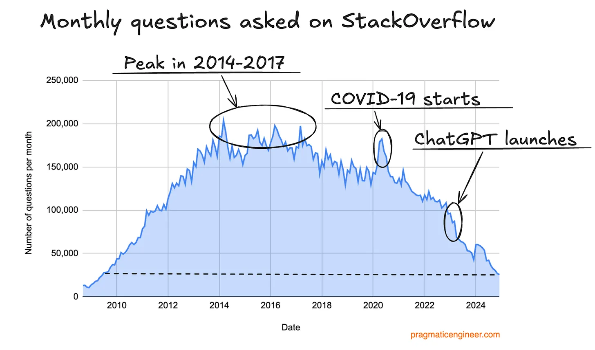
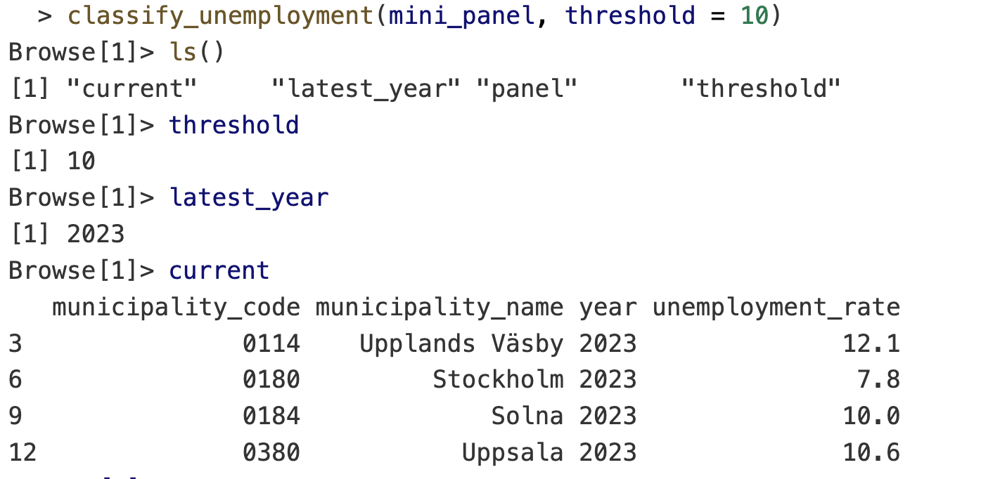
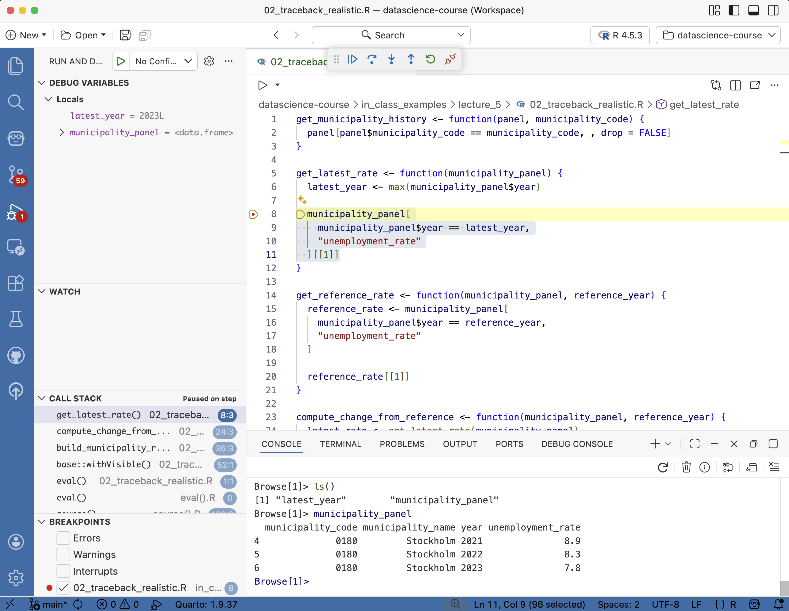
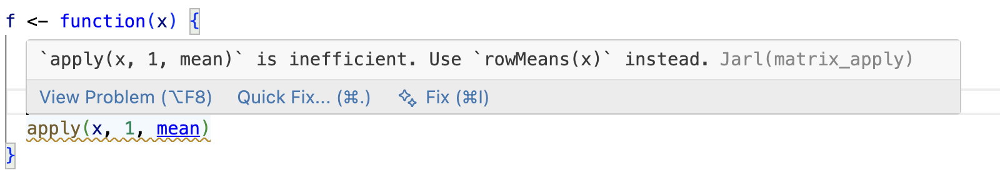
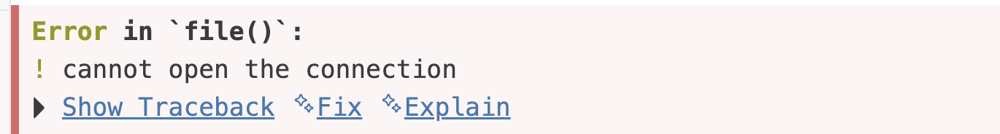

```{r}
#| echo: false
options(width = 90)
project_root <- here::here()
lecture_example_dir <- file.path("in_class_examples", "lecture_5")
knitr::opts_knit$set(root.dir = project_root)
mini_panel <- read.csv(
  file.path(project_root, lecture_example_dir, "data", "mini_panel.csv"),
  colClasses = c(municipality_code = "character")
)

show_file <- function(path, lang = "r") {
  lines <- readLines(path, warn = FALSE)
  comment_prefix <- switch(
    lang,
    r = "# ",
    py = "# ",
    sh = "# ",
    bash = "# ",
    md = "<!-- ",
    "# "
  )
  comment_suffix <- if (identical(lang, "md")) " -->" else ""

  if (identical(lang, "r")) {
    lines <- lines[!grepl("^\\s*#", lines)]

    while (length(lines) > 0 && trimws(lines[1]) == "") {
      lines <- lines[-1]
    }

    while (length(lines) > 0 && trimws(lines[length(lines)]) == "") {
      lines <- lines[-length(lines)]
    }
  }

  cat(
    paste0(
      "```", lang, "\n",
      comment_prefix, path, comment_suffix, "\n",
      paste(lines, collapse = "\n"),
      "\n```\n"
    )
  )
}

show_code <- function(code, lang = "r") {
  cat(
    paste0(
      "```", lang, "\n",
      paste(code, collapse = "\n"),
      "\n```\n"
    )
  )
}

run_bad_file <- function(path, echo = FALSE, output = TRUE, traceback = FALSE) {
  if (echo) {
    show_file(path)
  }

  if (!output && !traceback) {
    return(invisible(NULL))
  }

  path <- normalizePath(path, winslash = "/", mustWork = TRUE)
  expr <- paste0(
    "old_error <- getOption(\"error\"); ",
    "on.exit(options(error = old_error), add = TRUE); ",
    "options(error = function() traceback(2)); ",
    "source(", encodeString(path, quote = "\""), ", chdir = TRUE)"
  )

  out <- system2(
    "Rscript",
    c("-e", shQuote(expr)),
    stdout = TRUE,
    stderr = TRUE
  )

  error_start <- grep("^Error", out)[1]
  traceback_start <- grep("^(Calls:|[0-9]+: )", out)[1]

  error_lines <- character()
  traceback_lines <- character()

  if (length(out) > 0) {
    if (is.na(error_start)) {
      error_lines <- out
    } else {
      error_end <- if (is.na(traceback_start)) length(out) else traceback_start - 1
      error_lines <- out[seq.int(error_start, error_end)]

      if (!is.na(traceback_start)) {
        traceback_lines <- out[seq.int(traceback_start, length(out))]
      }
    }
  }

  if (identical(knitr::opts_current$get("results"), "asis")) {
    opts <- knitr::opts_current$get()
    opts$results <- "markup"
    hook <- knitr::knit_hooks$get("output")

    render_output <- function(lines) {
      if (length(lines) == 0) {
        return(invisible(NULL))
      }

      cat(hook(paste0(paste(lines, collapse = "\n"), "\n"), opts))
    }

    if (output) {
      render_output(error_lines)
    }

    if (traceback) {
      show_code("traceback()")
      render_output(traceback_lines)
    }
  } else {
    lines_to_show <- c(
      if (output) error_lines,
      if (traceback) traceback_lines
    )

    if (length(lines_to_show) > 0) {
      writeLines(lines_to_show)
    }
  }

  invisible(out)
}
```

## Today

- Why code breaks and what to do about it
- How to fail early
- Getting coding assistance from your IDE and agents

## Why this lecture now

- The hard part is no longer just writing code
- The hard part is keeping track of objects, files, assumptions
- This is where people start wasting hours
- Good workflow habits are cheap

## Positron

- We will be using [Positron](https://positron.posit.co/) today, because of its built-in debugger.
- Positron is a VS Code fork, so it will look familiar.
- If you prefer to stay with VS Code you can use the [R Debugger extension](https://marketplace.visualstudio.com/items?itemName=RDebugger.r-debugger) but it can be a bit finicky to get going.

# Errors everywhere

## Errors everywhere

Programming is a process of constant errors.

## Getting unstuck

```
Error in if (x) { : missing value where TRUE/FALSE needed
```

```
Error: object 'panel_2023' not found
```

```
Error in library(httr2) : there is no package called 'httr2'
```

```
Error in [ : subscript out of bounds
```

Your job: debug the code and find the *bad assumption*.

## *Running* code is not necessarily *working* code

- Errors stop the script (good!)
- But bad assumptions do not always cause errors
- A silent bug is much worse
- In data work, incorrect output can still look great

## Debugging is a loop

1. Reproduce the problem
2. Isolate the first bad step
3. Inspect what exists now
4. Compare expected versus actual
5. Change one thing
6. Retry

## Make it repeatable and small

- Get to one command or one script that fails every time
- Strip away code that is not part of the problem
- Keep the failing example fast to rerun
- Pay attention to inputs that fail and inputs that do not
- Small, repeatable bugs are much easier to debug and share

## What to inspect first

- What file or object is this line using?
- What class does the object have?
- What values do I actually have?
- Which line first creates something surprising?
- What changed since the last time this worked?

## Useful inspection commands

```r
str(x)               # structure: type, dimensions, first values
class(x)             # what type of object?
head(x)              # first rows
names(x)             # column names
dim(x)               # rows × columns
```

`str()` is probably the most useful inspection command in R.

::: aside
When inspecting large objects with `str()` use its second argument `max.level` to control how deep it goes. For example, `str(x, max.level = 1)` will show the top-level structure without going into nested details.
:::

## Remember to start a clean session

- Restart R to clean the slate
- Rerun the script from the top
- If it works in a clean session, it is more likely to be truly fixed

## Don't use `.RData`

R offers to save your workspace on exit and reload it on startup

- Objects from last week's session silently reappear
- This is the top cause of "huh, this worked before?"

**Turn it off.**

::: {.aside}
In RStudio, go to Tools → Global Options → General, and set "Save workspace to .RData on exit" to "Never". Positron already defaults to off. To disable globally (including in VS Code), you could replace `q()` in your `.Rprofile` with:
```r
q <- function(save = "no", ...) quit(save = save, ...)
```
:::

## Example 1: Selecting a data frame column

```{r}
#| output-location: default
col_subset <- mini_panel[mini_panel$year == 2023, "unemployment_rate"]
```

Let's inspect:

```{r}
names(col_subset)
```

```{r}
class(col_subset)
```

```{r}
str(col_subset)
```

- Selecting a single column returns a vector
- An issue if you expected a data frame

## Example 1: Selecting a data frame column (cont.)

`drop = FALSE` forces R to keep the data frame structure:

```{r}
col_subset_df <- mini_panel[
  mini_panel$year == 2023,
  "unemployment_rate",
  drop = FALSE
]
```

```{r}
names(col_subset_df)
```
```{r}
is.data.frame(col_subset)
```
```{r}
is.data.frame(col_subset_df)
```

## Asking for help

Sometimes you cannot figure out or resolve the error on your own.

I was planning on talking about Stack Overflow here, but...

## Asking for help (from robots)

{.r-stretch}

Just ask an LLM instead - I'll teach you how in a few slides!

::: attribution
https://blog.pragmaticengineer.com/stack-overflow-is-almost-dead/
:::

# Debugging

## Debugging tools

- Simple issues can be debugged by printing and inspecting
- For more complex problems, R provides powerful debugging tools:
  - `traceback()` to see the call stack after an error
  - `browser()` to step through code interactively
  - `debug(FUN)` to run `browser()` on `FUN()` calls

::: aside
We use `traceback()` to find *where* the error happened and `browser()` (or `debug()`) to inspect *what* is going on at that point.
:::

## Example 2: A simple `traceback()`

```{r}
#| echo: false
#| results: asis
run_bad_file(
  file.path(lecture_example_dir, "01_traceback_test.R"),
  echo = TRUE,
  output = TRUE
)
```

## Reading a traceback

- `traceback()` prints the *call stack*
- One row per function call, starting with the most recent

The error message tells you **what** went wrong; the traceback helps you locate **where** the error occurred.

## Example 2: A simple `traceback()` (cont.)

```{r}
#| echo: false
#| results: asis
run_bad_file(
  file.path(lecture_example_dir, "01_traceback_test.R"),
  output = FALSE,
  traceback = TRUE
)
```

## Example 3: A more realistic `traceback()`

```{r}
#| echo: false
#| results: asis
run_bad_file(
  file.path(lecture_example_dir, "02_traceback_realistic.R"),
  echo = TRUE,
  output = TRUE
)
```

::: notes
I'll go through the code and error live in class. This example shows how traceback() can actually help finding the bad assumption when the error message in itself it not informative enough.
:::

## Example 3:  A more realistic `traceback()` (cont.)

```{r}
#| echo: false
#| results: asis
run_bad_file(
  file.path(lecture_example_dir, "02_traceback_realistic.R"),
  output = FALSE,
  traceback = TRUE
)
```

## After traceback: inspection

- `traceback()` shows you where the error happened
- Especially useful with nested (custom) function calls
- Next step: inspect the state at that point
- Simple version: `print()` objects at critical lines inside functions
- Advanced version: use `browser()` to step through the code interactively

::: aside
Both `print()` and `browser()` have their use! `print()` is quick and good for a few checks, while `browser()` is more powerful for stepping through complex code. You can start with `print()` and switch to `browser()` when you need more control.
:::

## A broken function

```{r}
#| output-location: default
classify_unemployment <- function(panel, threshold = 10) {
  latest_year <- max(panel$year)
  current <- panel[panel$year == latest_year, ]

  current$risk_group <- ifelse(
    current$unemployment_rate <= threshold,
    "high",
    "low"
  )
  current
}
classify_unemployment(mini_panel, threshold = 10)
```

Notice anything wrong?

::: aside
Silent bugs are much harder to detect. Most bugs are silent, but in a few slides we will talk about fail loudly to catch them.
:::

## Use `browser()` to step through the code interactively

Drop a call to `browser()` into the function where things look suspicious. When R hits it, execution pauses and the prompt changes to `Browse[1]>`. From there:

- `n`: next expression
- `s`: step into (function)
- `f`: finish current function
- `c`: continue until the end or the next breakpoint
- `Q`: quit

{.r-stretch}

::: notes
I'll show how to use `browser()` in class, to step through the code and inspect variables. Try it on your own. You see that you are in the browser because the prompt changes to `Browse[1]>`. When it does, you can use the commands above, e.g. writing `n` and pressing enter to execute the next line of code. You can also inspect variables by just typing their name and pressing enter, e.g. `latest_year` to see its value.
:::

## Enter the browser on a function call: `debug()`

- `debug(<function_name>)` browses the function every time it's called
- `debugonce(<function_name>)` enters `browser()` only on the next call
- `undebug(<function_name>)` turns debugging off

::: aside
Forgetting `undebug()` is a common footgun, default to `debugonce()` if you just want an interactive pass through the function.
:::

## IDE debugger

- VS Code, Positron, and RStudio all have built-in debuggers
- GUI + breakpoints instead of `browser()` calls. Same underlying tools.

{.r-stretch}

::: aside
Positron and RStudio come with built-in R debugging. To get debugging in VS Code, you need to install the [R Debugger extension](https://marketplace.visualstudio.com/items?itemName=RDebugger.r-debugger). It can be a bit finicky which is why I recommend you use Positron for this lecture.
:::

::: notes
The debugger interface might feel intimidating at first, but once you are used to it it is really helpful!
:::

## A useful fallback: `recover`

```r
options(error = recover)
```

- Good when you are unsure where the error is happening
- On error, R shows the call stack and lets you inspect

::: aside
When you are done, set `options(error = NULL)` to reset the error behavior to the default.
:::

# Pre-empt the bugs: fail usefully

## Fail early and loudly

Do you know what the code is supposed to do? Why not verify that it actually does?

- Adding checks, errors, messages, assertions, and tests is a cheap way to catch problems early.

::: aside
We'll focus on `stop()`, `warning()`, and `message()` here, but there are also packages like `assertr`/`validate` for more formal checks and `testthat` for unit testing. See the extra slides for a brief introduction to these tools.
:::

## `stop()`, `warning()`, `message()`

Use:

- `stop()` to generate error
- `warning()` to warn about risky state
- `message()` to inform about progress

```{r}
#| message: true
panel_path <- file.path("data", "mini_panel.csv")
message("Reading ", panel_path)
```

```{r}
#| error: true
if (!file.exists(panel_path)) {
  stop("Can't find ", panel_path)
}
```

```{r}
#| warning: true
if (anyNA(c(mini_panel$municipality_code, NA))) {
  warning("Some municipality codes are missing")
}
```


## Turn warnings into errors

```r
options(warn = 2)
```

- Temporarily turns warnings into errors
- Useful when a warning is the first visible sign of a real problem
- Then you can use the usual traceback and debugger tools

::: aside
Reset with `options(warn = 0)` afterwards.
:::

## Conditional `browser()`

```r
classify_unemployment <- function(panel, threshold = 10) {
  latest_year <- max(panel$year)
  current <- panel[panel$year == latest_year, ]

  if (threshold < 0) {
    browser()
  }

  current$risk_group <- ifelse(
    current$unemployment_rate <= threshold, "high", "low"
  )
  current
}
```

- Useful when the bad case is rare
- Like in a loop where only certain iterations are problematic

## Put checks in the code


```r
required <- c("municipality_code", "year", "unemployment_rate")
missing <- setdiff(required, names(panel))
if (length(missing) > 0) {
  stop("Missing columns: ", paste(missing, collapse = ", "))
}
```

Issue `stop()` or `warning()` when:

- Required columns are missing
- Key columns have duplicates
- Values are not in a plausible range
- Missing values appear where they should not
- Row counts collapse or explode
- Input file paths are wrong

## Municipality panel checks

- Municipality code should not disappear
- Year should stay in the expected range
- Unemployment rate should not be negative
- Keys should not duplicate by accident
- Filters should not silently return zero rows unless that is expected

## Debugging versus testing

:::: {.columns}
::: {.column width="50%"}
**Debugging**

- Manual
- Find out why this failed now
- Trace the first bad assumption
- Inspect current state
- Fix the immediate bug
:::
::: {.column width="50%"}
**Testing**

- Automatic
- Catch the same bug earlier
- Use known inputs
- Verify expected outputs
:::
::::

After a bug fix, add the smallest check that would have caught it earlier.

# IDE code assistance

## Code formatting with Air

- Air cleans up your code on save.
- Consistent indentation, spacing, line breaks
- Air extension in Positron or VS Code

```r
# before
df<-read.csv( "data.csv" );summary(df[ ,c("x","y") ])

# after
df <- read.csv("data.csv")
summary(df[, c("x", "y")])
```

::: aside
[Air](https://posit-dev.github.io/air/formatter.html) is really new. There is an older (and much slower) code formatter called `styler` that you can use if Air does not work.
:::

## Code linting with Jarl

- Flags suspicious patterns *before* you run the code.
- Catches what errors and tests won't:
  - `any(is.na(x))` → suggests the faster `anyNA(x)`
  - Unreachable code after `return()`, `stop()`, or `break`
- Jarl extension in Positron or VS Code
- Air makes code *look* consistent, Jarl makes it *behave* better

{.r-stretch}

::: aside
Jarl is even newer, and in active development. If you want a more robust option (that is a lot slower), use `lintr` instead.
:::

## AI-assisted code completions

- Start writing code and `Copilot` suggests the rest in grey
- `Tab` to accept, `Esc` to dismiss, or keep typing and the suggestion adapts
- Suggestions use the whole file as context, not just the current line
- Comments steer what you get:

```r
# read your_file.csv from raw_data
```

gives you a suggestion like:

```r
read.csv("raw_data/your_file.csv")
```

## Inline Copilot interactions

- Highlight code and click the `💡` (or press `Cmd/Ctrl + I`) to ask Copilot to **modify** or **review**
- On R console errors, the Positron assistant can suggest a fix:

{.r-stretch}

## From completions to agents

- **Completions** suggest the next line. You stay in control of every keystroke.
- **Agents** run multi-step tasks: read files, write files, run commands, loop until done.
- Same underlying models — the difference is how much rope you give them.

# Agentic development

## What is an AI agent?

A language model given **tools**: read files, write files, run commands, read the output — then loop.

- Copilot agent mode in VS Code / Positron (free with GitHub Education)
- Paid standalones: Claude Code, OpenAI Codex, Cursor
- Recent revolution: models have not changed; their *harness* has

::: aside
**Harness** = the code that lets the model call tools and read their results. A model that can run your tests is qualitatively different from one that cannot.
:::

## Working with agents: what changes

- **Commit more often.** Every agent session starts from a clean diff you can throw away
- **Scope each task.** One file, one fix — not "refactor the project"
- **Read the diff.** Every line. Don't merge what you can't explain
- **Close the loop with checks.** Tests, `air`, `jarl`, CI — the agent sees failures and corrects itself

## Context is everything

:::: {.columns}
::: {.column width="50%"}
**Vague**

```text
Fix this traceback.
```
:::
::: {.column width="50%"}
**Scoped**

```text
In 02_traceback_realistic.R, explain
why get_reference_rate() fails for
reference_year = 2020 and propose the
smallest fix. Don't rewrite the script
or add packages.
```
:::
::::

Good context has four parts: 

- the file
- the error
- the expected output
- a stop point

Under the hood, agents are just LLMs in a loop — their reasoning is only as good as the context you give them.

## `AGENTS.md`: house rules for the repo

Agents read instruction files before acting. Tell them which packages you prefer, how the code is structured, how to run the tests.

```{r}
#| echo: false
#| results: asis
show_file(file.path(lecture_example_dir, "agent-example", "AGENTS.md"), lang = "md")
```

## Point the agent at the right files

`AGENTS.md` doesn't have to say everything — it can point.

```md
- Data dictionary: `data/README.md`
- Style conventions: `docs/style.md`
- Run the full pipeline: see `Makefile`
```

- Keeps the root file short and scannable
- Agent loads detail only when the task needs it
- Think of it as a table of contents for the repo

## Agents read text like humans do

- No special format required — READMEs, source, CSV headers, `.Rprofile`
- A good comment or docstring helps both your teammate *and* the agent
- The flip side: outdated or misleading docs mislead the agent too
- Write for humans first; agents come along for free

## Skills: packaging repeatable tasks

A **skill** is a reusable bundle of instructions (± helper scripts) for a specific workflow the agent should run the same way every time.

- "Open a PR the way we like it"
- "Check register metadata before writing a query"
- "Format, lint, run tests, then commit"

The agent picks up the skill when the task matches — you stop re-explaining the same workflow in every prompt.

::: aside
Copilot and Codex both support putting skills in a `.agents/skills` folder in the project repo; Claude requires `.claude/skills/`. The structure follows an [open standard](https://github.com/agentskills/agentskills) with a subfolder for each skill, at least containing a `SKILL.md` witht basic instructions.
:::

## GitHub Issues and PRs: a systematic review surface

- **Issue** = contract: what "done" looks like, and a good home for agent instructions
- **Pull request** = diff: line-by-line review, the place to reject bad edits

## Never paste secrets into AI tools

- API keys, passwords, credentials
- Private or unpublished data
- Anything you wouldn't send on Slack or push to GitHub

Assume anything you paste may be logged or used for training.

## Before you accept the diff

1. Commit your own work first — cheap rollback
2. Open the diff and read every line
3. Run the code
4. Confirm package and function names actually exist (hallucination check)
5. Reject large edits that solve the wrong problem
6. If you can't explain it, don't submit it

::: aside
A reviewable diff beats a vague memory of what changed, even when you're working alone.
:::

## Live AI demo

- Ask Copilot to explain the traceback in `01_traceback_test.R`
- Ask for the smallest fix, not a rewrite
- Ask for one guard that prevents the same mistake next time
- Review the diff before accepting anything

## Next lecture: Data Wrangling I

## Extra: data validation with `assertr`

*Fail-fast style.* Halts the pipeline on the first bad row.

```r
library(assertr)

mini_panel |>
  verify(has_all_names("municipality_code", "year", "unemployment_rate")) |>
  assert(within_bounds(0, 100), unemployment_rate) |>
  assert(not_na, year)
```

- `verify()`: one logical expression — row counts, column names
- `assert()` / `insist()`: predicate / data-driven bounds per column
- Error points at the offending rows

::: aside
Same idea as the `if (!all(...)) stop(...)` pattern from earlier, but pipe-native.
:::

## Extra: data validation with `validate`

*Report style.* Define rules, confront the data, inspect — nothing crashes.

```r
library(validate)

rules <- validator(
  year_range   = year >= 2000 & year <= 2025,
  unemp_bounds = unemployment_rate >= 0 & unemployment_rate <= 100,
  no_dupes     = is_unique(municipality_code, year)
)
summary(confront(mini_panel, rules))
```

- Rules are objects: store, reuse, keep in a YAML file
- Pass/fail report per rule instead of stopping

::: aside
`assertr` when bad data should *break* the pipeline. `validate` when you want to *measure* data quality — better for recurring audits on register data.
:::

## Extra: unit tests and `testthat`

Validation checks *data*. Tests check *code*. Remember the silent bug in `classify_unemployment()`?

```{r}
#| error: true
#| output-location: default
library(testthat)

test_that("high unemployment is classified as high risk", {
  panel  <- data.frame(year = 2023, unemployment_rate = 15)
  result <- classify_unemployment(panel, threshold = 10)
  expect_equal(result$risk_group, "high")
})
```


## Extra: unit tests and `testthat` (cont.)

- After each bug fix, add the smallest test that would have caught it
- Run with `testthat::test_file()` — works in plain projects, not just packages
- Tests are documentation: they show how the function is supposed to be used and what it should return
- Really useful when you have an agent making edits: ask the agent to write a test that would have caught the bug before accepting the fix

::: aside
`usethis::use_testthat()` scaffolds `tests/testthat/`. Common expectations: `expect_equal()`, `expect_true()`, `expect_error()`.
:::

## Extra: continuous integration (CI)

Automatic checks on every change. Like a spell-checker for your code, but it can run tests and linters too.

- GitHub Actions is the standard for R — free for public repos
- You actually already experienced the auto-grading CI in PS1
- Configure it to run on every push or pull request
- `usethis::use_github_action("check-standard")` for packages

::: aside
Another way for agents to self-correct and to catch errors before they reach production: a failing check blocks deployment and is a signal for the agent to fix something.
:::