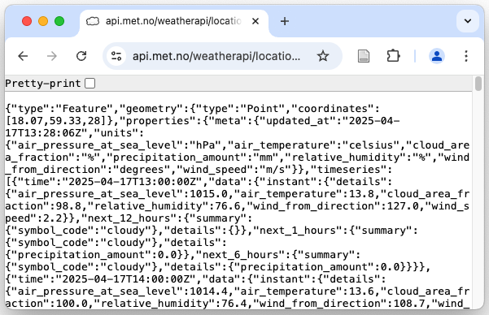
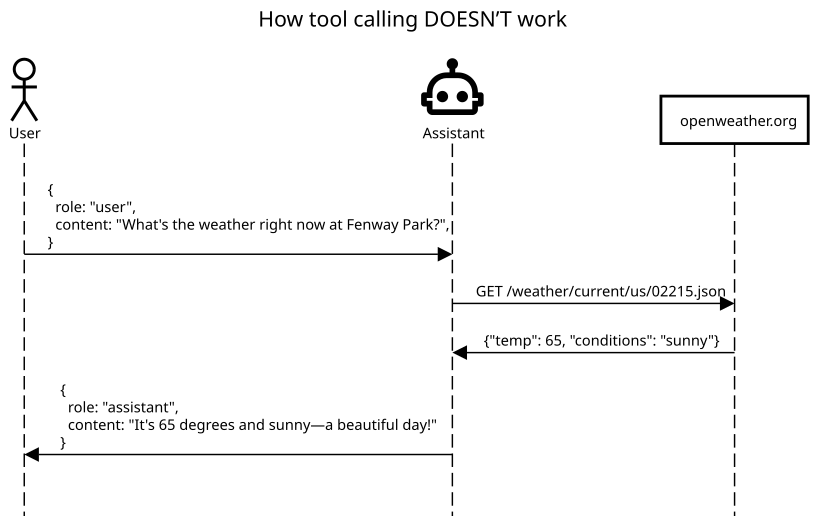
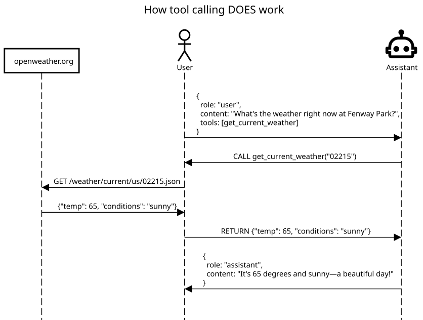

# Introduction {background-color="#40666e"}

```{r}
#| echo: false
#| message: false
#| warning: false
# Basic setup chunk

# Load necessary packages
library(data.table)
options(width = 300) #default 80
```

## Introduction

This lecture is about using code to interface with systems outside your own computer.

```{r}
#| output-location: default
library(ellmer)
chat = chat_gemini(
  model = "gemini-2.5-pro-exp-03-25",
  system_prompt = "You are my teaching assistant in a course on Data Science for
  Economists. You are an expert on data science and R programming. Your responses
  are terse but pedagogical, engaging, and informative, with no comments or formatting."
)
```

```{r}
#| output-location: fragment
chat$chat("Write 1 sentence for a slide on using LLM APIs.")
```

::: {.aside}
I'm using the very new Gemini 2.5 Pro here that is available for free from Google during its experimental phase. But Google uses your data for training.
:::

## Ellmer and R

[`ellmer`](https://ellmer.tidyverse.org/index.html) is a new R package for interacting with AI chatbots:

```{r}
chat$extract_data(
  "I'm your teacher. My name is Adam,
  I'm 36 years old. I live in Sweden
  in a city called Stockholm.",
  type = type_object(
    name = type_string("Name"),
    age = type_number("Age in years"),
    city = type_string("City of residence"),
    country = type_string("Country of residence.")
  )
)
```

Useful, huh? Before we get back to how to use LLMs for data science, I want to teach you a couple of other relevant concepts.

# Application Programming Interfaces {background-color="#40666e"}

## What is an API?

- **A**pplication **P**rogramming **I**nterface
- A structured way for software systems to communicate
- Specifies rules for requests and responses
- Allows controlled access to functionality or data
- We will focus on online data access APIs, but e.g. Apple provides an API for developers who want to add a save file window to their app.

## Like a restaurant menu

- Menu (API) describes what's on offer
- You tell the system what you want, no need to understand how the food is cooked
- API documentation defines the "menu" (available actions/data) and how to "order" (request format)

## Web APIs & REST
- Most common type: APIs accessed over the web (HTTP/S)
- REST (REpresentational State Transfer)
  - Common architectural style for building web APIs
  - Stateless=the API does not keep track of you, each request needs to contain all information
  - Uses standard HTTP methods

## Key REST Concepts

- **Resources:** The "things" the API exposes (users, tweets, weather data)
  - Identified by **URLs** (Uniform Resource Locators)
- **HTTP Methods:** Verbs defining actions on resources
  - GET: Retrieve data
  - POST: Create new data
  - PUT / PATCH: Update existing data
  - DELETE: Remove data
- **Representations:** Format of data exchanged
  - **JSON** is dominant
  - XML sometimes used

## Anatomy of an API request URL

```
https://api.example.com/v1/forecast?lat=59.3&lon=18.1&current=true
\_____________________/\_/\________/ \____________________________/
       Base URL        Ver Endpoint         Query Parameters
```

- Base URL: Core address of the API service
- Endpoint: Path to the specific resource (e g , `/forecast`, `/users`)
- Query Parameters: Key-value pairs after `?`, separated by `&`
  - Filter, sort, specify request details

## HTTP headers

- Additional metadata sent with requests/responses
- Not part of the URL
- Common uses:
  - Authentication (e.g. API key) (`Authorization: Bearer ...`)
  - Set request format (`Content-Type: application/json`)
  - Ask for response format (`Accept: application/json`)

::: {.aside}
We will not have time to cover API calls using headers, but the [httr2 vignette](https://httr2.r-lib.org/articles/wrapping-apis.html) has some great examples.
:::

## Most used data output format: JSON

```json
{
  "city": "Stockholm",
  "location": {
    "latitude": 59.3293,
    "longitude": 18.0686
  },
  "forecast_date": "2025-04-30",
  "daily_low_celsius": 10,
  "daily_high_celsius": 15,
  "is_sunny": true,
  "hourly_temperatures": [10, 12, 14, 15, 14, 12, 10]
}
```

## JSON

- Lightweight, text-based data interchange format
- Relatively easy for humans to read and write
- Also easy for machines to parse and generate

## JSON structure

Based on two data structures:

- Objects literal: Unordered collections of key/value pairs
  - Keys and values are separated by a colon (`:`)
  - Keys are strings (in double quotes)
  - Values can be strings, numbers, booleans, arrays, or other objects
  - Each object literal is enclosed in curly braces `{}`
- Array literals: Ordered lists of values
  - Values can be of any valid JSON type
  - Enclosed in square brackets `[]`


## Why JSON for APIs?

- Widely adopted standard
- Language-independent (parsers exist for nearly all languages)
- Less verbose than alternatives like XML
- Maps naturally to data structures in many programming languages (like R lists and data frames)

## Working with APIs in R with `httr2`

```{r message=FALSE}
library(httr2)
```

[`httr2`](https://httr2.r-lib.org/) makes HTTP requests in R

- Wraps the powerful Unix `curl` library
- Functions like `request()`, `req_headers()`, `req_perform()`
- Parses JSON with `resp_body_json()`

::: {.aside}
If you want to parse JSON on your own, [`jsonlite`](https://cran.r-project.org/web/packages/jsonlite/jsonlite.pdf) and the `fromJSON()` function is what you need.
:::

## Example 1: Weather data

- Goal: Get the current weather for Stockholm university
- Met.no API docs: <https://api.met.no/weatherapi/documentation>
- ...requires coordinates, so let's get that first!

## Getting coordinates from OpenStreetMap

- Nominatim Geocoding: <https://nominatim.org/>
- Specifies search API format: `https://nominatim.openstreetmap.org/search?<params>`
- Parameters:
  - `q`: the (unstructured) search query
  - `format`: can be one of `[xml, json, jsonv2, geojson, geocodejson]`, defaults to `jsonv2`
  - `limit` limit the number of returned results

## Creating a request

```{r}
#| output-location: default
response = request("https://nominatim.openstreetmap.org/search") |>
  req_url_query(q = "Stockholms universitet, Stockholm, Sweden",
                format = "json", limit = 1) |>
  req_headers(`User-Agent` = "SU-EC7412")
dplyr::glimpse(response)
```

## Performing the request

::: {.small-output}
```{r}
#| output-location: default
response = req_perform(response)
dplyr::glimpse(response)
```
:::

## Checking the response status

- Crucial step: did the request succeed?
- Check the HTTP status code

```{r}
resp_status(response)
```

```{r}
resp_status_desc(response)
```

```{r}
resp_check_status(response)
```

`resp_check_status()` errors if there was a problem (useful in functions)

## Extracting the body of the response

::: {.small-output}
```{r}
#| output-location: default
resp_body_string(response)
```
:::

## Parsing the JSON

We specified we wanted the response in JSON, lets parse it using `httr2` built-in parser

::: {.small-output}
```{r}
su_loc = response |> resp_body_json()
dplyr::glimpse(su_loc)
```
:::

## Getting weather from Met.no

- Now that we have a location, let's get the weather using Met.no
- <https://api.met.no/weatherapi/locationforecast/2.0/compact?lat=59.3327&lon=18.0656>



## Getting weather from Met.no (cont.)

::: {.small-output}
```{r}
response = request("https://api.met.no/weatherapi/locationforecast/2.0/compact") |>
  req_url_query(
    lat = su_loc[[1]]$lat,
    lon = su_loc[[1]]$lon
  ) |> req_perform()
result = response |> resp_body_json()
dplyr::glimpse(result)
```
:::

## Getting weather from Met.no (cont.)

::: {.small-output}
```{r}
#| output-location: default
dplyr::glimpse(result$properties$timeseries[[1]])
```
:::

## Getting weather from Met.no (cont.)

::: {.small-output}
```{r}
#| output-location: default
result$properties$timeseries[[1]]$data$instant
```
:::

## Example 2: Using Google to get location

- Google Geocoding API
- Requires an account on [Google Maps Platform](https://mapsplatform.google.com/),
- ...and a personal API key


## API authentication

- Many APIs need verification (prove you are allowed access)
- Common method: **API Key** (a secret string)

## Passing API Keys

How the key is sent depends on the API design:

- **Query Parameter** `...?key=API_KEY` (less secure, visible in URL)
  - This is what Google wants
  - Often used for low risk API calls
- **HTTP Header** (safer)
  - `Authorization: Bearer <KEY>`
  - Normally used for riskier calls (e.g. OpenAI, Github)

## Protect Your Keys!

- **Never** hardcode API keys or secrets directly in your scripts
- **Never** commit keys to Git or share them publicly
- Use evironment variables or secrets manager!

## Environment variables?

- Define the "environment" R runs in, see yours with `Sys.getenv()`
- Add R-specific variables to `~/.Renviron` or `.Renviron`
- Recommended way: `usethis::edit_r_environ()`
  - `edit_r_environ(scope = "project")` if project-specific

`.Renviron` with a (fake) Google API key:

```r
GMAPS_API_KEY="darhr3hr32rr-sdai2"
```

::: {.aside}
Remember what I said about relative paths? Here `~/.Renviron` is pointing to a file called `.Renviron` which is located in your home folder (that's what `~` stands for), while only `.Renviron` refers to the file with the same name that is located in the current working directory. R looks in both places, so use `~/.Renviron` if you want the variable to be accessible no matter from where you start your R session.

Can't see the file in your Finder/Explorer? Files starting with `.` are hidden, but they are still visible in VSCode or using the shell (with `ls -a`).
:::

## Accessing the Google Geocoding API

```{r}
#| output-location: default
response = request("https://maps.googleapis.com/maps/api/geocode/json") |>
  req_url_query(address = "Stockholms universitet, Stockholm, Sweden",
                key = Sys.getenv("GMAPS_API_KEY")) |>
  req_perform()
dplyr::glimpse(resp_body_json(response))
```

```{r}
resp_body_json(response)[[1]][[1]]$geometry$location
```

# LLMs for Data Science {background-color="#40666e"}

## Large Language Models (LLMs)

- Neural networks trained on huge amounts of unlabelled data
- Trained to *predict the next token*
- Use the whole public internet (and more) for training

## LLMs excel at

- Text summarization
- Translation
- Text classification (sentiment analysis, topic modeling)
- Information extraction
- Code generation and explanation

## Why use LLMs for data processing

- Process unstructured text data at scale
  - Summarize survey responses, reports, articles
  - Classify customer feedback
  - Extract entities (names, locations, products)
- Assist with data cleaning & transformation
  - Standardize messy categories
  - Generate complex regular expressions

## Important caveats & limitations

- Hallucination: LLMs can generate confident-sounding but factually incorrect information - always verify crucial outputs
- Bias: Models reflect biases present in their vast training data - be mindful of potential fairness issues
- Consistency: Output can vary even for the same prompt

::: {.aside}
Many models have a `temperature` setting which trades off consistency and creativity.
:::

## Important caveats & limitations (cont.)

- Cost: API calls to state-of-the-art models can be expensive, especially for large tasks
- Privacy/Security: Avoid sending highly sensitive or private data to public third-party APIs

## Tokens

- LLMs digest text as `tokens`
- Used to determine the cost of using a model, and the maximum size of the `context window`
- An average english word is 1.5 tokens, a page 375-400, and a book 75-150,000 tokens.
- Non-english text typically requires more tokens

## ChatGPT 4o tokens example

"Data Science for Economists" = 5 tokens:

- Data (1186)
- Science (13993)
- for (395)
- Econom (7808)
- ists (2549)

::: {.aside}
Test here: <https://tiktokenizer.vercel.app/?model=gpt-4o>
:::

## Pricing per 1 million tokens (for SOTA models)

- OpenAI GPT-4.1: $2 input, $8 output
- OpenAI GPT-4.1-mini: $0.4 input, $1.6 output
- Claude 3.7 Sonnet: $3 input, $15 output
- Gemini 2.5 pro: $1.25 input, $10 output


::: {.aside}
Gemini 2.5 pro has a free preview tier at the moment and is the one I will be using for most of these slides.
:::

# Interfacing with LLMs in R with `ellmer` {background-color="#40666e"}

## `ellmer`

- A new R package from Posit (<https://ellmer.tidyverse.org/>)
- Provides a unified interface to interact with LLMs
  - OpenAI, Anthropic (Claude), Google (Gemini), and many more
  - Supports [ollama](https://ollama.com/)---the easiest way to run local models
- Simplifies API calls, authentication, and response handling
- Supports chat, structured data extraction, and tool calling

::: {.aside}
The [ellmer vignette](https://ellmer.tidyverse.org/articles/ellmer.html) is a good intro to the package. At the time of making these slides, the latest version of `ellmer` on CRAN is `0.1.1`.
:::

## Authentication

`ellmer` looks for API key environment variables to access LLM APIs.

You will need to create an account and generate a key for each of the models you want to use. Then use `usethis::edit_r_environ()` and save the key in an environment variable.

- `GOOGLE_API_KEY` for `chat_gemini()` from <aistudio.google.com>
- `OPENAI_API_KEY` for `chat_openai()` from <platform.openai.com>
- `ANTHROPIC_API_KEY` for `chat_claude()` from <console.anthropic.com>

::: {.aside}
Note that the API accounts are different from the chat accounts.
:::

## ellmer `chat` interface

Iniates a connection. Separate functions for different LLM providers

```{r}
#| output-location: default
library(ellmer)
bird_chat = chat_gemini(
  model = "gemini-2.5-pro-exp-03-25",
  system_prompt = "You answer using stupid/silly bird metaphors while still answering the question. Your responses are succinct and without comments."
)
```

```{r}
#| output-location: default
bird_chat$chat("Describe data science in one sentence.")
```

::: {.aside}
Use `live_console(<chat_object>)` to start a chat in the R terminal.
:::

## ellmer `chat` interface (cont.)

The `chat_*()` functions return a `chat` object. Each message to the chat contains the full history of previous messages (stateless!).

::: {.small-output}
```{r}
#| output-location: default
dplyr::glimpse(bird_chat)
```
:::

## Structured data

- Standard LLM response is just text
- Difficult to reliably use in automated data pipelines
  - How to extract specific pieces of information consistently?

## Structuring data example

```{r}
#| output-location: default
sale_ads = c(
  "For sale: Men's comfy crew neck t-shirt, heather grey color. It's a Large. Worn a couple of times, great condition, 100% cotton. Super soft! Asking $12.",
  "Selling barely used women's skinny jeans from Zara. Dark blue wash, size US 6 / EUR 38. Really flattering fit, just don't reach for them anymore. 98% cotton, 2% elastane for stretch. Price is $30 firm.",
  "Vintage wool blazer jacket, maybe 80s? No brand tag visible. Brown tweed pattern. Fits like a Men's Medium (approx 40 chest). Has elbow patches! Some minor lining wear but good overall shape for its age. Make me an offer? Thinking around $55.",
  "Cute summer sundress, floral print (mostly yellow & white flowers on navy background). Size Small. From Old Navy. Lightweight rayon material. Perfect for vacation. Worn once. $20 OBO."
)
```

Let's try to extract product information from these messy descriptions.

The goal is to create a structured dataset, with variables referring to specific properties.

Any idea how we can do this?

## Solution: asking the LLM (unreliable)

::: {.small-output}
```{r}
#| output-location: default
new_chat = chat_openai(
  model = "gpt-4o",
  system_prompt = "You return a JSON string based on information from unstructured clothing ads, no comments or formatting. For each piece of clothing, return JSON objects for: item_type, size, color, material, price."
)
clothes_json = new_chat$chat(sale_ads)
```
:::

## Structured data from the chat interface (cont.)

::: {.small-output}
```{r}
#| output-location: default
library(jsonlite)
fromJSON(gsub("```(json)?", "", clothes_json))
```
:::

## Better: structured output

Forces the LLM to adhere to our data schema.

::: {.small-output}
```{r}
#| output-location: default
new_chat2 = chat_openai(model = "gpt-4o")
new_chat2$extract_data(
  sale_ads,
  type = type_array(
    items = type_object(
      "A piece of clothing",
      item_type = type_string("Type of clothing, e.g. t-shirt or dress. No description or gender."),
      size = type_string(),
      color = type_array("Array of colors", type_string()),
      material = type_array("Array of materials, with percentages if available.", type_string()),
      price = type_number("Price in dollars.")
)))
```
:::

::: {.aside}
`ellmer` automatically converts arrays of objects to data frames. Our arrays of materials and colors gets coerced to strings. If we do not want this we need to set `extract_data(..., convert = FALSE)`
:::

## LLM Tool calling

**Problem**: LLMs are limited by their data cutoff.

They have no (built-in) way to interact with the world.

```{r}
#| output-location: default
bird_chat$chat("How long ago exactly was the moment Neil Armstrong
                touched down on the moon?")
```

True answer:

```{r}
#| output-location: default
library(lubridate)
as.period(interval(ymd_hms("1969-07-21 02:56:15"), Sys.time()))
```

::: {.aside}
These slides were built on `r Sys.time()`.
:::

## Solution: Tool calling

- User advertises tools that the LLM can ask to use
- LLM can reply with a call to the tool
- User runs call and returns output to LLM

##



##



## Tool calling example

```{r}
#| output-location: default
get_current_time = function() {
  format(Sys.time(), tz = "Europe/Stockholm", usetz = TRUE)
}

bird_chat$register_tool(tool(
  get_current_time,
  "Gets the current time in the given time zone.",
))
bird_chat$chat("How long ago exactly was the moment Neil Armstrong touched down on the moon?")
```

## Tool calling example: local weather

We can use tool calling to create a natural language weather service:

```{r}
#| output-location: default
bird_chat$chat("What is the weather tomorrow at Stockholm university?")
```

## Tool calling example: local weather

```{r}
#| output-location: default
get_weather = function(query) {
  library(httr2)
  loc_response = request("https://maps.googleapis.com/maps/api/geocode/json") |>
    req_url_query(address = query, key = Sys.getenv("GMAPS_API_KEY")) |>
    req_perform() |>
    resp_body_json()
  loc = unlist(loc_response[[1]][[1]]$geometry$location)
  request("https://api.met.no/weatherapi/locationforecast/2.0/compact") |>
    req_url_query(lat = loc[1], lon = loc[2]) |>
    req_perform() |>
    resp_body_string()
}
bird_chat$register_tool(tool(
  get_weather,
  "Returns the weather 10-day forcast for the supplied adress as a JSON-formatted string.",
  query = type_string("The address search query", required = TRUE)
))
```

## Tool calling example: local weather (cont.)

```{r}
#| output-location: default
bird_chat$chat("What is the weather this weekend at Stockholm university?")
```

## Prompt engineering matters

The quality of output depends heavily on the prompt

- **Be explicit:** Clearly describe keys, value types, expected format
- **Provide examples:** (few-shot prompting) can significantly improve results for complex tasks
- **Instruct on edge cases:** Tell it what to do if information is missing (use `null`)
- **Test and iterate:** Refine prompts based on observed outputs

# Concluding remarks {background-color="#40666e"}

## Concluding remarks

I asked Google Gemini to produce some final slides

## What Now? 🤔

You've wrangled R, wrestled Git, deciphered APIs, and chatted with algorithms!

```{mermaid}
graph LR
    A["Start Here<br>(Confused?)"] --> B(R Basics);
    B --> C{Version Control?<br>Git Happens!};
    C --> D[APIs: Asking<br>the Internet Nicely];
    D --> E[LLMs: Asking<br>the Internet... creatively?];
    E --> F["You Are Here!<br>(Slightly Less Confused?)"]
```

You've come a long way!

## Your constant companion: debugging 🫠

- Errors and debugging are normal parts of learning and using these tools, even for me
- Embrace the red text. It means you're *doing* things!

> Classic programming meme: e.g., Distracted Boyfriend looking at Stack Overflow instead of documentation, or the "This is Fine" dog in a room on fire labeled 'My Code'

## Seriously though...

- LLMs are really promising for data science
  - So many menial text processing tasks that I've spent days on that would be done in hours if not minutes with structured output
  - Will hopefully not improve too fast and replace us completely!
- Dare go beyong the chat! API access is much more powerful

## Thank you!

- 6 lectures only scratches the surface
- I hope its been inspiring and that you will continue to explore and learn these tools on your own.
- Let me know if you do! I would love to hear your stories.

## ... and good luck! 🎉

```{r}
#| output-location: default
bird_chat$chat("This is the final class of my course in Data Science
                for Economists. Please say goodbye and wish my students
                good luck in the future endeavors!")
```