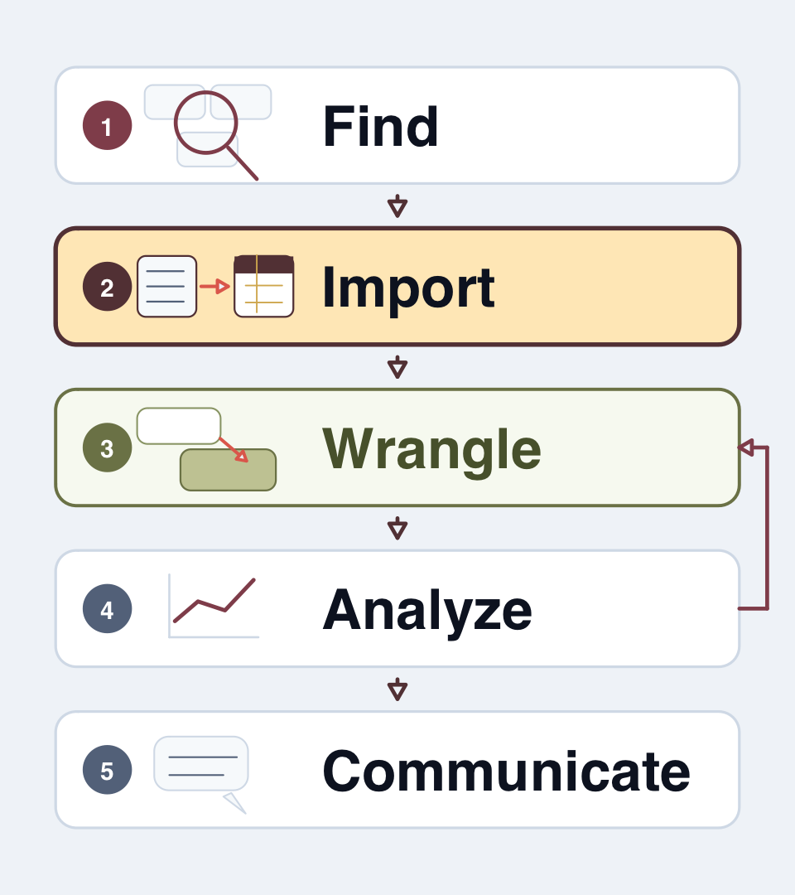
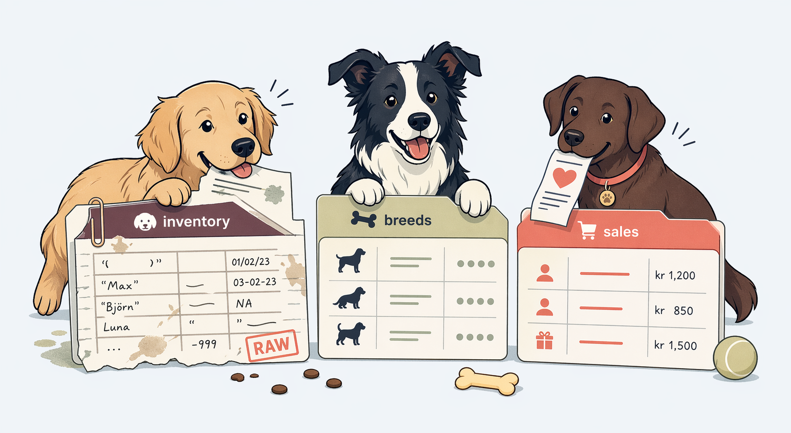
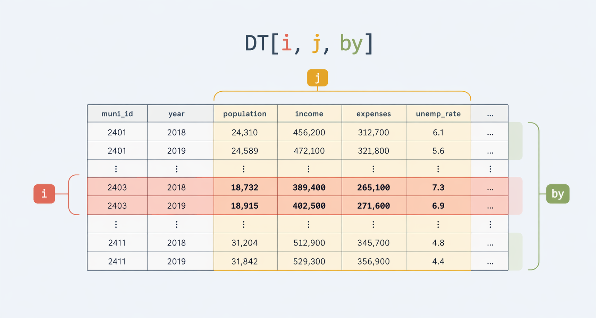
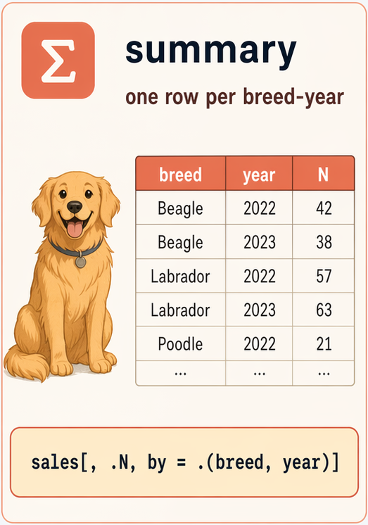
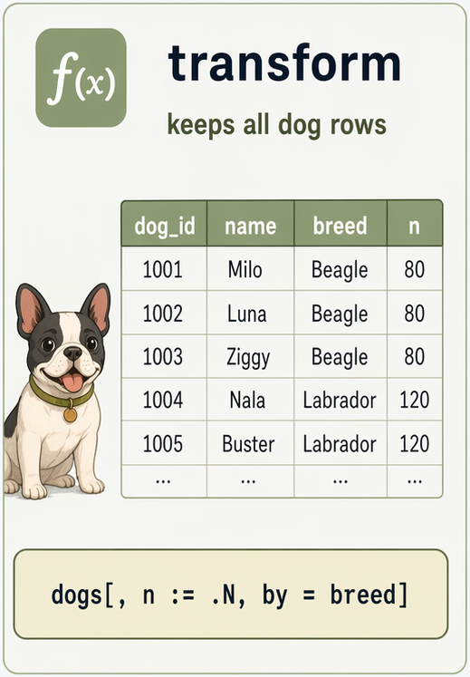

```{r}
#| echo: false
#| message: false
#| warning: false
options(width = 90)
options(datatable.print.nrows = 8)
options(datatable.print.topn = 3)
knitr::opts_knit$set(root.dir = here::here())
library(data.table)
```

## Today

- Importing real files
- Core `data.table` grammar: `DT[i, j, by]` and tooling
- Missing-values and type repair
- Writing a cleaned file back to disk
- Wrangling with functions

::: notes
This lecture is about the first half of ordinary wrangling work: getting a table into `R`, checking what arrived, and making the first targeted fixes.
:::

## Importing: Raw data is not always easy to read

:::: {.columns}
::: {.column width="55%"}
- A file is just bytes
- Import decides:
  - delimiter
  - types
  - encoding
  - missing-values
- Inspection checks whether those choices were sensible
:::
::: {.column width="45%"}
{fig-align="center" width="100%"}
:::
::::

::: aside
It is often worthwhile to spend some time on the import step to make sure wrangling starts from a data set that is as clean and usable as possible. Import tools are often better at dealing with raw file issues than later code.
:::

::: notes
"I have a CSV" and "I have usable data" are different states. The file format, encoding, and type guesses are part of the wrangling problem, not a prelude to it.
:::

## Wrangling: Make data usable for analysis

:::: {.columns}
::: {.column width="55%"}
- Clean inconsistencies
- Tidy data
- Transform data, create variables
:::
::: {.column width="45%"}
{fig-align="center" width="100%"}
:::
::::

# Importing Data

## Repeating the import checklist

Before doing any real work, ask:

- Where is the file, and what produced it?
- Are identifiers read with the right type?
- Are missing values coded as blanks, `NA`, or fake numbers?
- Do names need repair?
- What is the intended key?

::: notes
This is intentionally repetitive with the debugging lecture. The recurring theme is to inspect assumptions early. Once this checklist becomes habit, many later errors become obvious immediately.
:::

## `data.table::fread()` for text files

- `fread()` is fast and flexible for delimited text (CSV, TSV)
- Automatically solves many possible data issues

## Let's import data from an AI-generated kennel

:::: {.columns}
::: {.column width="45%"}
- `dog_inventory.csv` our inventory
- `dog_breeds.csv` a lookup-table of information
- `dog_events.csv` event history for each dog
- `dog_sales.csv` "market research"
:::
::: {.column width="55%"}
{fig-align="center" width="100%"}
:::
::::

```{r}
#| output-location: default
dog_path <- here::here(
  "data-sources", "data", "dogs", "dog_inventory.csv"
)
list.files(
  dirname(dog_path),
  pattern = "^dog_.*\\.csv$"
)
```

## View your raw data

```{r}
#| output-location: default
readLines(dog_path, n = 6)
```

::: notes
`readLines()` is just a convenient way to show raw data on a slide; opening the file directly in the IDE works just as well. A messy file often reveals problems before `R` even parses it: metadata lines above the header, unusual date formats, spaces in variable names, and suspicious codes that probably mean "missing". Looking at a few raw lines is often faster than guessing from memory.
:::

## `fread()` is forgiving, but can't solve all issues

```{r}
#| warning: true
#| output-location: default
fread(dog_path)[3:4]
```

- Good news: `fread()` found the real header
- Less good: that still does **not** mean the import is correct

::: notes
`fread()` is often great at skipping junk and guessing delimiters. That is helpful, but it can also tempt people into overconfidence. A successful import call is not evidence that the types, encodings, or missing-value rules are correct.
:::

## Encoding problems show up in the values

```{r}
#| warning: true
#| output-location: default
fread(dog_path)[c(4, 6), .(name, `new owner`)]
```

- Computers need to encode characters to store them
- Unfortunately there are tons of different encodings
- A-Z, 0-9 is usually the same, but code for e.g. å can vary
- Can create a real mess...

::: notes
This is a realistic symptom of encoding trouble: the table loaded, but names with accented characters became broken text. These bugs often go unnoticed until much later, for example during joins, filtering, or plotting.
:::

## Tell `fread` what you know

```{r}
#| warning: true
#| output-location: default
fread(
  dog_path,
  skip = 3,
  encoding = "Latin-1"
)[c(4, 6), .(name, `new owner`)]
```

- `skip = 3` removes the preamble explicitly
- `encoding = "Latin-1"` tells `fread` the file is in Latin-1 (an old single-byte Western European encoding)

::: notes
The general rule is simple: anything known about the file should be encoded in the import call. That is more robust than hoping future guesses will land the same way.
:::

## Repairing names

```{r}
#| output-location: default
names(fread(dog_path, skip = 3, encoding = "Latin-1"))[9:10]
names(fread(dog_path, skip = 3, encoding = "Latin-1", check.names = TRUE))[9:10]
```

`check.names = TRUE` converts spaces into syntactic names

::: aside
To refer to a name with a space we need to enclose it with backticks (\`\`), like in `dogs$`new owner`[5]`. Easier to fix at import so we can use `dogs$new.owner[5]` instead.
:::

::: notes
Name repair is useful when import is messy, but it should be done thoughtfully. The goal is not to let the computer rename things without inspection. The goal is to get names into a form that is easy to reference and unlikely to break code.
:::

## Protect identifiers at import time

```{r}
#| output-location: default
dogs_bad <- fread(dog_path, skip = 3, encoding = "Latin-1")
dogs_good <- fread(
  dog_path,
  skip = 3,
  encoding = "Latin-1",
  colClasses = list(character = "dog_id")
)

dogs_bad[1:5, dog_id]
dogs_good[1:5, dog_id]
```

::: aside
Just like with the municipal data, `dog_id` is an identifier, not a quantity. If the leading zero disappears, later joins, filters, and duplicate checks will silently become less reliable.
:::

## A good import call is explicit

```{r}
#| warning: false
#| output-location: default
dogs <- fread(
  dog_path,
  skip = 3,
  encoding = "Latin-1",
  check.names = TRUE,
  na.strings = c("", "-99"),
  colClasses = list(character = "dog_id")
)

dogs[1:3, .(dog_id, name, intake_date, sale_date, new.owner)]
```

::: notes
This is not "verbose for the sake of verbosity". It is a compact contract with the future reader. The ugly details of this file are now visible in one place: skip the preamble, fix the encoding, protect the identifier, repair the names, and treat the fake missing code as missing.
:::

## `select` the columns you use

```{r}
#| output-location: default
fread(
  dog_path,
  skip = 3,
  encoding = "Latin-1",
  select = c(
    "dog_id",
    "name",
    "breed",
    "intake_date",
    "sale_date"
  ),
  colClasses = list(character = "dog_id")
)[1:5]
```

::: notes
Selective import is useful when a file is wide and the first job is just inspection or a focused task. It also reduces noise on slides and in exploratory work. The important thing is to avoid pretending that unused columns are part of the current task.
:::

## Importing Stata `.dta` files with `haven`

- Use `haven::read_dta()`. Preserves Stata labels.
- Convert to `data.table` with `as.data.table()`,
- Set value labels with `as_factors()`

```r
library(haven)

stata_dt = read_dta("path/to/stata_file.dta") |>
  as.data.table()

stata_dt[, factor_variable := as_factor(labelled_variable)]
```

::: {.aside}
Similarly, we would use `haven::write_dta()` to save a data frame as a Stata dta file.
:::

## Reading excel files with `readxl`

```r
library(readxl)
excel_dt = read_excel("path/to/spreadsheet.xlsx")
```

`readxl` supports selecting sheets:

```r
excel_sheets("path/to/spreadsheet.xlsx")
read_excel("spreadsheet.xlsx", sheet = "Sheet2")
```

and even specific ranges:

```r
read_excel("spreadsheet.xlsx", range = "A1:D10", skip = 2)
```

# Core data.table Grammar

## `data.table` and `dplyr`

- Two dominant paradigms for data manipulation in R
- Both are powerful and widely used, but with different syntax
- We will focus on `data.table`, because it is much faster

## `data.table`: Core concept

- An **enhancement** of base R's `data.frame`
- **Fast:** Operations implemented in C
- **Memory efficient:** Modifies *by reference* using `:=`
- **Indexing:** Automatic indexing speeds up subsets and joins
- **Concise syntax:** Combines operations efficiently

## Read `DT[i, j, by]` as a sentence

{fig-align="center" width="100%"}

"from this table, keep these rows (`i`), then return (and compute) these columns (`j`), grouped by these variables (`by`)"

::: notes
The small diagram previews the full `DT[i, j, by]` logic, but the key point on this slide is still the basic `i` and `j` split. Once those feel concrete, later grouped work and joins become much easier to understand.
:::

## `i` filters rows

```{r}
#| output-location: default
dogs[
  age >= 5 & price > 500,
  .(dog_id, name, breed, age, price)
]
```

::: notes
This is the direct analogue of row filtering: define a logical condition, keep the matching rows, and optionally return only the relevant columns.
:::

## `i` can use membership too

```{r}
#| output-location: default
dogs[
  breed %in% c("Pug", "Boxer", "Border Collie") & insured == 1,
  .(dog_id, name, breed, insured)
]
```

::: notes
`%in%` is usually clearer than a long chain of `|` comparisons. It is especially useful for filtering on lists of categories, codes, or allowed values.
:::

## `%between%` filters ranges

```{r}
#| output-location: default
dogs[
  price %between% c(400, 700) & age %between% c(2, 5),
  .(dog_id, name, age, price)
]
```

- Shorthand for `x >= a & x <= b`, both endpoints included
- Reads closer to intent than a chained comparison

::: notes
A small piece of syntax, but range filters appear constantly in wrangling. The inclusive-on-both-ends behaviour matches the usual reading of "between 400 and 700".
:::

## `j` selects columns

```{r}
#| output-location: default
dogs[
  ,
  .(dog_id, name, breed, age, price, insured)
]
```

::: aside
The `.()` notation is just a convenient shorthand for `list()`. In `data.table`, that list of columns becomes a table again.
:::

## `j` can compute new outputs

```{r}
#| output-location: default
dogs[
  age > 0,
  .(
    dog_id,
    name,
    breed,
    price_per_year = round(price / age, 1)
  )
][1:8]
```

::: notes
This is a good example of why `j` is more than "select columns". It is the place where new columns or summaries are created from existing ones.
:::


## `:=` modifies **by reference**

```{r}
#| output-location: default
dogs_work <- copy(dogs)

dogs_work[, price_per_year := fifelse(
  age > 0,
  round(price / age, 1),
  NA_real_
)]

dogs_work[
  1:5,
  .(dog_id, name, age, price, price_per_year)
]
```

::: notes
This is one of the most important `data.table` differences from copy-heavy workflows. `:=` changes the existing object in memory. That is powerful and efficient, but it requires deliberate handling whenever a separate copy is needed. If one new column depends on another, the safe pattern is two steps or a chained operation, not a single `:=` call that quietly relies on evaluation order.
:::

## Use `copy()` when you need separation

```{r}
#| output-location: default
"price_per_year" %in% names(dogs)
"price_per_year" %in% names(dogs_work)
```

::: notes
This small check makes the point visible. We created `dogs_work` from `copy(dogs)`, so the new column appears only in the copy. Without `copy()`, the original object would also have been changed.
:::

## Comparison to `dplyr`

- Part of the **Tidyverse** collection of packages
- Focuses on **readability** and **consistency**
- Uses distinct "verbs" for common operations

:::: {.columns}
::: {.column width="50%"}
`data.table`
```r
data[condition,
     .(new_var = mean(old_var)),
     by = "group_var"]
```
:::
::: {.column width="50%"}
`dplyr`
```r
data |>
  filter(condition) |>
  group_by(group_var) |>
  summarise(new_var = mean(old_var))
```
:::
::::

::: {.aside}
If you really like the `dplyr` syntax but want to take advantage of `data.table` speeds, there is the [dtplyr](https://dtplyr.tidyverse.org/) package which uses data.table as a backend for dplyr-syntax operations.
:::

## `data.table` vs. `dplyr` - key differences

**`data.table`**

- **Pros:** Speed, memory efficiency, concise syntax, powerful indexing/joins. Ideal for large data.
- **Cons:** Steeper learning curve, syntax less "English-like", modify-by-reference needs care.

**`dplyr`**

- **Pros:** Highly readable verbs, Tidyverse integration (ggplot2, etc.).
- **Cons:** Slower, uses more memory, especially on large data or complex groups.

# Useful data.table Tooling

## Setting a key creates an index for faster operations

```{r}
dogs[, .(dog_id, name, breed)][1:2]
```

```{r}
setkey(dogs, dog_id, breed)
dogs[, .(dog_id, name, breed)][1:2]
```

::: aside
`setkey()` automatically sorts the data table by the key. 
:::

::: notes
`setkey()` does two things at once: it sorts the table by the chosen columns and stores them as the key. The visible change above is just the sort. The invisible change is that subsequent subsets and joins on those columns now use binary search instead of a linear scan, which matters for large tables.
:::

## Removing columns by reference with `:= NULL`

```{r}
#| output-location: default
dogs_work[, price_per_year := NULL]
"price_per_year" %in% names(dogs_work)
```

::: notes
Because `:=` changes the table by reference, deletion is also explicit. This is useful when a temporary helper column did its job and should not leak into later analysis.
:::

## Renaming and reordering by reference

```{r}
#| output-location: default
dogs_demo <- copy(dogs)

setnames(dogs_demo, c("new.owner", "intake_date"), c("owner", "intake"))
setcolorder(dogs_demo, c("dog_id", "name", "breed", "owner"))

names(dogs_demo)
```

- `:= NULL` deletes
- `setnames()` renames
- `setcolorder()` reorders

::: notes
Like `:=`, both functions change the table in place without making a copy. That makes them fast on large tables, but the same caveat applies: they mutate the object passed in. Use `copy()` first when separation matters.
:::

## `fcase()` is cleaner than nested `ifelse()`

```{r}
#| output-location: default
dogs_work[, fee_group := fcase(
  price < 400, "low",
  price < 700, "middle",
  default = "high"
)]

dogs_work[, .(dog_id, name, price, fee_group)]
```

::: notes
This is one of the practical `data.table` conveniences worth teaching early. Nested `ifelse()` calls become unreadable quickly. `fcase()` makes mutually exclusive categories much easier to inspect.
:::

## Diagnose distinct values and duplicates

```{r}
dogs[, .(
  rows = .N,
  distinct_ids = uniqueN(dog_id),
  distinct_breeds = uniqueN(breed)
)]
```

```{r}
dogs[duplicated(dogs, by = "dog_id"), .(dog_id, name)]
```

```{r}
dim(unique(dogs, by = "dog_id"))
```

- `uniqueN()` counts distinct values; `unique()` returns them
- `uniqueN(key) == nrow(dt)` is a one-line uniqueness test
- `duplicated(dt, by = ...)` lists offending rows
- `unique(dt, by = ...)` keeps one row per key

::: notes
A duplicated identifier is a quiet bug. It will not stop the script, but it will silently inflate joins and break aggregations. Pairing `.N` with `uniqueN()` is one of the most useful first-look diagnostics after import, and `unique(dt, by = key)` is the matching fix when duplicates appear. This sets up the join-key checks that lecture 7 leans on.
:::

## Piping with `data.table`

- `data.table` supports the native pipe `|>`
- Use `_` as a placeholder for the output of the previous step

```{r}
dogs |>
  _[age > 0] |>
  _[, price_per_yr := round(price / age)] |>
  _[order(-price_per_yr)] |>
  _[, .(dog_id, name, price_per_yr)]
```

::: aside
The first `_[age > 0]` returns a new filtered table, so the later `:=` modifies *that* table, not `dogs`. Skipping the filter step (`dogs |> _[, := ...]`) would have written the new column straight into `dogs`. Mixing `:=` into a pipe is fine, but the upstream step has to actually produce a copy.
:::


# Grouping and Summarizing

## 

{fig-align="center"}

## Grouping and summarizing with `by=` 

- `i` chooses rows
- `j` says what to return or compute
- `by` says which groups should get separate answers

## Grouping and summarizing with `by=` (cont.)

Evaluate `j` separately for each group:

```{r}
dogs[, mean(price), by = .(insured)]
```

Can group by multiple variables, and by conditions:

```{r}
dogs[, mean(price), 
     by = .(insured, 
            white = color == "White")]
```

## Grouping and summarizing with `by=` (cont.)

Find cheapest dog by breed, ordered by how frequent the breed is

```{r}
#| output-location: default
dogs[, .(.N, min(price)), by = "breed"] |>
  _[order(-N)]
```

## Grouped counts are useful diagnostics

```{r}
#| output-location: default
dogs[, .(
  rows = .N,
  missing_sale_date = sum(is.na(sale_date)),
  insured_share = round(mean(insured == 1, na.rm = TRUE), 2)
), by = breed][order(-rows)]
```

::: notes
Grouped summaries are not just for presentation. They are also diagnostic tools. A quick count by category can reveal sparse groups, missing values concentrated in one group, or unexpected coding patterns.
:::

## 

{fig-align="center"}

## Transforming with `:=` and `by=`

Saving the average price by age to a new column, repeating the summary for each row in group:

```{r}
dogs[, avg_price_by_age := mean(price),
     by = .(age)]

dogs[order(age),
     .(age, avg_price_by_age)]
```

```{r}
#| echo: false
dogs[, avg_price_by_age := NULL]
```

## Grouped transformations create new columns

```{r}
#| output-location: default
copy(dogs) |>
  _[, price_gap_from_breed_mean :=
    price - mean(price, na.rm = TRUE),
    by = breed] |>
  _[breed %in% c("Pug", "Boxer"),
    .(dog_id, name, breed, price, price_gap_from_breed_mean)]
```

::: aside
The grouped mean is repeated within each group because this is a grouped transformation, not a grouped collapse. That distinction matters. Summaries reduce rows; transformations keep the original rows.
:::

## `.SD`

Inside a `data.table`, `.SD` refers to the **S**ubset of **D**ata for each group.

We can use this to run more complex operations, like

```r
dogs[, lapply(.SD, func), by = ...]
```

applying a custom function `func` to each `.SD` group.

::: {.aside}
`.SD` is also a data.table
:::

## `.SDcols`

Specifies the columns included in `.SD`. Can be used to select columns in smart ways.

```{r}
#| output-location: default
dogs[, c(
  list(dogs = .N),
  lapply(.SD, function(x) round(mean(x, na.rm = TRUE), 2))
), by = breed, .SDcols = c("age", "price")]
```

## Use `shift()` to create a lagged vector

`shift()` returns a lagged vector within groups

```{r}
#| echo: false
events_raw <- fread(
  file.path(dirname(dog_path), "dog_events.csv"),
  colClasses = list(character = c("dog_id", "event_time"))
)
events <- copy(events_raw)
events[,
  event_time := as.POSIXct(
    event_time,
    format = "%Y-%m-%d %H:%M:%S",
    tz = "Europe/Stockholm"
  )
]
events[, event_date := as.IDate(event_time, tz = "Europe/Stockholm")]
```

```{r}
#| output-location: default
events
setorder(events, dog_id, event_time) # setorder() is crucial!
events[,
  hours_since_previous_event := round(
    as.numeric(difftime(event_time, shift(event_time), units = "hours")), 1
  ),
  by = dog_id
]
events[
  dog_id %in% c("0013", "3382"),
  .(dog_id, event_time, event_type, hours_since_previous_event)
]
```

# Missing Values And Type Repair

## Missing values are a workflow issue

- Some missings are genuine unknowns
- Some are fake codes like `-99`
- Some are actually impossible values that should become `NA`

::: notes
It is useful to separate three ideas: a value that is truly unavailable, a code that means unavailable, and a recorded value that is simply wrong. They should not all be treated the same way.
:::

## Code fake missings at read time when you can

```{r}
#| warning: false
#| output-location: default
dogs_raw <- fread(dog_path, skip = 3, encoding = "Latin-1")
dogs <- fread(
  dog_path,
  skip = 3,
  encoding = "Latin-1",
  check.names = TRUE,
  na.strings = c("", "-99"),
  colClasses = list(character = "dog_id")
)

unique(dogs_raw$insured)
unique(dogs$insured)
```

::: notes
This is a clean example of a rule that should live in the import step. If `-99` means missing, it is better to say so once while reading the file than to remember that fact in three later scripts.
:::

## Use `is.na()` explicitly

```{r}
#| output-location: default
dogs[is.na(insured), .(dog_id, name, insured)]
```

::: notes
Comparisons like `x == NA` do not work the way beginners expect. Missingness should be checked with `is.na()` so the intention is explicit and correct.
:::

## Some values are not missing, just wrong

```{r}
#| output-location: default
dogs[age < 0, .(dog_id, name, age)]
```

::: notes
Negative ages are not a plausible substantive value here. They should not stay in the data as if they were meaningful. This is a good example of an "impossible value" rather than a pre-coded missing.
:::

## Repair obvious problems explicitly

```{r}
#| output-location: default
dogs_fixed <- copy(dogs)
dogs_fixed[age < 0, age := NA_integer_]

dogs_fixed[, .(
  missing_age = sum(is.na(age)),
  missing_sale_date = sum(is.na(sale_date)),
  missing_insured = sum(is.na(insured))
)]
```

::: notes
The pattern matters more than this specific example: identify the impossible condition, change only the affected rows, and then verify the result with a small count.
:::

## `fcoalesce()` fills missings with a default

```{r}
#| output-location: default
dogs_fixed[, owner_label := fcoalesce(new.owner, "not yet sold")]

dogs_fixed[
  is.na(new.owner),
  .(dog_id, name, new.owner, owner_label)
][1:5]
```

- Returns the first non-`NA` value, argument by argument
- Replaces nested `ifelse(is.na(x), y, x)` patterns
- Accepts more than two arguments: `fcoalesce(a, b, c)`

::: notes
`fcoalesce()` is the SQL `COALESCE` idea. The multi-argument form is useful when several columns hold the same logical value and the goal is the first that is actually populated, for example `fcoalesce(reported_date, recorded_date, intake_date)`.
:::

## Date parsing is a type problem too

```{r}
#| output-location: default
class(dogs$intake_date)
class(dogs$sale_date)
```

- `intake_date` was parsed as `IDate` (data.table's date type, inherits from `Date`)
- `sale_date` is still text — the `03/20-2023` format wasn't recognized

::: notes
This is intentionally a bridge to lecture 7. Date handling is not a separate universe; it is a special case of getting types right. If a date is still a character string, date arithmetic will not work reliably.
:::

## Parse the dates explicitly

```{r}
#| output-location: default
dogs_fixed[, sale_date := as.IDate(sale_date, format = "%m/%d-%Y")]

class(dogs_fixed$sale_date)
dogs_fixed[1:3, .(dog_id, intake_date, sale_date)]
```

- `as.IDate()` parses text into `IDate`, given the format string
- `%m/%d-%Y` matches `03/20-2023`: month, `/`, day, `-`, four-digit year

::: aside
Format strings come from `strptime()`. Common pieces: `%Y` four-digit year, `%y` two-digit year, `%m` month, `%d` day. Lecture 7 covers the rest.
:::

# Writing Clean Data

## Separate raw, processed, and analysis steps

- Raw files are inputs
- Processed files are reproducible intermediate outputs
- Analysis starts from processed data, not from manual edits

::: notes
This mirrors the project-workflow lecture. A processed file is useful when the cleaning work is non-trivial and should not be repeated interactively from memory. It also creates a clear surface for version control and debugging.
:::

## Write a cleaned file with `fwrite()`

```{r}
#| output-location: default
out_dir <- file.path(tempdir(), "ec7422-wrangling")
dir.create(out_dir, showWarnings = FALSE)

out_path <- file.path(out_dir, "dogs_clean.csv")
fwrite(dogs_fixed, out_path)
```

## Read it back and verify

```{r}
#| output-location: default
dogs_roundtrip <- fread(
  out_path,
  colClasses = list(character = "dog_id")
)
dogs_roundtrip[1:3, .(dog_id, name, age, sale_date)]
```

::: aside
Note how we still need be explicit about some types when re-importing. The information is not stored in the CSV.
:::

# Using Functions when Wrangling

## Repetition is the best reason to write a function

- repeated import rules
- repeated validation checks
- repeated cleaning with one file path changed
- repeated summaries that should agree exactly

::: notes
This is the practical reason to care about functions in a wrangling workflow. The gain is not elegance for its own sake. The gain is one stable place for logic that would otherwise get copied, edited, and slowly broken.
:::

## A wrangling function should show its contract

- explicit arguments
- one clear output
- no hidden dependence on objects in the global environment
- one place to store the weird file-specific rules

::: notes
This is the level of functions that matters most in applied data work. A small explicit function is easier to inspect than a long script with near-duplicate code blocks scattered through it.
:::

## Put the dog import rules in one place

```{r}
#| output-location: default
read_dogs <- function(path) {
  fread(
    path,
    skip = 3,
    encoding = "Latin-1",
    check.names = TRUE,
    na.strings = c("", "-99"),
    colClasses = list(character = "dog_id")
  )
}

read_dogs(dog_path)[
  1:3,
  .(dog_id, name, intake_date, sale_date)
]
```

::: notes
This is already useful even before any advanced programming ideas show up. The messy import rules now live in one place, and future code can call the function without retyping them.
:::

## Hidden globals make even simple functions misleading

```{r}
#| output-location: default
bad_oldest <- function(dt) dogs[which.max(age), .(dog_id, name, age)]
oldest_dog <- function(dt) dt[which.max(age), .(dog_id, name, age)]

puppies <- dogs[age <= 2]

bad_oldest(puppies)
oldest_dog(puppies)
```

::: notes
The two signatures look identical, but the behavior is not. `bad_oldest` declares an argument `dt` and silently ignores it, falling back to the global `dogs` — so `bad_oldest(puppies)` returns the oldest dog overall, not the oldest puppy. `oldest_dog` actually uses `dt`. Hidden global lookups are easy to miss in code review and only surface once the global object is renamed, mutated, or no longer in scope.
:::

## Returning a table keeps the effect visible

```{r}
#| output-location: default
add_senior_flag <- function(dt, age_cutoff = 7L) {
  out <- copy(dt)
  out[, senior := age >= age_cutoff]
  out
}

add_senior_flag(dogs)[, .(dog_id, age, senior)]
```

::: aside
When using data.tables as arguments we need to take extra care with the editing copy-vs-reference issue. If we want the function to return a modified table without changing the original, we need to make a copy inside the function and return that copy.
:::

## Default arguments keep small helpers flexible

```{r}
#| output-location: default
add_senior_flag(dogs)[, .N, by = senior]
add_senior_flag(dogs, age_cutoff = 9L)[, .N, by = senior]
```

::: notes
Default arguments are useful when one rule is common but not universal. Most calls can use the default, while the rare special case can still be handled without copying the function body and editing it by hand.
:::

## Main takeaways

- A successful import is not the same as a correct import
- Inspect names, types, keys, and missingness immediately
- Read `DT[i, j, by]` as "i=rows, j=columns/calculations, by=groups"
- Use `:=` deliberately and `copy()` when you need separation

## Next lecture: advanced wrangling
