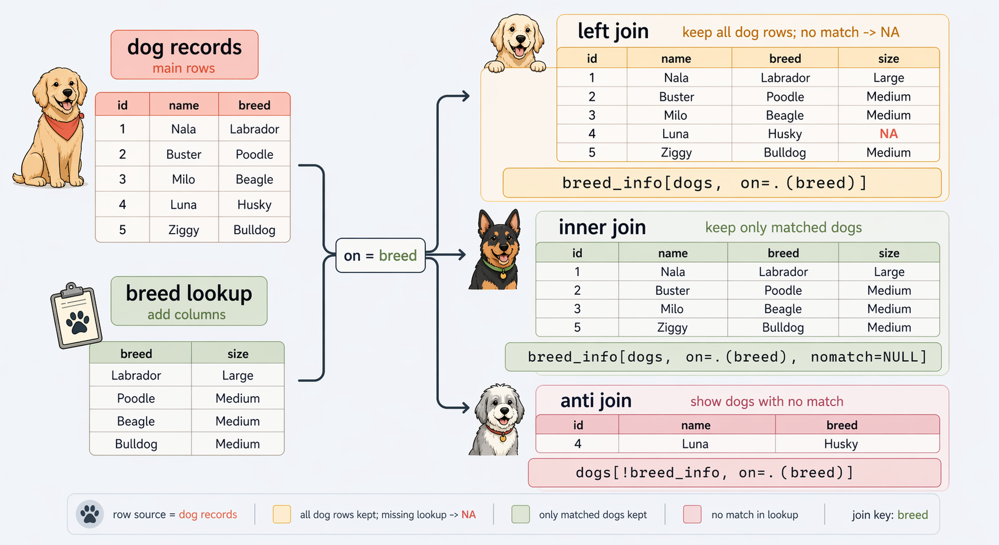
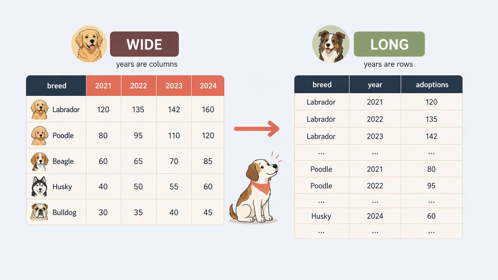
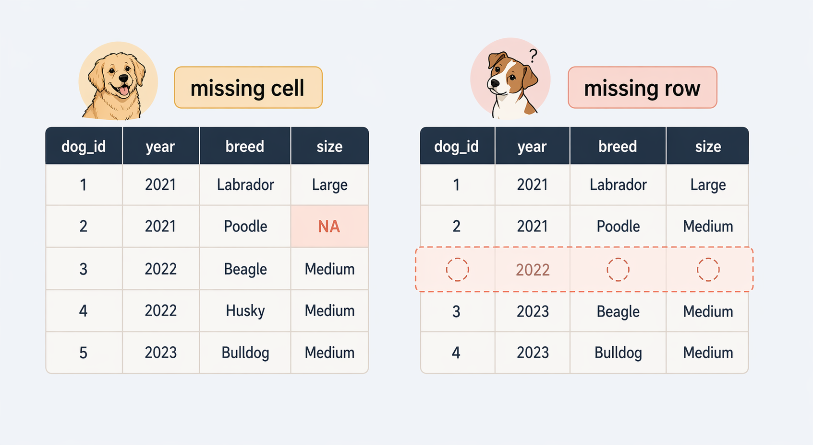
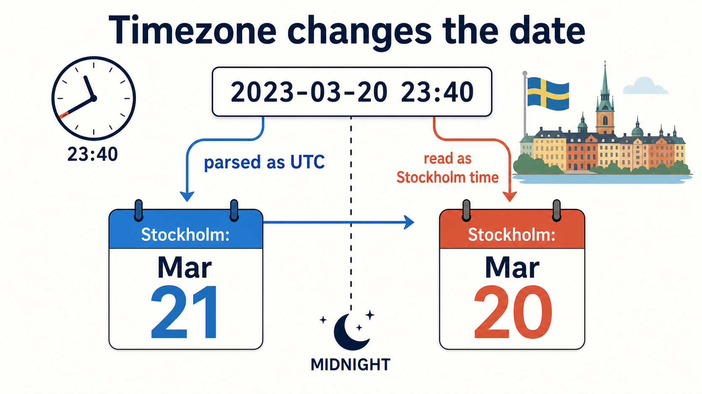
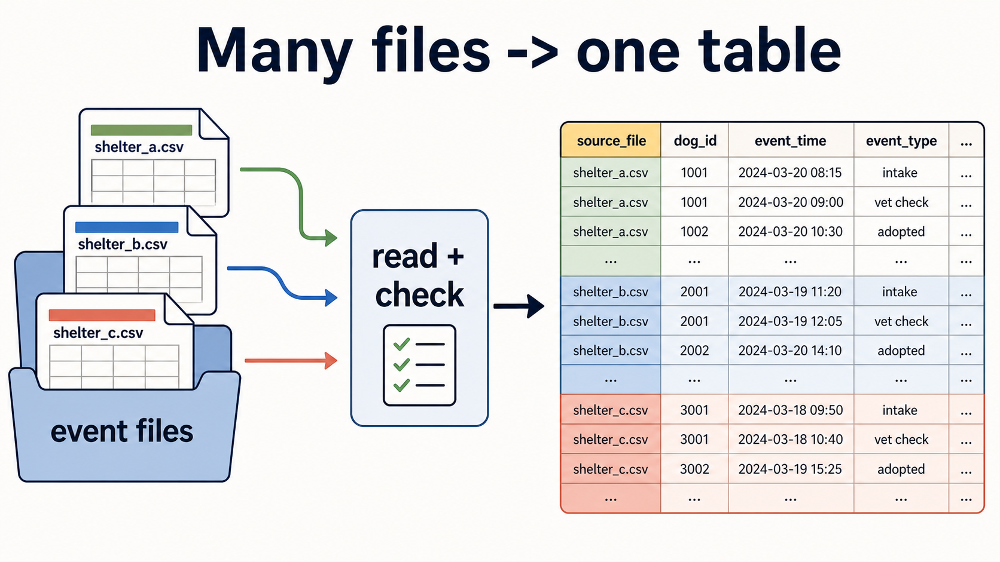

```{r}
#| echo: false
#| message: false
#| warning: false
options(width = 90)
options(datatable.print.nrows = 8)
options(datatable.print.topn = 3)
knitr::opts_knit$set(root.dir = here::here())
library(data.table)
library(ggplot2)
library(lubridate)
theme_set(
  theme_bw() %+replace%
    theme(
      plot.background = element_rect(fill='transparent', color=NA)
    )
)

dog_path <- here::here("data-sources", "data", "dogs")
dogs <- fread(
  file.path(dog_path, "dog_inventory.csv"),
  skip = 3,
  encoding = "Latin-1",
  check.names = TRUE,
  na.strings = c("", "-99"),
  colClasses = list(character = "dog_id")
)
# Lecture 6 detected a duplicate dog_id (a re-intake row);
# keep one row per dog before any join work.
dogs <- unique(dogs, by = "dog_id")

breed_info <- fread(file.path(dog_path, "dog_breeds.csv"))
sales <- fread(file.path(dog_path, "dog_sales.csv"))
events_raw <- fread(
  file.path(dog_path, "dog_events.csv"),
  colClasses = list(character = c("dog_id", "event_time"))
)

events <- copy(events_raw)
events[,
  event_time := as.POSIXct(
    event_time,
    format = "%Y-%m-%d %H:%M:%S",
    tz = "Europe/Stockholm"
  )
]
events[, event_date := as.IDate(event_time, tz = "Europe/Stockholm")]
```

## Today

- Joins / merges
- Reshaping wide <-> long
- Manipulating strings and date time objects
- Applying functions to vectors

::: notes
Lecture 6 established the core `data.table` grammar and covered ordinary grouped summaries and grouped transformations. Lecture 7 builds on that foundation by focusing on data table operations restructuring our data.
:::

## Lecture 6 gave us the basic grammar

- `DT[i, j]` to subset and compute
- add `by=` to summarize and transform by group
- Today we focus on structure: join and reshape
- We will also talk about how to manipulate the data content: strings, regex, and dates

::: notes
The main shift today is that the data structure becomes less forgiving: rows may need to be ordered within units, keys must identify the right thing, and reshaping can hide missing combinations.
:::

# Joining

## Joining: matching rows across tables

- Two tables share one or more key columns
- A join uses those keys to line up matching rows
- The usual goal is to add columns from one table to another

::: notes
Joining and merging are the same core idea in this course: combine tables by matching identifiers. The syntax matters, but the structural question matters more. What counts as the key, and what should happen when no match exists?
:::

## 

{.r-stretch}

## SQL join types

**Inner Join:** Keep only rows with matching keys in *both* tables

**Left (outer) join:** Keep left table, add matches from the right

**Full outer join:** Keep *all rows from both* tables

**Anti join:** Keep rows from left table that have *no match* in the right

::: aside
The right (outer) join instead keeps the right table, adding matches from the left. But it is rarely used and it is usually better to just swap table places and do a left join.
:::

::: notes
Even outside SQL, these names are useful shorthand. They describe what should happen to the row count and to unmatched observations. The diagram also previews the `data.table` rule that the object inside the brackets is the row source you keep. Full outer joins are useful for reconciliation tasks, but anti joins are usually the sharper first diagnostic because they isolate exactly which rows failed to match.
:::


## Primary key vs foreign key

- A (primary) key: uniquely identifies rows
- A **foreign key**: another table's primary key
- `breed_info$breed` should be unique
- `dogs$breed` is allowed to repeat

::: notes
This vocabulary clarifies what kind of duplication is normal and what kind is dangerous. Repeated foreign keys are ordinary. Repeated primary keys are often a join bug waiting to happen.
:::

## Most join bugs are key bugs

- A join matches rows using key columns
- If the key is wrong, the join is wrong
- If a key is duplicated unexpectedly, rows can multiply
- If keys do not match, rows can silently pick up `NA`

::: notes
Joins are mainly data-structure problems not syntax problems. The first question should be about keys and units of observation, not about which join verb to type.
:::

## Joining in data.table

`data.table` has two alternatives:

- `merge(x, y, by = "key")`
- `Y[X, on = "key"]` more efficient, allows calculations during join
  - `breed_info[dogs, on = .(breed)]` is like the SQL command:
  - `dogs LEFT JOIN breed_info ON breed`


::: notes
This is the `data.table` join rule worth memorising: the object inside the brackets determines the rows you keep. Here we keep the dog inventory rows and add matching breed information from `breed_info`.
:::

## Left join: unmatched foreign keys get missing values

```{r}
#| output-location: default
breed_info[dogs, on = .(breed)] |>
  _[, .(dog_id, name, breed, avg_life_exp, origin)]
```

::: aside
Left join with merge syntax: `merge(dogs, breed_info, by = "breed", all.x = TRUE, sort = FALSE)`
:::

::: notes
This is a crucial interpretation habit. Missing values after a join often mean "no key match", not "true missing information in the source table". Those are different diagnoses and need different fixes.
:::

## Inner join: unmatched rows are dropped

```{r}
#| output-location: default
breed_info[dogs, on = .(breed), nomatch = NULL] |>
  _[, .(dog_id, name, breed, avg_life_exp, origin)]
```

::: aside
Inner join with merge syntax: `merge(dogs, breed_info, by = "breed", all = FALSE, sort = FALSE)`. `all = FALSE` is the default, but it is good to be explicit about the intended join type.
:::

::: notes
The difference is conceptual: do you want to preserve the main table and flag failures, or do you want to drop failures immediately?
:::

## Anti join: list failed matches

```{r}
#| output-location: default
dogs[!breed_info, on = .(breed), .(dog_id, breed)]
```

::: notes
This is essentially an anti-join style diagnostic: show the rows from `dogs` that did not find a match in `breed_info`. It is often a much better debugging surface than staring at a large joined table full of `NA`.
:::

## Check the key before trusting the join

Keys should not have duplicates:

```{r}
anyDuplicated(breed_info, by = "breed")
```

```{r}
anyDuplicated(events, by = c("dog_id", "event_time"))
```

Or missing values:

```{r}
dogs[, .(missing_breed = sum(is.na(breed)))]
```

```{r}
events[, .(
  NA_dog_id = sum(is.na(dog_id)),
  NA_event_time = sum(is.na(event_time))
)]
```

## Duplicate keys can explode the row count

```{r}
#| output-location: default
bad_lookup <- rbind(
  breed_info[breed == "Labrador Retriever"],
  breed_info[breed == "Labrador Retriever"]
)

nrow(dogs[breed == "Labrador Retriever"])
nrow(bad_lookup[
  dogs[breed == "Labrador Retriever"],
  on = .(breed),
  allow.cartesian = TRUE
])
```

::: notes
This is a deliberately broken lookup table. The dog inventory contains one row per dog, but the duplicated lookup table turns each Labrador row into two rows. Thankfully, data.table refuses duplicate key joins by default, which is why we needed to set `allow.cartesian = TRUE`.
:::

## Joining tables with different units of observation

```{r}
#| output-location: default
nrow(dogs)
nrow(sales[dogs, on = .(breed), allow.cartesian = TRUE])
```

- `dogs` has one row per dog
- `sales` has many rows per breed over time
- Problem is that the tables do not share the same unit of observation

## Build a lookup table at the right unit

```{r}
#| output-location: default
sales_by_breed <- sales[,
  .(
    sales_n = .N,
    mean_sale_price = round(mean(price_usd), 1),
    last_sale = max(date)
  ),
  by = breed
]

sales_by_breed
```

::: notes
This is the fix: decide what information should be attached to each dog, then aggregate the sales table to exactly that unit. Once the sales data become one row per breed, they can behave like a lookup table.
:::

## Validate the lookup before you join

```{r}
#| output-location: default
anyDuplicated(sales_by_breed, by = "breed")
nrow(sales_by_breed)
```

::: notes
This is the minimum validation before the repaired join. The lookup key should now be unique. A quick row count also helps with interpretation: the table is now a summary over breeds, not a transaction-level sales table.
:::

## Join again and inspect what is still unmatched

```{r}
#| output-location: default
dogs_sales <- sales_by_breed[dogs, on = .(breed)]

nrow(dogs_sales)
dogs_sales[is.na(mean_sale_price), unique(breed)]
```

::: notes
Now the row count is back where it should be: one row per dog. That does not mean the join is perfect, though. Unmatched breeds still need inspection, because they may reflect coverage limits in the sales data rather than random missingness.
:::

## Composite keys are common in event logs

```{r}
#| output-location: default
event_timing <- events[, .(
  dog_id,
  event_time,
  event_type,
  event_date
)]

event_staff <- events[, .(
  dog_id,
  event_time,
  shelter_name,
  staff_id
)]

event_staff[event_timing, on = .(dog_id, event_time)][1:6]
```

::: notes
This example is intentionally simple because the structure matters more than the novelty. One dog can have several events, so `dog_id` alone is not enough. The event time is part of the identity of the observation.
:::

## `i.` lets `data.table` compute during the join

```{r}
#| output-location: default
dogs_join <- copy(dogs)

dogs_join[breed_info, on = .(breed), avg_years_left := i.avg_life_exp - age]

dogs_join[1:5, .(dog_id, breed, age, avg_years_left)]
```

::: aside
The `i.` prefix refers to columns from the incoming table (the one in `i`), so the join can directly create a derived column without a separate intermediate object. Similarly, we can use `x.` to refer to columns from the outer table (`DT[]`).
:::

## Use `shift()` to create a lagged vector

`shift()` returns a lagged vector within groups

```{r}
#| output-location: default
event_order <- copy(events)
setorder(event_order, dog_id, event_time) # setorder() is crucial!
event_order[,
  hours_since_previous_event := round(
    as.numeric(difftime(event_time, shift(event_time), units = "hours")), 1
  ),
  by = dog_id
]
event_order[
  dog_id %in% c("0013", "3382"),
  .(dog_id, event_time, event_type, hours_since_previous_event)
]
```

::: notes
The honest comparison: a non-equi self-join (see "extra" section) on `event_time < event_time` would also produce this column, but it is much harder to read and slower to run. `shift()` solves the within-group lag case directly. The first row per dog gets `NA` because there is nothing to lag against.
:::


## Join diagnostics should be routine

- Compare row counts before and after the join
- Check duplicates in the lookup key
- Inspect unmatched rows explicitly
- Re-state the intended unit of observation

::: notes
These checks are quick and they scale. The habit matters more than memorising a specific join taxonomy.
:::

# Reshaping

## One data set, two shapes

{.r-stretch}

## Pick shape by use case

- *Wide* is convenient for:
  - reading side-by-side and comparing values directly
  - joining the result onto a per-unit table
- *Long* is convenient for:
  - grouping or summarising by the "variable" itself
  - plotting with `ggplot` (one column per aesthetic: x, y, colour)
  - adding a new variable without changing the schema

::: notes
The shape is not "more correct" or "less correct" — it depends on the next operation. A common pipeline is wide-for-reading, long-for-computing, then back to wide for the final output.
:::

## Reshaping in data.table

Base R has `reshape()` but it is clunky. `data.table` has two more intuitive (and much faster) functions:

- `dcast()` for long → wide
- `melt()` for wide → long

## `dcast()`: long → wide

```{r}
#| output-location: default
events_long <- events[, .N, by = .(event_date, event_type)]
events_long
```

## `dcast()`: long → wide

```{r}
#| output-location: default
#| code-line-numbers: "2|3|4|5|1-7"
wide_events <- dcast(
  events_long, # long input
  event_date ~ event_type, # rows ~ new columns
  value.var = "N", # what fills each cell
  fill = 0 # default for empty cells
)
wide_events[1:2]
```

- Left of `~` stays as rows
- Right of `~` becomes new column names
- `value.var` says which column's values fill the cells

::: aside
The data.table [vignette on reshaping](https://cran.r-project.org/web/packages/data.table/vignettes/datatable-reshape.html) is a good place to learn more.
:::

::: notes
The formula is the heart of `dcast`: "rows on the left, new columns on the right". Without `fill = 0`, missing combinations come out as `NA` — usually not what you want when the underlying value is a count.
:::

## When cells are not unique, `dcast` aggregates

```{r}
#| output-location: default
breed_events <- events[dogs, on = "dog_id", nomatch = NULL]
dcast(breed_events, breed ~ event_type, fun.aggregate = length, value.var = "dog_id")[1:3]
```

- Many events share each `breed × event_type` combination
- A cell can only hold one value, so `dcast` *must* aggregate
- Default is `length` with a warning; better to say what you mean
  - Pass `fun.aggregate` explicitly: `length`, `sum`, `mean`, `min`, `max`

::: notes
If more than one source row maps to the same output cell, `dcast` cannot produce a single value without aggregating. Explicit beats implicit — say what you want the cell to contain rather than relying on the default.
:::

## `melt()`: wide → long

```{r}
#| output-location: default
#| code-line-numbers: "2|3|4|5|1-7"
long_events <- melt(
  wide_events,
  id.vars = "event_date", # columns to keep as-is
  variable.name = "event_type", # name for old column names
  value.name = "N" # name for old cell values
)
long_events
```

- `id.vars` are the columns that identify a row
- All *other* columns get stacked into one
- names in one column, values in another

::: notes
Every column not in `id.vars` is treated as a measurement. Names go into one new column, values into another. The result has more rows and fewer columns — same content, with categories now living as values rather than as a schema.
:::

## Why long form pays off

```{r}
#| output-location: default
long_events[, .(total = sum(N)), by = event_type]
```

- Group by `event_type` directly
  - In wide form you'd repeat the calculation for each column
- `ggplot()` wants the same shape: one column per aesthetic
- `melt()` first often simplifies summary and plotting

::: notes
A telling sign that you need long form: you are about to write three almost-identical calls, one per column. That is a workflow pushing you toward `melt`.
:::

## A missing row can be hard to notice

{.r-stretch}

::: aside
A missing *cell* is an `NA` value — usually visible in the output. A missing *row* is an entire expected combination that is absent — invisible unless you build a list of what you expected to see.
:::

## Detect missing combinations: skeleton + anti-join

```{r}
events[dog_id %in% c("0013", "3382"),
  .(dog_id, event_time, event_type)]
```

```{r}
#| output-location: default
skeleton <- CJ(
  dog_id = unique(events$dog_id),
  event_type = c("intake", "vet_check", "adopted")
)
skeleton[!events, on = .(dog_id, event_type)][dog_id %in% c("0013", "3382")]
```

- `CJ()` cross-joins the levels you *expected* to see
- Anti-join data against the skeleton: what's left is missing

::: notes
The pattern is: state what should exist, then ask what's actually present. The diagnostic is the *difference*. Much more reliable than visually scanning a table for gaps.
:::

## A quick plot makes the gap obvious

```{r}
#| output-location: default
combination_grid <- events[skeleton, on = .(dog_id, event_type)]
combination_grid[, present := !is.na(event_time)]
combination_grid[, event_type := factor(event_type, levels = c("intake", "vet_check", "adopted"))]
missing_combo_plot <- ggplot(
  combination_grid,
  aes(x = event_type, y = dog_id, fill = present)
) +
  geom_tile(color = "white", linewidth = 1.2) +
  scale_fill_manual(values = c("TRUE" = "#d9ead3", "FALSE" = "#f4b6a6")) +
  labs(x = NULL, y = NULL) +
  theme(legend.position = "none")
```

## A quick plot makes the gap obvious (cont.)

```{r}
#| echo: false
#| fig-width: 8
#| fig-height: 3.6
missing_combo_plot
```

::: notes
This is the same expected-combinations idea as the anti-join, but drawn as a grid. The missing `vet_check` row for dog 3382 becomes visible immediately.
:::

## A counts-over-time plot catches different problems

```{r}
#| output-location: default
#| fig-width: 8
#| fig-height: 2.6
events[, .N, by = event_date] |>
  ggplot(aes(x = event_date, y = N)) +
  geom_col() +
  labs(x = NULL, y = "events per day")
```

::: notes
The skeleton check flags missing combinations. A count over time flags a different class of issue — and the plot above is doing exactly that: there is a three-month stretch with no events at all in mid-2023. No tabular sanity check would have surfaced this. The fix is upstream (find out what happened to the logging during that window), but the diagnostic is one line of `ggplot`. Worth running after any join, reshape, or type change.
:::


# Manipulating Strings

## String = character vector

- Each element is text wrapped in quotes
- Most string functions apply to each element

```{r}
#| output-location: default
typeof(c("Buddy", "Lucy"))
length(c("Buddy", "Lucy"))
nchar(c("Buddy", "Lucy"))
```

::: notes
Strings in R are character vectors. Operations apply elementwise, which is why they slot into `data.table` columns directly without an explicit loop.
:::

## String problems show up everywhere

- Inconsistent case and whitespace: `"Corgi"`, `" corgi"`, `"CORGI "`
- Typos that drift over time: `"Russel"` vs `"Russell"`
- The same concept under different labels: `"Corgi"` vs `"Pembroke Welsh Corgi"`
- Several variables jammed into one column: `"03/20-2023"`
- Encoding artifacts on imported data

::: notes
These are not stylistic concerns. They are joins waiting to break. Almost every string job in a wrangling pipeline traces back to one of these patterns.
:::

## Encoding is set at import (recap from L6)

```{r}
#| output-location: default
fread(file.path(dog_path, "dog_inventory.csv"))[4:6, .(name, `new owner`)]
```

- For dogs we need to set: `fread(..., encoding = "Latin-1")`

```{r}
#| output-location: default
dogs[grepl("é|í|ö|å", name), unique(name)][1:5]
```

- Once imported correctly, treat the column as ordinary text
- Mangled accents usually mean the encoding was wrong **at import**

::: notes
Encoding lives at the import boundary. If accents look right just after import, treat the column as plain text from there on.
:::

## String problems cause join problems

```{r}
#| output-location: default
breed_info[dogs, on = .(breed)][
  is.na(avg_life_exp),
  unique(breed)
]
```

```{r}
#| output-location: default
breed_info[, unique(grepv("corgi|jack", breed, ignore.case = TRUE))]
```

::: notes
A breed label that almost matches another breed label still fails the equality test the join uses. The visible symptom is missing values after the join, not a string error.
:::

## Case and whitespace

```{r}
#| output-location: default
sample <- c("Buddy ", "  lucy", "REX", "  Corgi  ")
```

`tolower()` / `toupper()` standardise case

```{r}
#| output-location: default
tolower(sample)
```

::: fragment


`trimws()` removes leading and trailing whitespace

```{r}
trimws(sample)
```

::: fragment

`nchar()` returns each string's length

```{r}
nchar(sample)
```

:::

:::


::: notes
A lot of "string cleaning" in practice is just casing differences and stray whitespace. These three functions fix the bulk of "almost equal" string problems before any pattern matching is needed.
:::

## Building and slicing strings

`paste(a, b, sep = " ")` and `paste0(a, b)` glue vectors elementwise

```{r}
#| output-location: default
dogs[1:3, paste(name, "the", breed)]
```

::: fragment

`sprintf("%s ... %d", ...)` for templated output:
- `%s` strings, `%d` integers, `%f` doubles

```{r}
dogs[1:3, sprintf("%s (%d years old)", name, age)]
```

::: fragment

`substr(x, start, stop)` extracts characters by position

```{r}
dogs[1:3, substr(name, 1, 3)]
```

:::

:::

::: notes
Position-based extraction is fine when the format is rigid — for example, the first three letters of a fixed-width code. When the position varies, that is where regex enters.
:::


## Regex: a pattern language

When equality is not enough:

- Find every breed *starting with* "Lab"
- Find typos: "Russel" *or* "Russell"
- Split `"03/20-2023"` on either `/` or `-`

A *regular expression* (regex) describes a pattern of text:

- Built into `grepl()`, `sub()`, `gsub()`, `tstrsplit()`, ...
- Same syntax across R, Python, JavaScript, `grep`, `sed`
- A plain string is already a valid regex — `"Corgi"` matches `"Corgi"`
- The power comes from *metacharacters*: `^`, `$`, `.`, `*`, `+`, `[...]`, `|`

::: notes
Regex pays back the small learning curve many times over. Once these patterns are readable, parsing odd column shapes stops being a custom job each time.
:::

## Reading a regex

`^[A-Z][a-z]+ Russel+$` reads left-to-right as:

1. `^` — start of string
2. `[A-Z]` — one uppercase letter
3. `[a-z]+` — one or more lowercase letters
4. ` Russe` — a space, then literal text
5. `l+` — one or more `l`s (matches "Russel" *and* "Russell")
6. `$` — end of string

## Reading a regex

| Symbol | Meaning |
|---|---|
| `[abc]` | one of `a`, `b`, `c` |
| `[a-z]` | any lowercase letter |
| `.` | any single character |
| `*` / `+` / `?` | zero+, one+, or zero-or-one of the previous |
| `\\s` / `\\d` | whitespace / digit |
| `^` / `$` | start / end of string |
| `|` | OR — either pattern |

::: aside
`\` is special in R strings, so regex backslashes are doubled (escaped): `\\s`, `\\d`, `\\.`.
:::

## Detect with `grepl`

```{r}
#| output-location: default
# literal: contains "Corgi"
dogs[grepl("Corgi", breed), unique(breed)]

# alternation: either "Russel" or "Corgi"
dogs[grepl("Russel|Corgi", breed), unique(breed)]

# case-insensitive
dogs[grepl("corgi", breed, ignore.case = TRUE), unique(breed)]
```

- `grepl(pattern, x)` returns `TRUE`/`FALSE` per element
- `grepv`() returns the matching values

::: aside
Plain text is the simplest possible "pattern": it just matches itself. Alternation with `|` checks several variants in one call. `ignore.case = TRUE` is the regex-aware shortcut for "lowercase both sides before matching". `grepv()` is shorthand for `grep(pattern, x, value = TRUE)`.
:::


## Anchors

`^` matches the start of the string

```{r}
#| output-location: default
breed_info[, grepv("^Lab", breed)]
```

`$` matches the end of the string

```{r}
breed_info[, grepv("ver$", breed)]
```

::: notes
Anchors and quantifiers cover the bulk of pattern-matching needs in data wrangling. Collapsing repeated whitespace is a common preprocessing step on free-text fields.
:::

## Replace with `sub` and `gsub`

```{r}
#| output-location: default
dogs[, breed := gsub("Rus+el+", "Russell", breed)]
dogs[grep("[Cc]orgi", breed), breed := "Pembroke Welsh Corgi"]

breed_info[dogs, on = .(breed)][
  is.na(avg_life_exp),
  unique(breed)
]
```

- `sub(pat, repl, x)` — replace *first* match per element
- `gsub(pat, repl, x)` — replace *all* matches per element

```{r}
#| output-location: default
gsub("\\s+", " ", c("Border  Collie", "Labrador   Retriever"))
```
- `\\s` for a whitespace character
- `+` for one or more of the preceding character

::: notes
Detect, replace, then re-run the join check. Repairing labels in place is much better than pretending the mismatch was random missingness.
:::

# Manipulating Dates and Timestamps


## What is a date object?

- A `Date` stores a calendar day with no time of day
- Internally it is a number: days since 1970-01-01
- Arithmetic and comparisons work on that number
- Printing formats the number back as a calendar string

```{r}
#| output-location: default
d <- as.Date("2024-02-28")
```

```{r}
class(d)
```

```{r}
unclass(d)
```

```{r}
d + 3
```

```{r}
d - as.Date("2022-02-28")
```


::: notes
Dates are numbers underneath. That is what makes addition, subtraction, sorting, and grouping behave sensibly. The string we see is just a formatted view of the number.
:::

## What is a timestamp object?

- A `POSIXct` stores an instant in time, accurate to seconds
- Internally it is a number: seconds since 1970-01-01 UTC
- It carries a timezone attribute that controls how it prints

```{r}
#| output-location: default
t <- as.POSIXct("2024-03-20 23:40:00", tz = "Europe/Stockholm")
```

```{r}
class(t)
```

```{r}
unclass(t)
```

```{r}
format(t, tz = "UTC", usetz = TRUE)
```

::: aside
Base R also has `POSIXlt`, which stores the same instant as a list of components (year, month, day, hour, …). Prefer `POSIXct` for stored data; `POSIXlt` is mostly useful when you want direct component access without `format()`.
:::

::: notes
A timestamp is an instant plus a way of displaying it. The timezone is metadata for the display, not part of the underlying number.
:::

## `Date` vs `data.table::IDate`

- `IDate` is `data.table`'s calendar-date type — integer-backed, ~half the memory of base R `Date`
- `IDate` inherits from `Date`, so the two are interchangeable in almost all operations
- `Date` / `IDate`: **day only** — no time of day, no timezone
- Don't record time if you don't need it — it's a common source of problems

::: aside
`data.table` also provides `ITime` for time-of-day (seconds since midnight, no date or timezone). Useful when only the clock time matters — e.g., "events by hour of day across all days".
:::

::: notes
Picking the right type prevents a common overcomplication. Calendar dates are enough for intake and sale days. `POSIXct` is needed for events, logs, appointment times — anything where time of day and timezone change the meaning.
:::

## Strings that look like dates are not dates

```{r}
#| error: true
#| output-location: default
dogs[, sale_date - intake_date]
```

```{r}
#| output-location: default
sapply(dogs[, .(intake_date, sale_date)], class)
```

::: notes
The error is the symptom; the class output is the diagnosis. `sale_date` is still character, so date arithmetic has no sensible type to operate on. Looking like a date and being a date are different things.
:::

## Parsing strings into dates

- Same idea for both: tell R the format, get a real type back
- `as.IDate(x, format = ...)` for calendar dates
- `as.POSIXct(x, format = ..., tz = ...)` for timestamps
- `fread()` parses common formats automatically — flag suspect columns and re-parse
- The format string describes the *input*, not the output

::: notes
Parsing is a contract: the strings on disk look like X, so R should produce a date or a timestamp. Once that contract is met, every later operation gets simpler.
:::

## `strptime` format codes

:::: {.columns}
::: {.column width="50%"}
| Code | Meaning           |
|------|-------------------|
| `%Y` | year, 4-digit     |
| `%y` | year, 2-digit     |
| `%m` | month number      |
| `%B` | month name        |
| `%b` | month abbreviated |
| `%d` | day of month      |
:::

::: {.column width="50%"}
| Code | Meaning              |
|------|----------------------|
| `%H` | hour (24h)           |
| `%M` | minute               |
| `%S` | second               |
| `%F` | `%Y-%m-%d` shortcut  |
| `%T` | `%H:%M:%S` shortcut  |
:::
::::

```{r}
#| output-location: default
as.IDate("13 March 2024", format = "%d %B %Y")
```

::: aside
`%B` and `%b` depend on the locale — in a non-English session, "March" may not parse.
:::

::: notes
R uses the same POSIX codes as most other languages. Once you can read these codes, the format string for any input becomes mechanical to write.
:::

## Parse explicitly when the format is unusual

```{r}
str(dogs$sale_date)
```

```{r}
#| output-location: default
dogs[, sale_date := as.IDate(sale_date, format = "%m/%d-%Y")]
dogs[1:5, .(dog_id, intake_date, sale_date)]
```

::: notes
Non-standard formats need an explicit format string. The format is part of the cleaning contract, not a detail to keep in your head.
:::

## Avoid format codes with `lubridate`

- Function names spell out component order: `ymd`, `mdy`, `dmy`
- `ymd_hms("2024-03-20 23:40:00")` for timestamps
- Optional `tz =` argument; otherwise UTC

```{r}
#| output-location: default
mdy("03/20-2023")
ymd_hms("2024-03-20 23:40:00", tz = "Europe/Stockholm")
```

::: aside
Cheat sheet: <https://github.com/rstudio/cheatsheets/blob/main/lubridate.pdf>. Fall back to `as.IDate(x, format = ...)` for genuinely unusual formats or when an `IDate` is needed directly.
:::

::: notes
`lubridate` removes the format-string burden for common cases. The function name encodes the component order, so guessing the format is rarely necessary.
:::

## `fread()` may recognise timestamps automatically

```{r}
#| output-location: default
events_auto <- fread(
  file.path(dog_path, "dog_events.csv"),
  colClasses = list(character = "dog_id")
)

class(events_auto$event_time)
attr(events_auto$event_time, "tzone")
```

::: notes
Automatic parsing is convenient, but it still needs inspection. The CSV here records local Swedish clock time, but the file does not store a timezone — so `fread()` has to guess on UTC which is wrong.
:::

## A wrong timezone can change the date

:::: {.columns}
::: {.column width="50%"}
```{r}
#| output-location: default
t(events_auto[
  dog_id == "0013" & event_type == "adopted",
  .(as_utc = format(event_time, usetz = TRUE),
    in_sthlm = format(
      event_time,
      tz = "Europe/Stockholm",
      usetz = TRUE
    ),
    sthlm_date = as.IDate(event_time, 
      tz = "Europe/Stockholm"))
])
```
:::
::: {.column width="50%"}

:::

::::

::: notes
This row is intentionally close to midnight. If the timestamp is wrongly treated as UTC, displaying or aggregating it in Swedish time moves it to the next calendar date. That is not a formatting detail — it changes daily counts.
:::

## Parse naive local timestamps with the intended timezone

```{r}
#| output-location: default
events_local <- fread(
  file.path(dog_path, "dog_events.csv"),
  colClasses = list(character = c("dog_id", "event_time"))
)
events_local[,
  event_time := as.POSIXct(
    event_time,
    format = "%Y-%m-%d %H:%M:%S",
    tz = "Europe/Stockholm"
  )
]
events_local[, event_date := as.IDate(event_time, tz = "Europe/Stockholm")]
```

```{r}
events_local[
  dog_id == "0013" & event_type == "adopted",
  .(event_time, event_date)
]
```

::: notes
The timezone comes from metadata or domain knowledge, not from the column itself. Reading the timestamp as text first prevents the parser from silently assigning the wrong instant before the code has a chance to say what the clock time meant.
:::

## `lubridate::` `with_tz` displays, `force_tz` reinterprets

- `with_tz(t, "Europe/Stockholm")` keeps instant, changes display
- `force_tz(t, "Europe/Stockholm")` keeps time, changes instant

```{r}
#| output-location: default
t <- as.POSIXct("2024-03-20 23:40:00", tz = "UTC")
with_tz(t, "Europe/Stockholm")
force_tz(t, "Europe/Stockholm")
```

Different questions; using the wrong one silently shifts data.

::: notes
The same input can produce two different timestamps depending on which function you reach for. Choose by asking: did the source already record the right instant, or did it record clock time without a timezone?
:::

## Date arithmetic and comparison

```{r}
#| output-location: default
dogs[, stay_days := sale_date - intake_date]

dogs[
  !is.na(stay_days),
  .(
    average_stay_days = mean(stay_days),
    longest_stay = max(stay_days)
  )
]
```

```{r}
#| output-location: default
dogs[sale_date > as.IDate("2024-01-01"), .N]
```

::: notes
Subtraction returns a difference in days. Comparison and sorting work the way you expect once the type is right.
:::

## Extract date components (with `lubridate`)

```{r}
#| output-location: default
dogs[
  !is.na(sale_date),
  .(
    sale_date,
    year = year(sale_date),
    month = month(sale_date),
    day = mday(sale_date),
    weekday = wday(sale_date)
  )
][1:5]
```

::: aside
Component accessors `year()`, `month()`, `mday()`, `wday()`, `quarter()`, `yday()` come from `lubridate` (already loaded) and also work on `IDate`. `wday()` returns 1 for Sunday by default — pass `week_start = 1` for Monday.
:::

::: notes
Component accessors are cleaner than reformatting the date as text and re-parsing the parts. The `wday()` convention is a footgun: depending on the package and locale defaults, the week may start on Sunday or Monday.
:::

## Round dates and month-safe arithmetic

```{r}
#| output-location: default
floor_date(as.Date("2024-03-20"), unit = "month")
ceiling_date(as.Date("2024-03-20"), unit = "week")

as.Date("2024-01-31") + months(1) # NA — Feb 31 does not exist
as.Date("2024-01-31") %m+% months(1) # 2024-02-29 — clamps to month end
```

::: notes
`floor_date()` and `ceiling_date()` truncate or extend a date to a calendar boundary, keeping it as a date — much cleaner than the `format(..., "%Y-%m-01")` trick. Plain `+ months(1)` is strict: if the target day does not exist (Feb 31), it returns `NA`. `%m+%` and `%m-%` clamp to the last day of the target month, which is usually what you want.
:::

## Using `floor_date` in `by=` for monthly aggregation

```{r}
#| output-location: default
# Aggregate sales by month
dogs[!is.na(sale_date), .N, by = .(month = floor_date(sale_date, "month"))][1:6]
```

## Time differences with `difftime`

```{r}
#| output-location: default
t1 <- as.POSIXct("2024-03-20 23:40:00", tz = "Europe/Stockholm")
t2 <- as.POSIXct("2024-03-21 09:15:00", tz = "Europe/Stockholm")

t2 - t1
difftime(t2, t1, units = "hours")
as.numeric(difftime(t2, t1, units = "hours"))
```

::: aside
The default unit chosen by `-` and by `difftime()` depends on the magnitude. Pass `units = ` explicitly when the result feeds into arithmetic.
:::

::: notes
Subtracting timestamps returns a `difftime`. The default unit can flip from seconds to minutes to days depending on the gap, which is a quiet source of bugs. Forcing the unit and converting to numeric makes downstream arithmetic predictable.
:::

# Iteration

## Vectorise or use `by` before you iterate with loops

- Same summary by group → `by=`
- Same rule on several columns → `.SD`
- Same operation across separate files or objects → iterate

::: notes
`data.table` already loops for you in the first two cases. Iterate only when the inputs are inherently separate — different files, different objects. The next slides cover the family of R functions that handle that kind of iteration cleanly.
:::

## `lapply()` and relatives

- `lapply(x, f)` calls `f` on each element of `x` — returns a *list*, one result per input
- Predictable shape: `length(input) == length(output)`
- The wider family differs in how the output is shaped:
  - `sapply(x, f)` — simplify to a vector or matrix when possible
  - `vapply(x, f, FUN.VALUE)` — like `sapply` with a type contract
  - `mapply(f, x, y)` — parallel iteration over several vectors
  - `apply(M, MARGIN, f)` — over rows or columns of a matrix

## Counting the number of characters in each word

```{r}
#| output-location: default
words <- c("Buddy", "Lucy", "Rex")
```

```{r}
# list of results
lapply(words, nchar)
```

```{r}
# simplified to a named vector
sapply(words, nchar)
```

::: notes
The whole family applies a function elementwise over a vector or list. They differ mainly in the output shape. For data wrangling we usually want `lapply`: a predictable list of one result per input pairs cleanly with `rbindlist`. Prefer `lapply` over a `for` loop because the return value *is* the point — you want one object containing all results, not side effects.
:::

## Example: reading many files at once

```{r}
#| echo: false
event_dir <- file.path(tempdir(), "ec7422-dog-event-files")
dir.create(event_dir, showWarnings = FALSE)
for (shelter in unique(events_raw$shelter_name)) {
  file_stub <- gsub("[^a-z0-9]+", "_", tolower(shelter))
  fwrite(
    events_raw[shelter_name == shelter],
    file.path(event_dir, sprintf("%s_events.csv", file_stub))
  )
}
event_paths <- list.files(event_dir, pattern = "csv$", full.names = TRUE)
```

```{r}
#| output-location: default
event_paths
```

- One CSV per shelter, dropped in a folder
- Read them all with the right types, stacked into one table
- Keep track of which row came from which file

::: notes
A realistic reason to iterate: the inputs live in separate files, but the same reading logic should apply to all of them. In a project, these files would already exist; here they are written from `events_raw` in a hidden setup chunk.
:::

##

{.r-stretch}

## Write a reusable reader function

```{r}
#| output-location: default
read_dog_events <- function(path) {
  if (!file.exists(path)) {
    warning("File not found, skipping: ", path)
    return(NULL)
  }
  dt <- fread(path, colClasses = list(character = c("dog_id", "event_time")))
  dt[,
    event_time := as.POSIXct(
      event_time,
      format = "%Y-%m-%d %H:%M:%S",
      tz = "Europe/Stockholm"
    )
  ]
  dt[, event_date := as.IDate(event_time, tz = "Europe/Stockholm")]
  dt
}
```

- Pin down the format quirks: character IDs, Swedish local time
- `warning()` flags a problem without aborting the batch
- Returning `NULL` lets `rbindlist()` skip the file silently

::: notes
The function captures the rules that a future you, or another student, will otherwise forget by the third script. The missing-file branch uses `warning()` instead of `stop()` so a single bad path does not kill a 50-file run; `rbindlist()` drops `NULL` list elements automatically.
:::

## Workhorse pattern: `lapply()` + `rbindlist(idcol = ...)`

```{r}
#| output-location: default
event_list <- lapply(event_paths, read_dog_events)
names(event_list) <- basename(event_paths)

all_events <- rbindlist(event_list, idcol = "source_file")
all_events[, .(rows = .N, dogs = uniqueN(dog_id)), by = source_file]
```

- `lapply()` returns one list element per file
- Naming the list lets `rbindlist(idcol = ...)` keep provenance
- `rbindlist` silently drops `NULL` entries
  - A missing file just doesn't contribute rows

::: notes
This is the entire multi-file import pattern in three lines. The names on the list become the values in the `source_file` column, so you can always see which row came from which file. If `read_dog_events` returned `NULL` for a missing file, that element is dropped from the bind without complaint — combined with the `warning()` in the reader, the batch reports the problem and keeps going.
:::

## Validation checklist

After every join, reshape, or type change:

- Row count — did it change as expected?
- Key uniqueness — duplicates can explode joins
- Unmatched rows — which ones, and why?
- Missing combinations — anything absent that should exist?
- Types — dates are dates, IDs stayed character

::: notes
Five fast checks. Done individually they are trivial; done as a habit they catch most of the bugs that survive into reports.
:::

## Main takeaways

- Join problems are usually key problems
- Wide vs long is a question about what each row represents — pick the shape that fits the use case
- String and date cleaning are often prerequisites for correct joins
- Keep validating: check row counts, unit of observation, unmatched rows after every join, reshape, or type change
- Wrap repeated logic in a function, then apply it with `lapply()`

## Next lecture: APIs and external data

# Extra: More on strings and dates

## Split with `tstrsplit`

```{r}
#| output-location: default
sale_parts <- dogs[!is.na(sale_date), .(sale_date)]
sale_parts[,
  c("sale_month", "sale_day", "sale_year") := tstrsplit(sale_date, "[/-]")
]

sale_parts[1:5]
```

- `[/-]` matches either `/` or `-` — handles inconsistent delimiters in one pass
- Useful when one column hides several variables
- For dates specifically, parse to a real type instead — that is the next section

::: notes
The split character itself is a regex, so `[/-]` handles inconsistent delimiters in a single pass. If the goal is a date, parse it directly rather than keeping the parts as character columns.
:::

## `stringr` offers a more consistent grammar

- All functions start with `str_` and take the string first
- `str_detect(x, pattern)` for `grepl`
- `str_replace_all(x, pattern, replacement)` for `gsub`
- `str_to_lower(x)`, `str_squish(x)`, `str_split_fixed(x, sep, n)`
- Named vectors handle multiple replacements at once

```r
library(stringr)
dogs[, breed := str_replace_all(breed, c(
    "Russel"  = "Russell",
    "^Corgi$" = "Pembroke Welsh Corgi"
))]
```

::: notes
Either toolkit is fine. Function names are more consistent in `stringr`, and the named-vector form is convenient for batched replacements. The thing to avoid is mixing both inside one project.
:::

## ISO 8601 week convention

- Plain "week of the year" is ambiguous — does week 1 start Sun or Mon? Does it start in the old or new year?
- ISO 8601 fixes a convention: 
  - weeks run Mon–Sun
  - week 1 is the one containing the year's first Thursday
- Standard in business, public-health, and official statistics reporting (Eurostat, ECDC, retail) — needed if your data must line up with those sources

## ISO week footgun

ISO weeks have their *own* year. Dec 30, 2024 is ISO week 1 of 2025; pair `isoyear()` with `isoweek()`, never `year()`

```{r}
#| output-location: default
dogs[
  !is.na(sale_date),
  .N,
  by = .(
    iso_year = isoyear(sale_date),
    iso_week = isoweek(sale_date)
  )
][order(iso_year, iso_week)][1:8]
```

# Extra: DT non-equi joins and rolling joins

## Data table magic

I'm a bit of a `data.table` nerd though, so here is a cool example of an advanced operation.

Let's calculate the average price during two months around each sale:

```{r}
#| output-location: default
#| code-line-numbers: "3-6|7-9|1-12"
dogs[
  sales[
    dogs[
      !is.na(sale_date),
      .(
        dog_id,
        breed,
        date1 = as.Date(sale_date) %m-% months(2),
        date2 = as.Date(sale_date) %m+% months(2)
      )
    ],
    on = c("breed", "date >= date1", "date < date2"),
    by = .EACHI,
    .(dog_id, mean_price = mean(price_usd, na.rm = TRUE))
  ],
  on = "dog_id",
  avg_price_2months := i.mean_price
]
```


## Data table magic (cont.)

Let's verify it worked

```{r}
#| output-location: default
dogs[dog_id == 9367, .(breed, sale_date, avg_price_2months)]
```

```{r}
#| output-location: default
sales[
  breed == "Border Collie" &
    date %between%
      list(
        as.Date("2024-01-12") - months(2),
        as.Date("2024-01-12") + months(2)
      ),
  mean(price_usd)
]
```

## Data table magic (cont.)

- `data.table` supports rolling joins, to find the *closest* match
- `roll` can go forward, backward or to nearest match
- Let's find the sale price closest to `sale_date`

```{r}
#| output-location: default
dogs[
  sales[
    dogs,
    on = c("breed", "date == sale_date"),
    roll = "nearest",
    .(dog_id, price_usd)
  ],
  on = "dog_id",
  nearest_price := i.price_usd
]
```

## Data table magic (cont.)

```{r}
#| output-location: default
dogs[dog_id == "0013", .(breed, sale_date, nearest_price)]
sales[
  breed == "Labrador Retriever" &
    date %between% list(as.Date("2023-03-01"), as.Date("2023-04-01"))
]
```