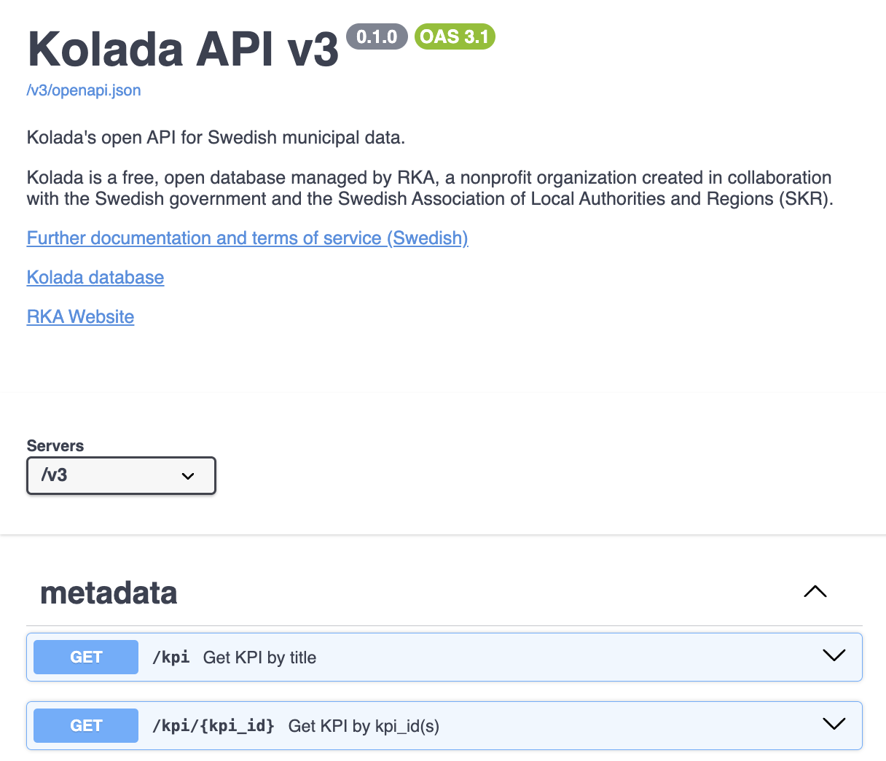

```{r}
#| echo: false
#| message: false
#| warning: false
knitr::opts_knit$set(root.dir = here::here())
options(width = 90)
options(datatable.print.nrows = 8)
options(datatable.print.topn = 3)
library(data.table)
library(httr2)
library(jsonlite)
library(tinytable)
```

## Today

- Web scraping, and why you should try to avoid it
- What an API is, and why economists meet them
- HTTP requests, status codes, JSON
- Calling APIs from R with `httr2` — Kolada and SCB
- Authentication with Google Maps geocoding
- Rate limits, retries, caching
- Wrapping an API call as an Agent *skill*

::: notes
The wrangling block left us with one big assumption: a clean CSV is sitting on disk waiting to be read. This lecture is about how that CSV gets there in the first place.
:::

## Where did our municipal data come from?

```{r}
#| output-location: default
panel <- fread(here::here(
  "data-sources", "data", "municipal-opportunity-panel",
  "municipal_opportunity_panel_2016_2023.csv"
))
panel[municipality_name == "Stockholm" & year == 2022,
      .(municipality_name, year,
        new_firm_starts_per_1000_16_64,
        share_postsecondary)]
```

- Every column in the panel was produced by an API call
- By the end of today you can reproduce this row

::: notes
The opportunity panel that we worked with did not appear out of nowhere. The build script in `data-sources/data/municipal-opportunity-panel/` calls Kolada and SCB, parses the responses, joins the pieces, and writes the CSV. Today we open up that script.
:::

# Web Scraping

## The data is on a page, not in a database

- A web page is full of data. You can see it in your browser, but there is no download button.
- The provider does not intend for you to get it in bulk, but you want it anyway
- The last-resort tool is *web scraping*: read the page's HTML, walk the divs and classes, pull out the bits you want
- Useful occasionally — but as you'll see, fragile and slow

## Classical scraping with `rvest`

- `read_html()` downloads and parses the page
- `html_element()` picks one element by **CSS** selector
- `html_table()` coerces a `<table>` into a data frame

```{r}
#| output-location: default
library(rvest)
"https://en.wikipedia.org/wiki/List_of_municipalities_of_Sweden" |>
  read_html() |> html_element("table.wikitable") |>
  html_table() |> as.data.table() |> _[1:2, 1:5] |> tt()
```

::: notes
The example above takes maybe ten seconds to write once you know the selector. The catch is figuring out the selector. SelectorGadget is the classical tool — a Chrome extension that prints the CSS selector when you click on the element you want.
:::

## Why scraping is fragile

- CSS selectors break the moment the site is restyled
- Many pages are JavaScript-rendered — the data is *not* in the HTML you download
- Rate limits and Terms of Service may forbid automated access
- "Quasi-regular" structures (the Craigslist case) need ad-hoc parsing per page
- Treat any scraper as *fragile infrastructure* with an expected lifetime

::: aside
A scraper that looks like a person browsing slowly is fine on most public-data sites. A scraper that hammers a server, ignores `robots.txt`, or republishes the data wholesale is not — and may not be legal. When in doubt, email and ask.
:::

## AI agents change the cost structure

- Old way: open inspector, click around, hand-write a selector, debug
- New way: send URL to agent, ask it write an `rvest` pipeline to pull the data you want
- The hardest part of scraping — finding the right selector — has become cheap
- *Browser use* allows agents to see the rendered page just like you would 
- The agent can also help with: "this site renders in JS, can you find the underlying API instead?"

::: notes
The most useful agent move is not "write me a scraper" — it's "look at this page in DevTools and tell me whether the data is loaded from a hidden JSON endpoint". Many "scraping" tasks turn out to be API tasks once an agent (or you) opens the Network tab of the Developer tools.
:::

## Look for a hidden API before you scrape

Most modern pages render in the browser by fetching JSON content separately. That JSON request *is* an API call — you can find it:

1. Open the page in Chrome
2. **DevTools → Network → XHR** (Cmd+Opt+I, filter to `XHR`)
3. Reload, click around — watch the requests roll in
4. Click one with a JSON-looking response → copy the URL
5. Paste it into R: `request(url) |> req_perform() |> resp_body_json()`

Agents are good at this too: paste a URL and ask "is there a JSON API endpoint behind this?"

::: notes
Many "this site has no API" complaints turn out to be "I did not look". When an agent helps, still verify manually: open the URL in your browser, confirm row counts and schema, check the site's terms.
:::

# What is an API?

## API = Application Programming Interface

- A structured way for software systems to talk to each other
- The provider sets rules: what you may ask, what they will return
- We will focus on *web APIs*: requests sent over `HTTP/S`
- The data we want lives behind one

::: notes
APIs are just an APIs: "ask in this format, and I will answer in this format." The R packages we use every day are also APIs in the broader sense — `data.table` exposes an interface to its internals through `DT[i, j, by]`. Today's APIs sit on a server and answer over the network.
:::

## Why care

- Many public statistics distributed through APIs
- Reproducibility: an API script documents the source and the query
- Up-to-dateness: re-run the script to get revised or new data
- Generate data on demand (e.g. coordinates from addresses)

::: notes
Statistical agencies, central banks, and platform companies have shifted to API-first delivery. The old workflow — download a spreadsheet, save it locally, edit by hand — does not scale and does not document itself. A small API script is shorter, more honest, and easier to rerun next year.
:::

## Web APIs and REST

- Most public data APIs follow a `REST` style
- Built on `HTTP`, the same protocol as your browser
- *Stateless*: each request stands alone, no memory of previous calls
- A handful of HTTP verbs cover almost everything
  - `GET` — read something
  - `POST` — submit a query or create something
  - `PUT` / `PATCH` / `DELETE` — update or remove (rare in data work)

::: notes
"REST" (REpresentational State Transfer) is a convention, not a strict standard. For data work the only verbs that matter are `GET` and `POST`. Everything else is an extension. Statelessness means you cannot rely on the server to remember which page you fetched last — you have to ask for the next page explicitly.
:::

## URL requests

```
https://api.kolada.se/v3/municipality?title=Stockholm
\______/\____________/\_/\__________/\____________/
 scheme       host    Ver Endpoint    Query
```

- **Scheme** — `https://` (encrypted) or `http://` (avoid)
- **Host** — server address
- **Endpoint** — which resource on the server (`/municipality`)
- **Query** — key/value parameters after `?`, separated by `&`
- Versioning often lives in the path (`/v3/`)

::: notes
Every `httr2` call below is just composing a URL like this one and choosing a verb. Once the URL looks right in a browser, the rest is plumbing. A useful debugging habit: paste the URL into a browser to confirm it returns something sensible before adding it to a script.
:::

## HTTP headers carry metadata

- Sent alongside the request, not in the URL
- Common uses:
  - `Authorization: Bearer <token>` — prove who you are
  - `Content-Type: application/json` — what you are sending
  - `Accept: application/json` — what you want back
  - `User-Agent: ec7422-student/0.1` — identify your client
- Servers also send headers back: caching info, rate-limit counters, content type

::: notes
Headers are the side channel of HTTP. Think of them as the envelope, while the URL and body are the letter. Most public APIs require very few headers; auth and `User-Agent` are the ones you will actually touch.
:::

## Status codes summarise the response

- 3-digit number returned with every response
- `2xx` — success (`200 OK`, `201 Created`)
- `3xx` — redirection (`301 Moved Permanently`)
- `4xx` — *your* fault (`400 Bad Request`, `401 Unauthorized`, `404 Not Found`, `429 Too Many Requests`)
- `5xx` — *server* fault (`500 Internal Server Error`, `503 Service Unavailable`)
- Always check the code before trusting the body

::: notes
A `200 OK` is the only status that means "your request worked and the body is what you asked for". Everything else is information about a problem. `4xx` codes blame the client; `5xx` blame the server. The split matters because the fix is in different places.
:::

## JSON

- Lightweight, text-based, easy for humans and machines
- Nearly every modern API speaks JSON
- R parses it into nested *lists*

```json
{
  "municipality_code": "0180",
  "name": "Stockholm",
  "year": 2023,
  "indicators": {
    "population_total": 984748,
    "share_postsecondary": 0.527
  },
  "source_tables": ["BE0101N1", "UF0506A1"]
}
```

## JSON has two structures

- **Objects**: unordered key/value pairs in `{ ... }`
  - Keys are strings (in `""`); values can be anything
  - Keys and values are separated by a colon (`:`)
  - Become *named lists* in R
- **Arrays**: ordered values in `[ ... ]`
  - Become *unnamed lists* (or vectors) in R
- Values are strings, numbers, booleans, `null`, or nested objects
- Everything you can express in JSON is some combination of these

::: notes
Two structures, recursively combined. Most "the API is complicated" frustration is really "the JSON is nested several layers deep". The path from a parsed response to a tidy table is mostly about navigating those layers.
:::

# Calling APIs from R: Kolada

## `Kolada`: open Swedish municipal database

- Run by `RKA` ("Rådet för främjande av kommunala analyser")
- Over 6,000 indicators ("KPIs") for Swedish municipalities and regions
- Free, no key, no agreement
- API base: `https://api.kolada.se/v3/`

::: aside
Source: <https://kolada.se/> and <https://kolada.se/om-oss/api/>. Try this in a browser right now: <https://api.kolada.se/v3/municipality?title=Stockholm>. The page you see is the API speaking — no rendering, just JSON.
:::

## `httr2`

- Modern HTTP client for R, built on `curl`
- Functions designed for pipelines: build the request → perform → inspect
- Handles JSON parsing, retries, auth, caching

::: aside
`httr` (no `2`) was the previous generation. `httr2` is the actively developed successor and what new code should use. The package website at <https://httr2.r-lib.org/> has a good vignette tour.
:::

## Build the request before you perform it

```{r}
#| output-location: default
req <- request("https://api.kolada.se/v3/municipality") |>
  req_url_query(title = "Stockholm") |>
  req_user_agent("ec7422-student/0.1 (adam@altmejd.se)")

req
```

- `request()` creates a request object — *no network call yet*
- `req_*()` functions add pieces (query params, headers, body)
- The request is just a description; nothing is sent until `req_perform()`

::: notes
Separating "describe the request" from "send the request" makes pipelines easier to read and easier to test. You can build, print, inspect, and even dry-run a request before it ever touches the network. `req_user_agent()` is good manners — public APIs use it to identify polite versus abusive callers.
:::

## Perform and check the status

```{r}
#| output-location: default
resp <- req_perform(req)
resp
```

```{r}
resp_status(resp)
```

```{r}
resp_status_desc(resp)
```

::: notes
`req_perform()` is the one line that hits the network. Always look at the status before you look at the body — a 200 is what makes the body trustworthy. `httr2` will also throw an R error on `4xx` and `5xx` by default, which is usually what you want.
:::

## Parse the JSON body

```{r}
#| output-location: default
body <- resp_body_json(resp)
str(body, max.level = 2)
```

- `resp_body_json()` parses JSON into a nested R list
- Use `str()` or `View()` if you want to click through

::: aside
Need raw text instead? `resp_body_string()`. Need raw bytes (e.g. an image)? `resp_body_raw()`. Want to keep the parser separate from `httr2`? `jsonlite::fromJSON()` works on a string.
:::

## Walk the list to find what you want

```{r}
#| output-location: default
str(body$values, max.level = 2)
```

```{r}
#| output-location: default
body$values[[2]]
```

::: notes
The shape almost always nests the actual rows one or two levels deep — typically under a key called `values`, `data`, `results`, or `items`. Print one element first to see what each row looks like before trying to assemble a table.
:::

## JSON shapes ≠ table shapes

- JSON: a tree of nested lists, with optional fields and varying depth
- Table: rectangular, named columns, one type per column
- Two-step pattern that almost always works:
  1. Find the list of "rows" (the array you want repeated)
  2. Map each list element to a one-row `data.table`, then `rbindlist`

## `lapply` + `rbindlist` is the workhorse

```{r}
#| output-location: default
municipalities <- rbindlist(lapply(
  body$values,
  function(entry) {
    data.table(
      municipality_code = entry$id,
      municipality_name = entry$title,
      region_type = entry$type
    )
  }
))
municipalities
```

::: notes
This is the entire JSON-to-table pattern in eight lines. `lapply` runs the per-element conversion; `rbindlist` stacks the results. Naming columns explicitly is much safer than relying on auto-flatten — it forces you to decide what each column should be called before the data lands.
:::

::: aside
Why not `as.data.table(body$values)` directly? Auto-flatten works only when every element has the *same* keys in the same order; real APIs return optional fields and nested sub-lists. The explicit `lapply` form documents which fields you use, produces predictable column types, and survives schema additions on the server side. Same caveat applies to `jsonlite::fromJSON(..., simplifyVector = TRUE)`.
:::

## Preparing a KPI lookup in Kolada

Kolada has 6000+ indicators. Say we want "new firm starts per 1000 inhabitants aged 16-64". How do we find the code for that?

- Two ways to find one:
  1. Browse <https://kolada.se/> by topic
  2. Hit `/v3/kpi?title=<keyword>` and read the matches

```{r}
#| output-location: default
hits <- request("https://api.kolada.se/v3/kpi") |>
  req_url_query(title = "nystartade företag") |>
  req_perform() |>
  resp_body_json()

rbindlist(lapply(hits$values, \(v)
  data.table(id = v$id, title = v$title)))
```

::: notes
The hard part of any API is rarely the HTTP call — it is figuring out *what to ask for*. Browse first, lock in the code, then write the script. The website and the API expose the same catalogue, so whichever you find more comfortable is fine.
:::

## Many APIs document themselves: OpenAPI / Swagger

See <https://api.kolada.se/v3/docs>

{.r-stretch}

::: notes
Most modern APIs ship an interactive **OpenAPI** (formerly Swagger) page that lists every endpoint, every parameter, and lets you fire requests from the browser. Kolada exposes one at `/v3/docs`.
:::

## Confirm the KPI before fetching values

```{r}
#| output-location: default
kpi <- request("https://api.kolada.se/v3/kpi/N00999") |>
  req_perform() |>
  resp_body_json()

kpi$values[[1]]$title
kpi$values[[1]]$description
```

- `N00999`: new firm starts per 1000 inhabitants aged 16-64
- The catalogue endpoint returns metadata, not data values
- Read the description and unit *before* you trust the numbers

::: notes
Even after you have a code, take ten seconds to check the description. KPI titles are short and easy to misread; the description tells you the unit, the denominator, and any disaggregation the source applies. This is the cheapest debugging step in API work.
:::

## Fetch the values for one KPI, one year

```{r}
#| output-location: default
firms_2022 <- request("https://api.kolada.se/v3/data/kpi/N00999/year/2022") |>
  req_url_query(region_type = "municipality") |>
  req_perform() |>
  resp_body_json()

length(firms_2022$values)
str(firms_2022$values[[1]])
```

- One entry per municipality
- Each entry is a small nested object with the value and metadata

## Flatten into a table

```{r}
#| output-location: default
extract_value <- function(entry) {
  data.table(
    municipality_code = entry$municipality,
    year = as.integer(entry$period),
    new_firm_starts_per_1000 = as.numeric(entry$values[[1]]$value)
  )
}

firms_dt <- rbindlist(lapply(firms_2022$values, extract_value))
firms_dt[order(-new_firm_starts_per_1000)][1:5]
```

::: notes
Wrapping the per-row shape in a small named function keeps the data-shape work out of the calling code, and documents which fields we keep. For gender-divided KPIs (`is_divided_by_gender = TRUE`), `entry$values` would have multiple elements and you would need to pick one — but `N00999` is a single-value KPI, so `[[1]]` is enough.
:::

## Many years: one call per year

```{r}
#| output-location: default
years <- 2016:2023
firms <- rbindlist(lapply(years, function(y) {
  request(sprintf("https://api.kolada.se/v3/data/kpi/N00999/year/%d", y)) |>
    req_url_query(region_type = "municipality") |>
    req_perform() |>
    resp_body_json() |>
    (\(p) rbindlist(lapply(p$values, extract_value)))()
}))
firms[1:2]
```

- Same `lapply()` pattern as multi-file reading from L7
- One iteration per request, one stacked table at the end
- Careful to not send too many requests at once — respect the provider's rate limits (coming up!)

::: notes
This is the same iteration shape as last week's multi-file reader. The only thing that changed is the source: instead of files on disk, the loop reads from a URL. The "function that returns a small `data.table`, then `rbindlist`" pattern is the recurring building block.
:::

# Example 2: SCB (PxWebApi v2, GET)

## What `SCB` exposes

- Statistics Sweden's Statistical Database (`PxWeb`) — ~5,000 tables
- Each table = multi-dimensional (region × age × sex × year × ...)
- New `PxWebApi v2` (October 2025) — `GET`-based, stable table IDs
- API base (beta): `https://api.scb.se/OV0104/v2beta/api/v2/`
- Free, no key. Rate limit: 30 requests / 10 seconds per IP

::: aside
The old `v1` API needed a `POST` with a JSON query body. `v2` covers the same data with plain URL parameters. Documentation: <https://www.scb.se/en/services/open-data-api/pxwebapi/pxwebapi-2.0/>.
:::

## SCB tables: pin the dimensions you want

- A request says *which slice* of the multi-dimensional data to return
- Variables are either **eliminable** (server can aggregate them away) or not
- Pin the ones you care about; drop the rest from the URL
- Mandatory dimensions are usually `ContentsCode` (the metric) and `Tid` (the period)

## Where to find codes?

- The SCB API hosts ~5,000 tables — you find one, then keep its short ID in the script
- Two equivalent paths:
  1. <https://www.statistikdatabasen.scb.se/> — click through to the data you want, at the bottom there is an "API" button that shows the URL
  2. Call the query endpoint: `/tables?query=<keyword>&lang=en` — same database, JSON

## Querying tables

```{r}
#| output-location: default
hits <- request("https://api.scb.se/OV0104/v2beta/api/v2/tables") |>
  req_url_query(query = "population marital status", lang = "en", pageSize = 3) |>
  req_perform() |>
  resp_body_json()

rbindlist(lapply(hits$tables, \(t)
  data.table(id = t$id, label = t$label, period = paste0(t$firstPeriod, "–", t$lastPeriod))))
```

::: aside
The web GUI is often faster for exploring an unfamiliar subject. Once you know the table ID, the API gives you a reproducible script — and `/tables/<id>` returns the same metadata the GUI shows on the table page.
:::

::: notes
SCB does not publish a Swagger page, but the GUI fills the same role — click through the subject tree, find the table, read the variable list, copy the table ID. Every choice you make in the GUI corresponds to a `valueCodes[...]` parameter in the API. If you can build the slice you want by point-and-click, you can build the URL.
:::

## Fetch table metadata

`TAB638` = "Population by region, marital status, age and sex"

```{r}
#| output-location: default
scb_base <- "https://api.scb.se/OV0104/v2beta/api/v2/tables/TAB638"

meta <- request(paste0(scb_base, "/metadata")) |>
  req_url_query(lang = "en") |>
  req_perform() |>
  resp_body_json()

names(meta$dimension)
```

- Each entry in `dimension` is a variable with codes and labels
- `extension$elimination = TRUE` means we can drop that variable from the request

```{r}
#| output-location: default
sapply(meta$dimension, \(d) d$extension$elimination)
```

::: notes
Without the metadata call you would be guessing at codes. The `elimination = TRUE` flag is what makes `v2` so much easier than `v1` — you only spell out the dimensions you actually care about.
:::

## Content codes: which metric do you want?

A single table can hold several metrics. `ContentsCode` is the dimension that picks one.

```{r}
#| output-location: default
unlist(meta$dimension$ContentsCode$category$label)
```

Same for other dimensions — `category$label` to see the codes

```{r}
#| output-location: default
head(unlist(meta$dimension$Region$category$label), 4)
```

::: notes
Every dimension in `meta$dimension` has the same shape: a `category$label` list mapping code to human-readable name.
:::

## Build the GET URL

```{r}
#| output-location: default
resp <- request(paste0(scb_base, "/data")) |>
  req_url_query(
    lang = "en",
    `valueCodes[Region]` = "0114,0180,1480,2480",
    `valueCodes[Tid]` = "top(5)",
    `valueCodes[ContentsCode]` = "BE0101N1",
    outputFormat = "json-px"
  ) |>
  req_perform()

resp_status(resp)
```

- Pin Region (four municipalities), `Tid` (last 5 years), and the metric
- Drop `Civilstand`, `Alder`, `Kon` — `elimination = TRUE` lets the server aggregate them
- `top(5)` selects; `*` (all) and `range(2010,2020)` also work

::: aside
The bracket syntax `valueCodes[Region]` is part of the API spec. `httr2` percent-encodes it for you. Backticks let you pass non-syntactic argument names like `` `valueCodes[Region]` ``.
:::

## Parse the response

```{r}
payload <- resp_body_json(resp)
str(payload$columns)
```

Save the column names

```{r}
column_codes <- sapply(payload$columns, `[[`, "code")
column_codes
```

## Parse the response (cont.)

```{r}
#| output-location: default
population <- rbindlist(lapply(payload$data, function(row) {
  setnames(as.data.table(as.list(c(row$key, row$values))), column_codes)
}))
population[, BE0101N1 := as.integer(BE0101N1)]
population[1:2]
```

- Same `lapply + rbindlist` shape as Kolada — the cube unpacks one row at a time
- `row$key` is the dimension values, `row$values` is the metric(s)

::: notes
Once you have the v2 URL, every PxWeb response unpacks the same way. Most of the work in a real build script is choosing the right tables and writing down the codes — the parse is one helper function.
:::

# Authentication and Respectful Use

## When you need a key

- Most public statistics APIs (`SCB`, `Kolada`, OECD): no key
- Private or commercial APIs (Google Maps, Twitter/X): key required
- Some tiered APIs (e.g., FRED): key unlocks features
- A key identifies *who* is calling — for billing and rate-limit accounting

## Geocoding: address → coordinates

- *Geocoding* is turning a street address into latitude/longitude
- Useful when you want to merge data on location (e.g. distance to nearest school)
- Google Maps Platform offers a generous free tier and good Swedish coverage
- Endpoint: `https://maps.googleapis.com/maps/api/geocode/json`
- Requires a personal API key from <https://mapsplatform.google.com/>

::: aside
Other free options exist — `Nominatim` (OpenStreetMap) is the most common no-key alternative, but it has tighter limits and patchier results outside major cities.
:::

## Environment variables: where the key lives

- Never paste a key into a script or commit it to Git
- Define it once, outside your project, e.g. in `~/.Renviron`:

```r
# ~/.Renviron — one KEY=value per line, no quotes needed
GMAPS_API_KEY=AIzaSyD...your-real-key-here
```

- Edit with `usethis::edit_r_environ()`, then restart R
- Read at runtime with `Sys.getenv("GMAPS_API_KEY")`

::: aside
`~/.Renviron` is a "dotfile", a type of configuration file that lives in your home directory — accessible from every project. A project-local `.Renviron` (no `~/`) overrides it for one project. Add `.Renviron` to `.gitignore`.
:::

::: notes
Keys exposed in public Git history get scraped within minutes by automated scanners. GitHub itself will email you when it spots a leaked secret, and the relevant providers usually disable the key.
:::

## Two ways APIs accept keys

- **Query parameter**: `...?key=ABC123`
  - Visible in URL and in server logs — less secure
  - Common for low-stakes calls (Google Maps, basic stats APIs)
- **Authorization header**: `Authorization: Bearer ABC123`
  - Not logged with the URL, slightly safer
  - Standard for OpenAI, GitHub, most modern APIs

```{r}
#| output-location: default
#| eval: false
# Query-parameter form (Google Maps)
request(url) |>
  req_url_query(key = Sys.getenv("GMAPS_API_KEY")) |>
  req_perform()

# Header form (OpenAI, GitHub, ...)
request(url) |>
  req_auth_bearer_token(Sys.getenv("OPENAI_API_KEY")) |>
  req_perform()
```

## Geocoding Stockholms universitet

```{r}
#| eval: false
#| output-location: default
geo <- request("https://maps.googleapis.com/maps/api/geocode/json") |>
  req_url_query(
    address = "Stockholms universitet, Stockholm, Sweden",
    key = Sys.getenv("GMAPS_API_KEY")
  ) |>
  req_perform() |>
  resp_body_json()

geo$results[[1]]$geometry$location
#> $lat
#> [1] 59.36546
#>
#> $lng
#> [1] 18.05518
```

- Same pipeline as before
- Only difference: the `key` argument to authenticate

::: notes
Geocoding is one of the rare API services where the response is generated on demand rather than retrieved from a fixed table — Google's geocoder runs a search engine over its address database for each call.
:::

## Rate limits

- Public APIs cap how often you may call them
- `SCB` v2: 30 requests per 10-second window per IP
- `Kolada`: no published limit, but be polite
- Google Maps Geocoding: free tier ≈ 10,000 requests / month
- `X-RateLimit-Remaining` and `Retry-After` tell you where you stand
- Going over the limit returns `429 Too Many Requests`

::: notes
Hitting the limit is not just rude — it usually gets you a temporary block. A build script that sleeps a fraction of a second between calls stays safely under most rolling-window limits even when issuing many calls back-to-back.
:::

## Slow yourself down

```{r}
#| eval: false
#| output-location: default
for (year in years) {
  fetch_one_year(year)
  Sys.sleep(0.4)   # stay well under SCB's 30-per-10-seconds limit
}
```

- A simple `Sys.sleep()` between calls is often enough
- Keep sleeps short but not zero — even for unlimited APIs

## Handle transient failures with `req_retry`

```{r}
#| eval: false
#| output-location: default
request(url) |>
  req_retry(
    max_tries = 3,
    backoff = \(n_failed) n_failed * 2 # seconds to wait
  ) |>
  req_perform()
```

- Network blips, momentary `503`s, and `429`s are normal
- `req_retry()` re-sends after waiting, with exponential backoff
- It also reads `Retry-After` headers automatically when present

::: notes
Retries are not a license to ignore errors — they are a way to recover from *transient* errors. A 4xx that means "your request is wrong" should not be retried, and `req_retry()` knows the difference by default. Always log retries; silent retries hide systemic problems.
:::

## Cache to disk so you do not re-fetch

```{r}
#| eval: false
#| output-location: default
request(url) |>
  req_cache(tools::R_user_dir("ec7422-cache", which = "cache")) |>
  req_perform()
```

- `httr2` can keep a local cache keyed by URL and headers
- Repeats during development become free
- Add a manual *invalidation strategy* — APIs do change

::: aside
This Quarto deck uses `cache: true` at the chunk level for the same reason: re-knitting should not require re-fetching every API. For the panel build, store the raw JSON next to the parsed CSV; reproducibility means the *raw bytes*, not just the cleaned table.
:::

## Identify yourself

- Set a meaningful `User-Agent` so providers can contact you on abuse
  - `req_user_agent("ec7422-student/0.1 (you@su.se)")`
- Read the documentation. Some APIs require it (Nominatim, met.no)
- Cite the source in any output that uses the data

::: notes
A polite `User-Agent` is the cheapest insurance against being blocked. The default `httr2` agent identifies as a generic R client, which some providers throttle harshly. A line that names the project and an email address tells a sysadmin who to ping if something looks wrong.
:::

# Wrapping API access in an Agent Skill

## From an API call to a skill

- An **agent skill** is a small package that tells an agent
  - *what* a capability does
  - *when* to reach for it
  - *how* to call it
- Folder with a `SKILL.md` runbook plus helper `R` scripts
- Same idea as L5: Skill is now pointed *outward* at an API

## What a `fetch-scb` skill should do

Help any caller — agent or human — pull statistics from SCB without re-learning the API every time.

- **Search** for table candidates - return candidate `TAB####` IDs and labels
- **Inspect** a table ID - list (eliminable/not) dimensions, codes
- **Slice** a table ID - fetch and parse into a tidy `data.table`
- **Iterate** politely — sleep between calls, retry on fail, cache repeats
- **Cite** — return the table ID, `ContentsCode`, API call

::: notes
The three core layers — search, inspect, slice — match the workflow we walked through manually. Wrapping each step lets the agent compose them: "find a table about employment rates, list its dimensions, pull the rate for these four municipalities." Without the search and inspect layers, the agent would only fetch from tables you already named — which defeats the point of the skill.
:::


## `SKILL.md` — the runbook the agent reads

````markdown
---
name: fetch-scb
description: Search SCB tables and fetch tidy slices as data.table.
  Use for any Swedish official-statistics question by region, year, or demographic.
---

# fetch-scb

## Workflow

1. If the user names a topic, run `search_scb_tables(...)`. Show top hits, ask which to use.
2. Run `scb_metadata(...)`. Confirm the metric (`ContentsCode`) and the slicing dimensions.
3. Call `scb_query(...)` with `selections` listing only the dimensions to pin.

## Rules

1. Always set `outputFormat=json-px` — the parser expects that shape.
2. Pin `ContentsCode` and `Tid`. Drop dimensions where `elimination = TRUE`.
3. Sleep ≥ 0.4 s between calls (SCB's 30-per-10-s limit). Retry once on `503`.
4. SCB returns everything as character — convert numeric columns explicitly.
5. Cite table ID, `ContentsCode`, and time range in any output that uses the data.
````

::: notes
The frontmatter `description` is what the runtime actually reads when deciding whether the skill is relevant — keep it specific enough to disambiguate from neighbouring skills. The body is the runbook a new caller would otherwise discover the hard way: a step-by-step workflow first (so the order of operations is unambiguous), then the rules that bite if you forget them. The citation rule is what makes downstream work reproducible — without it, the agent's output is a number with no provenance.
:::

## Layout: small folder, one job per script

```text
skills/fetch-scb/
├── SKILL.md
└── scripts/
    ├── scb_search.R   # search_scb_tables(query, page_size = 10)
    ├── scb_meta.R     # scb_metadata(table_id), dim_codes(meta, dim)
    └── scb_query.R    # scb_query(table_id, selections, years)
```

- One helper script per capability, each callable from R or from the agent's tool layer
- Helpers are normal R functions — write tests, run them at the REPL, ship them in the skill

::: aside
You already have building blocks for these: the search slide called `/tables?query=...`, the metadata slide drilled into `meta$dimension`, and the URL slide pinned `valueCodes[...]`. The skill just packages each step under a stable name.
:::

## A skill grows institutional memory

- `SKILL.md` is where that knowledge lives — versioned with the project, re-read on every call
- More wisdom over time — append, don't rewrite

````markdown
## Tables we have used

| ID      | What                                  | ContentsCode |
|---------|---------------------------------------|--------------|
| TAB638  | Population by region, age, sex        | BE0101N1     |
| ...     | (add as you confirm them)             | ...          |

## Gotchas

- **Labour-market series breaks in 2022.** Pre-2022 lives in one table,
  2022+ in another. The series is *not* seamless — keep a `source_table`
  column so the join is auditable.
- **414 URI Too Long.** `valueCodes[Alder]` with many ages overflows the
  URL. Split age ranges into chunks of ≤ 25 codes and `rbindlist`.
- **Income is in price-base amounts (`pbb`)**, not SEK. Join the yearly
  `prisbasbelopp` to convert. Real-terms comparisons need the index too.
````

::: notes
This is *explicit* memory: version-controlled, peer-reviewable, transferable when a colleague picks up the project. Different from an agent's session memory — that lives in one chat; this lives in git. Borrow the entries when starting `fetch-eurostat`; throw them out when SCB fixes the bug. The same appendix doubles as a personal knowledge base — students who keep one across PS3, the thesis, and their first job will rediscover the same gotchas exactly once.
:::

## Why a skill, not just a script

- **Discoverable**: the agent finds it when relevant
- **Interactive**: the agent can ask questions and help you search
- **Single source of truth**: API quirks and rate-limit rules in one place
- **Adaptable**: the agent can adjust parameters on the fly (e.g., "fetch 2010–2020 instead of just 2022")
- **Transferable**: same shape works for `fetch-eurostat`, `fetch-fred`, `fetch-worldbank`

::: notes
A good skill fits on one screen and is one place to update when the API changes. For L8 it also bridges to next week, when we look at LLMs as the data-processing tool itself rather than as the caller. The skill pattern is what turns "I once wrote an SCB script" into "my projects can talk to SCB"; the difference is having the runbook live next to the code instead of in your head.
:::

# Wrapping Up

## Main takeaways

- Look for an API before you scrape — and look for a hidden API before you give up
- `httr2` pipeline: `request → req_*() → req_perform → resp_body_json`
- Nested JSON → table = `lapply` + per-row constructor + `rbindlist`
- Keep keys in `~/.Renviron`; pull with `Sys.getenv()`
- Respect rate limits, retry transient failures, identify yourself politely
- Wrap a working call as an agent skill — you and your agents both get it for free

## Next lecture: LLMs for data processing

- Structured extraction, classification, and summarisation
- Validation and failure documentation