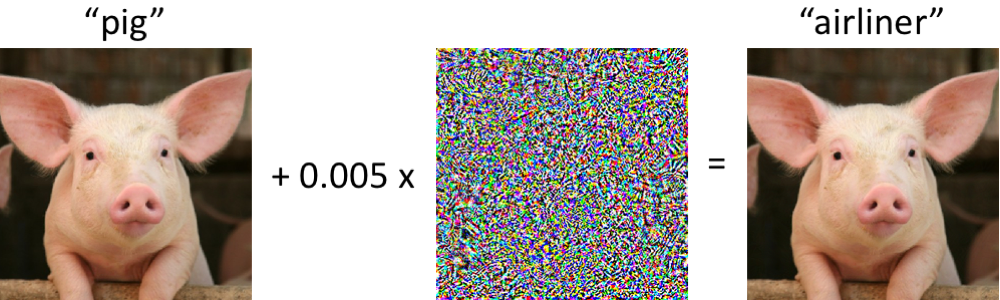
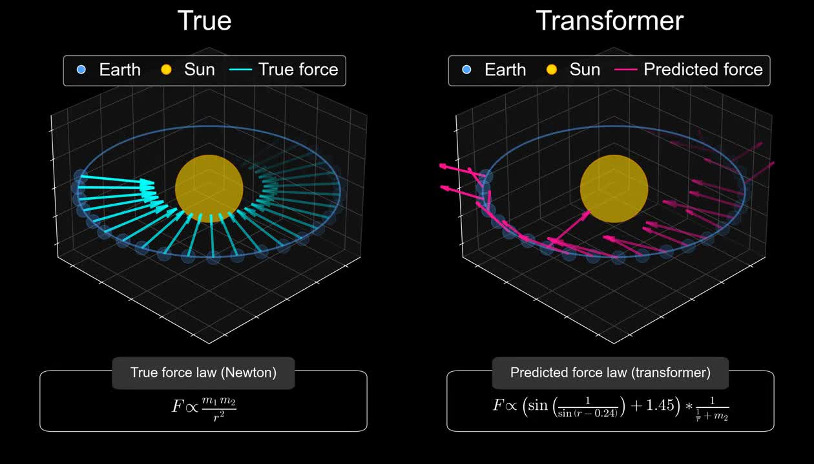
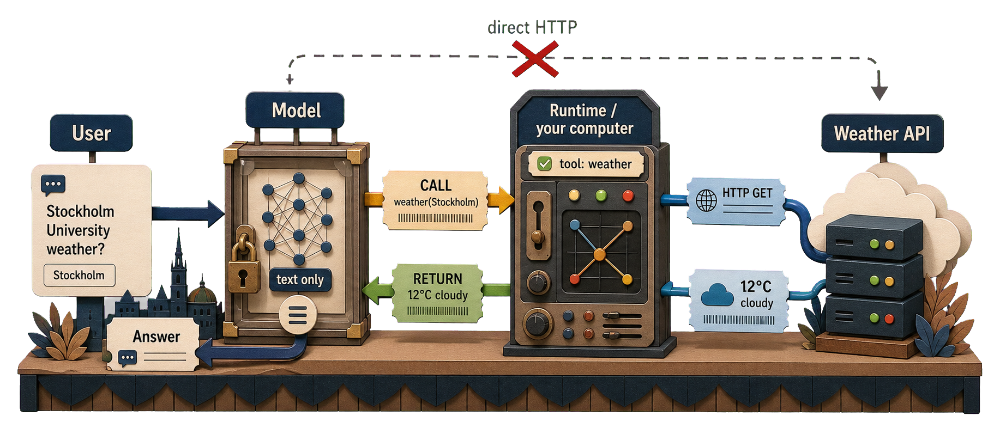

```{r}
#| echo: false
#| message: false
#| warning: false
options(width = 90)
options(datatable.print.nrows = 8)
options(datatable.print.topn = 3)
library(data.table)
library(ggplot2)
theme_set(
  theme_bw(base_size = 12, base_family = "Inter") %+replace%
    theme(
      plot.background = element_rect(fill = "transparent", color = NA)
    )
)

project_root <- here::here()
lecture_example_dir <- file.path("in_class_examples", "lecture_9")
knitr::opts_knit$set(root.dir = project_root)
source(file.path(project_root, "src", "lecture_helpers.R"))
```

## Today

- Where LLMs fit in a data pipeline (and where they don't)
- How to call one: shell, HTTP, and `ellmer`
- Three concrete tasks:
  - **structured extraction**
  - **classification**
  - **summarization**
- Cost, privacy, and key discipline

# Large Language Models

## A working definition

- A **large language model** is a neural network trained to predict the next token of text
- Trained on a very large fraction of the public internet, plus licensed data, plus human feedback
- The trained model is a fixed mathematical function — no learning happens at inference time
- "Reasoning" is just longer chains of token prediction conditioned on a prompt

::: aside
"In-context learning" is the technical term for the fact that the model can "learn" from the prompt. While not persistent, it can provide something much like learning. The model is not changing its weights, but it is changing its output based on the prompt.
:::

::: notes
The math behind these models matters less for our purposes than the operational consequences. A trained LLM is a stateless function from prompt to output. There is no database it can query and no memory of previous conversations unless you supply that context every time.
:::

## 2024: Reasoning models think before they answer

- Models can run a (hidden) chain of thought before answering
- Visible in API responses as `reasoning` objects
- Tradeoff: Smarter but more tokens and higher latency
- Rule of thumb for data work:
  - Thinking **on** for complex per-item tasks where errors are costly
  - Thinking **off** for short, batch-shaped, high-volume tasks

::: aside
On Gemini, `gemini-3-flash-preview` thinks by default; `gemini-3.1-flash-lite` does not. Most providers now expose a thinking budget (in tokens) or toggle — check the docs for the exact parameter name before relying on a default.
:::

::: attribution
@Wei2022_chain_of_thought; @Jaech2024_o1_system_card
:::

::: notes
Reasoning modes are the main reason a single LLM call can cost ten times more than the back-of-envelope tokens-times-price would predict. The hidden tokens count toward the bill. They also count toward latency, which matters when a script runs over thousands of items in a loop.
:::

## 2025: Training models to verify themselves

- When correctness is mechanical, both training and inference get a clean signal
- Reasoning models are trained with RL on **auto-graded rewards** — unit tests pass, math answer matches, JSON validates
- Use to your advantage: tell the model to auto-verify
  - Execute the code, read the traceback, retry
  - Validate output against a schema, read the error, retry
  - Loop until the verifier accepts
- Help the model *fix its own mistakes*

::: attribution
@Lambert2024_tulu3; @DeepSeekAI2025_r1
:::

::: notes
The headline result from DeepSeek-R1, and the OpenAI o-series before it, is that a mechanically-graded reward — did the code compile, did the unit test pass, did the answer match a known integer — pushes capability much further than imitation learning alone. The same logic reshapes everyday use. If you can write a checker for the output, an agentic loop fixes its own mistakes; if you cannot, you are flying blind. The structured-output schemas, regression sets, and sample audits that come up later in the lecture are all cheap verifiers that turn a one-shot call into a feedback loop.
:::

## What LLMs are good at in data work

- **Reading** unstructured data and pulling out structured fields
- **Classifying** text with labels
- **Summarising** large volumes of text
- **Translating** between languages

::: aside
Several of the latest models are multi-model and are excellent at reading not only text data but also images, videos, and audio.
:::

::: notes
Notice the missing categories: arithmetic, retrieval of specific facts, anything that requires the model to know a current value. LLMs can do those things sometimes, but not reliably. The four tasks above are where the technology earns its keep in a data pipeline.
:::

## What LLMs are (still) bad at

- **Counting** and exact arithmetic over long inputs
- **Lookup of fringe facts** without tool calling or web search
- **Determinism** — the same prompt can return different answers
- **Calibrated confidence** — they are often confidently wrong

::: aside
Counting and fact lookup is not that much of a problem if the model can call tools and search the web.
:::

::: notes
The last two are the hardest to internalise. Output that reads as a confident, well-formed answer carries the same prose cues whether it is right or fabricated. That is why the rest of this lecture spends as much time on validation as on the calls themselves.
:::

## "Jagged" intelligence

- Capabilities are uneven and unpredictable across tasks
- The same model can ace a hard problem and fail a trivial one
- Classic examples:
  - Miscounts the `r`s in "strawberry"
  - Says `9.11 > 9.9` because it reads them as version numbers
  - Fails on radiology images from a different scanner brand
- AI firms overfit to benchmarks, RL on famous failures
- Implication: really hard to infer "true" capability

::: attribution
@Zech2018_variable_generalization
:::

::: notes
The term, popularised by Andrej Karpathy, describes a profile of strengths and weaknesses that does not match human intuition about difficulty. A task we find easy may be genuinely hard for the model, and vice versa. The practical consequence for data work is the same as for hallucination: do not trust on priors, measure on a sample.
:::

## What do you get if mix a pig and some noise?

{.r-stretch fig-align="center"}

- Left: pig, classified as `pig`. Right: same pig, every pixel nudged by at most 0.005, classified as `airliner` with high confidence
- Adversarial example, not something that happens by chance
- AI outputs can be brittle in ways invisible to the eye

::: {.attribution}
@MadrySchmidt2018_adversarial — <https://gradientscience.org/intro_adversarial/>
:::

::: notes
This is an Inception-v3 image classifier, not an LLM, but the lesson generalises. A model that scores well on average can still have specific inputs on which it confidently fails. The next slide shows the LLM version of the same phenomenon, where the "perturbation" is just an everyday-looking task the model happens to be bad at.
:::

## Predicting orbits without knowing gravity

{.r-stretch fig-align="center"}

::: attribution
@Vafa2025_foundation_world_models
:::

::: notes
Vafa, Chang, Rambachan, and Mullainathan (ICML 2025) introduce *inductive bias probes*: adapt the foundation model to a new task in the same domain and see which underlying law it generalises with. A model trained on Kepler-like orbital data predicts orbits well, but when nudged onto a related physics task it does not behave as if it has internalised gravity. The same pattern shows up across other domains they test. The takeaway for this course: a model that scores well on the headline task can still be missing the structure you would need it to have for any task you have not benchmarked yet.
:::

## Four common failure modes

- **Hallucination** — invents fields that aren't in the input
- **Sycophancy** — labels match the prompt's framing, not the text
- **Calibration** — equally confident on right and wrong answers
- **Spec drift** — returns `"part-time-ish"` when the enum forbids it

::: notes
Hallucination used to be treated as the single defining failure. With grounded tasks and frontier models the picture is broader — any of the four can sink a pipeline. None can be eliminated, all can be contained.
:::

## Containment patterns

- **Structured output** — schema rejects free-form invention
- **"Don't know" option** — `unknown` enum value, fail loudly on it
- **Sample audit** — eyeball 30-50 outputs against their inputs
- **Regression set** — fixed cases re-run on every change
- **Re-ask differently** — labels that flip reveal sycophancy

::: notes
A small set of moves covers most failure modes. Structured output and the don't-know path catch hallucination and spec drift; re-asking catches sycophancy; sample audit and regression set catch calibration drift over time. The Validation section later in the lecture turns these into a workflow.
:::

## Same prompt, different answer

- LLM output depends on a sampling step
- A `temperature` parameter (sometimes) controls randomness
  - `0` is the most (but not fully) deterministic
  - Higher values produce more varied (creative?) output
- Two consequences for data work:
  - You cannot rerun a script and expect the same answer
  - Save the output, do not just save the script

::: notes
Even at temperature zero, the underlying engine still has small sources of variation: GPU scheduling, batched inference, and silent provider patches. The honest mental model is that any given call's output is a sample, not a value.
:::

## Non-determinism and reproducibility

- An LLM call is more like a measurement than a function evaluation
- Three things move under your feet between runs:
  - **Sampling** — the next slide
  - **Provider updates** — models can change without notice
  - **Hidden state** — chat history, tool calls, and system prompts compound across turns
- Reproducibility recipe:
  - Pin the model version explicitly, and write it to the output
  - Save the raw response next to the script that produced it
- Treat the call as the experiment, the response as the data

::: notes
This is a different reproducibility problem than the one that comes up with `set.seed()` in a simulation. There, the randomness is yours to control. Here, the randomness is on the provider's side. The defensive habit is to record what you got, not just how you asked.
:::

## Example 1: Washing our car

Let's try a classic problem with a local model (Gemma4:e4b, a 4-bit quantised version of the full Gemma 4):

```bash
ollama run gemma4:e4b --hidethinking \
  "I need to wash my car. The car wash is only 50m from my house, should I walk or drive?"
```

```text
You should **walk**.

For a distance of only 50 meters, walking is by far the most practical, efficient, 
and quickest option.

Here is why:

1.  **Time:** Walking will take less time than getting into the car, navigating, 
    and finding a spot.
2.  **Effort:** It requires virtually no effort.
3.  **Convenience:** You won't have to worry about maneuvering the vehicle or 
    finding parking right at the entrance.

Unless you have a severe physical limitation, walking is the clear winner in this scenario.
```

::: aside
`ollama` is one of several local LLM runtimes. `ollama pull gemma4:e4b` downloads the weights; `ollama run` then runs prompts.
:::

## Let's ask a paid model API (gemini-3.1-flash-lite)

```bash
curl -s -X POST "https://generativelanguage.googleapis.com/v1beta/models/gemini-3.1-flash-lite:
                 generateContent?key=$GOOGLE_API_KEY" -H "Content-Type: application/json" 
  -d '{
    "contents": [{
      "parts": [{"text": "I need to wash my car. The car wash is only 50m 
                          from my house, should I walk or drive? Answer briefly."}]
      }]
  }' | jq -r '.candidates[0].content.parts[0].text'
```

```text
**Walk.** It is safer for your car to be washed when the engine is cool, and it avoids the
inconvenience of idling or starting/stopping for such a short distance.
```

- POST a JSON payload, read a JSON response 
  - I used `jq` to extract the response
- API key lives in `GOOGLE_API_KEY`, never on the command line directly

::: aside
I'm actually cheating a bit here. I added "Answer briefly" because the model gave a long answer and reasoned its way to answering "drive". gemini-3.1-flash-lite was released 2026-03-03, this example is almost surely in its training data so its unclear if the model actually "gets" it.
:::

::: notes
Nothing here is specific to LLMs — it is the same HTTP-and-JSON shape we used for SCB in L8. The provider differs; the mechanics do not. Reading the raw response once makes the rest of the lecture less mysterious: the model is a web service that returns a string wrapped in metadata.
:::

## Google API JSON output

```json
{
  "candidates": [
    {
      "content": {
        "parts": [
          {
            "text": "**Walk.** It is safer for your car to be washed when the engine is cool, and 
            it avoids the inconvenience of idling or starting/stopping for such a short distance.",
            "thoughtSignature": "EjQKMgEMOdbH+yMIl7M52JHLWeiHtjM640/
            M6BSIRJVQgzKrHUPsmGMO8K3UNMmSlWDqR43t"
          }
        ],
        "role": "model"
      },
      "finishReason": "STOP",
      "index": 0
    }
  ],
  "usageMetadata": {
    "promptTokenCount": 29,
    "candidatesTokenCount": 35,
    "totalTokenCount": 64,
    "promptTokensDetails": [
      {
        "modality": "TEXT",
        "tokenCount": 29
      }
    ],
    "serviceTier": "standard"
  },
  "modelVersion": "gemini-3.1-flash-lite",
  "responseId": "r_sCaoSmCfn4vdIPsdiBsAc"
}
```


## Example 2: Reasoning works

```bash
ollama run gemma4 "How many r's are there in Strawberry? Answer with a single number."
```

```text
2
```

```bash
ollama run gemma4 "How many r's are there in Strawberry?"
```

```text
Thinking...
1.  **Analyze the request:** The user wants to know the count of the letter 'r' in the word "Strawberry".
2.  **Examine the word:** S-t-r-a-w-b-e-r-r-y
3.  **Count the 'r's:**
    *   S-t-**r** (1)
    *   a-w-b-e-**r** (2)
    *   **r**-y (3)
4.  **Formulate the answer:** There are three 'r's.
...done thinking.
```

## `ellmer` wraps model calls in R

- Building the payload, parsing the response, retries, rate limits, streaming, schemas
- `ellmer` is an R interface that hides it all behind convenient functions
- The two calls above, written in R:
  - `chat_ollama(model = "gemma4:e4b")` for the local route
  - `chat_google_gemini(model = "gemini-3-flash-preview")` for the hosted route

::: notes
Showing the shell version first is deliberate. `ellmer` is mostly a payload builder and a response parser — nothing magical is happening. Knowing what is under the hood means a stuck call can be debugged by dropping back to `curl`, and provider docs (which are written in HTTP terms) can be read without translation.
:::

## `ellmer` syntax

- Small R package from `Posit` for talking to LLMs
- One unified interface across providers
- Four things we will use:
  - `chat_*()` — start a chat
  - `$chat()` — free-form text completion
  - `$chat_structured()` — schema-constrained output
  - `parallel_chat_structured()` — over a vector of inputs

::: aside
Package site: <https://ellmer.tidyverse.org/>. "Articles" section has useful resources. The package is young — exact function names may shift between releases.
:::

## Google Gemini

- We will use **Google Gemini**
- Google offers a *free* preview tier that covers everything we will do in the problem sets
- Set `GOOGLE_API_KEY` once in `~/.Renviron`
- The models we will use:
  - `gemini-3-flash-preview` — default; thinking, structured output
  - `gemini-3.1-flash-lite` — faster and cheaper, less capable

::: aside
Gemini Flash are small and cheap models, far from as capable as GPT5.5 or Claude 4.7, but good enough for our purposes and a lot cheaper.
:::

## A first `ellmer` call

```{r}
#| eval: false
#| output-location: default
library(ellmer)

chat <- chat_google_gemini(
  model = "gemini-3-flash-preview",
  system_prompt = "You are a terse R teaching assistant. No preamble."
)

chat$chat("In one sentence, define structured extraction.")
```

```text
Structured extraction is the task of converting unstructured text into
fields that conform to a fixed schema, so that the result can be used
as data rather than read as prose.
```

::: notes
A "system prompt" is a persistent instruction prepended to every message in the conversation. It is the cleanest place to set tone, scope, and any non-negotiable rules. Without one, the model defaults to a generic chat persona that wastes tokens on pleasantries.
:::

## Chats are stateful, calls are not

- A LLM API call is stateless — the model does not remember previous calls
- A `chat` object remembers the conversation, each `$chat()` sends the entire history
- This is also how ChatGPT etc work — the "conversation" is just the provider storing and resending the history
- Gets expensive fast
- For data work, split processing into many chats or use `parallel_chat_structured()`

::: notes
Long conversations get expensive fast because the input grows linearly with each turn. For data-processing tasks, you almost never want a multi-turn chat — you want a per-item single-shot call.
:::

# Structured Extraction

## Free text in, structured fields out

```{r}
#| output-location: default
ads <- c(
  "Software developer wanted, Stockholm. Full-time, 3-5 yrs experience. SEK 55,000/mo.",
  "Söker undersköterska till hemtjänsten i Malmö, deltid 75%, snar tillträde.",
  "Data analyst, hybrid (Gothenburg/remote). Python required. Salary 48-58k depending on experience."
)
```

- Three short job ads, mixed languages, mixed structure
- Goal: pull out role, location, employment type, and salary as separate columns
- Done by hand: tedious, error-prone, does not scale to 10,000 ads

## Without structure, you get prose

```{r}
#| eval: false
#| output-location: default
chat$chat(ads[1])
```

```text
This is a Stockholm-based software developer position with 3-5 years
of required experience, paying 55,000 SEK per month, on a full-time
basis...
```

- Useful for a human reader, useless as a column in a `data.table`
- Parsing this back into fields is hard

::: notes
The whole point of using an LLM as a data tool is to skip the parsing-prose-back-into-fields step. Free chat output puts that step right back in front of you.
:::

## Define the schema first

```{r}
#| eval: false
#| output-location: default
job_schema <- type_object(
  role = type_string("Job title, normalised to English"),
  location = type_string("City. Use 'remote' if no city is given."),
  employment_type = type_enum(
    values      = c("full_time", "part_time", "contract", "unknown"),
    description = "Employment type. Use 'unknown' if not stated."
  ),
  salary_sek_monthly = type_number(
    "Monthly salary in SEK. Midpoint if a range. NA if not stated."
  )
)
```

- The schema is the contract — what the model is allowed to return
- Each field has a name, a type, and a short description
- The description doubles as a prompt: the model reads it
- `type_enum()` constrains a field to a fixed vocabulary

::: notes
The schema is half data definition, half prompt. The descriptions tell the model how to handle missing or ambiguous cases. Vague descriptions produce inconsistent output; explicit ones are worth the extra five minutes.
:::

## Extract structured data

```{r}
#| eval: false
#| output-location: default
extract_chat <- chat_google_gemini(model = "gemini-3-flash-preview")

result <- parallel_chat_structured(
  extract_chat, ads, type = job_schema
)

as.data.table(result)
```

```text
                   role   location employment_type salary_sek_monthly
1:   Software developer  Stockholm       full_time              55000
2: Healthcare assistant     Malmö       part_time                 NA
3:        Data analyst Gothenburg       full_time              53000
```

- One ad in, one row out
- `parallel_chat_structured()` sends one prompt per element
- Result in tibble with one row per prompt, columns per schema

::: aside
`ellmer` handles the schema-to-prompt translation behind the scenes. Different providers expose this as either "JSON mode" or "tool calling"; `ellmer` picks the right path automatically.
:::

## Why this beats free-form prompting

- The model **cannot** return free text — the API rejects it
- Optional fields are explicit (`NA` rather than "not stated")
- Enums prevent invented categories (no `"part-time-ish"`)
- Numeric fields come back as numbers
- Schema lives in version control

::: notes
Structured output is the single biggest reliability win available with current LLMs. It removes an entire class of "the model said it was a salary but actually wrote a sentence" bugs. For any LLM step that feeds downstream code, structured output should be the default.
:::

## Schema design checklist

- Use `type_enum` whenever the value space is bounded
- Always pass `type_enum()` args by name: `values = ...`, `description = ...`
  - `type_enum`'s first arg is `values`, not `description` — the other
    `type_*()` constructors put `description` first, so positional calls
    silently bite
- Document missing-value handling in the description
- Decide units up front (`SEK_monthly`, not `SEK`)
- Keep descriptions short — the model reads every word

# Classification

## Classification is structured extraction with one field

```{r}
#| eval: false
#| output-location: default
sentiment_schema <- type_object(
  label = type_enum(
    values      = c("positive", "neutral", "negative"),
    description = "Overall sentiment of the comment toward the survey itself."
  ),
  reason = type_string("One short sentence supporting the label.")
)
```

- A label is just a `type_enum` field
- Use `reason` field to fetch the models motivation for the label
- Cheaper and more reliable than asking for sentiment in free text

::: notes
The "reason" trick is also a debugging aid: when the label looks wrong, the reason often shows whether the model misread the input or applied the wrong rule. Save the reason; you will read it during validation.
:::

## Example: survey feedback

```{r}
#| output-location: default
feedback_path <- here::here(
  "in_class_examples", "lecture_9", "survey_feedback_generated.txt"
)
feedback <- readLines(feedback_path, encoding = "UTF-8")
length(feedback)
head(feedback, 4)
```

- 800 short Swedish-language comments from a future-of-work survey of 15-year-olds
- Mixture of substantive feedback, complaints, jokes, and off-topic chatter

::: aside
The data is synthetic for GDPR reasons but I used a (local!) LLM to generate it from real survey feedback that we received.
:::

## Classify the corpus

```{r}
#| eval: false
#| output-location: default
classify_chat <- chat_google_gemini(model = "gemini-3.1-flash-lite")

labels <- parallel_chat_structured(
  classify_chat, feedback, type = sentiment_schema
)

labels_dt <- as.data.table(labels)
labels_dt[, comment := feedback]
labels_dt[, .N, by = label]
```

```text
      label   N
1: negative 412
2:  neutral 287
3: positive 101
```

::: aside
`parallel_chat_structured()` sends one prompt per element and runs them concurrently. For 800 short rows on `gemini-3.1-flash-lite`, that finishes in a minute or two and costs cents at current pricing — the lite model is the right pick when the per-item task is short and there are many items.
:::

::: notes
Resist the urge to send the entire batch in one prompt. Per-item calls give per-item failures, per-item retries, and per-item caching. They are also the only safe way to compare model outputs against a hand-coded validation set.
:::

## Build a validation set by hand

- Pull a stratified sample (say 50 comments — some short, some long, some jokes)
- Code the labels yourself before looking at the model's output
- Keep this file in the repo
- Revalidate after you change something, but watch out for overfitting!

::: notes
Fifty hand-coded items is enough to tell a 70%-accuracy model from a 90%-accuracy one. It is not enough to publish, but it is more than enough to choose between two prompts. Hand coding is also the moment you discover that your own definition of "negative" is fuzzier than you thought.
:::

## Compare model to your validation set: confusion matrix

```{r}
#| eval: false
#| output-location: default
truth <- fread(here::here(
  "in_class_examples", "lecture_9", "feedback_truth.csv"
))
merged <- merge(truth, labels_dt, by = "comment", suffixes = c("_truth", "_model"))

merged[, .N, by = .(label_truth, label_model)] |>
  dcast(label_truth ~ label_model, value.var = "N", fill = 0)
```

```text
   label_truth negative neutral positive
1:    negative       24       2        0
2:     neutral        3      14        1
3:    positive        0       1        5
```

- Negatives leaking into "neutral" is a different problem from positives leaking into "negative"
- Different errors call for different prompt fixes

::: notes
A confusion matrix is the right diagnostic because it separates *which way* the model is wrong. A model that misses positives is acceptable for some uses; one that misses negatives is not.
:::

## Disagreement is the signal

- Sample 20 disagreements at random and read them
- Three patterns to look for:
  - You were wrong (refine your codebook)
  - The prompt was ambiguous (refine the schema description)
  - The model was wrong (try a stronger model, or accept it)
- Check the "reason" field for the model's motivation when uncertain

::: notes
The codebook-refinement step is real work. Hand coding 50 items will surface ambiguities you did not anticipate when writing the prompt. The model's "errors" are often a mirror of underspecification in your own task definition.
:::

# Summarization

## Two distinct goals

- **Per-document summary** — turn each long input into a short paraphrase
- **Corpus-level summary** — extract themes across many documents
- Different prompts, different validation, different failure modes

## Per-document: small and reliable

```{r}
#| eval: false
#| output-location: default
summary_chat <- chat_google_gemini(
  model = "gemini-3-flash-preview",
  system_prompt = "Summarise the input in one sentence. No preamble."
)

summary_chat$chat(feedback[42])
```

```text
The student wishes the survey were shorter and finds the questions
about household income too personal.
```

- One input, one output
- Easy to spot-check
- Cheap because each call is short

## Corpus-level: needs a strategy

- SOTA models often have 1M token context windows (=4-5 novels)
- But even if your corpus fits, the model overweights the start and end of long inputs
- Two-stage pattern (map-reduce):
  1. **Map** — summarise each document or small batch on its own
  2. **Reduce** — feed the per-batch summaries into a final summarising call
- Validation happens *between* stages, not only at the end

::: notes
The "lost-in-the-middle" effect is well documented: as input length grows, content from the middle is recalled less reliably. Map-reduce is the standard workaround. It also gives you intermediate artifacts you can spot-check, which a single huge call does not.
:::

## A map-reduce summary

```{r}
#| eval: false
#| output-location: default
batches <- split(feedback, ceiling(seq_along(feedback) / 50))

# Fresh chat per batch — reusing one would compound history across calls
per_batch <- vapply(batches, function(b) {
  chat_google_gemini(
    model = "gemini-3-flash-preview",
    system_prompt = "Summarise the input in one sentence. No preamble."
  )$chat(paste(b, collapse = "\n"))
}, character(1))

reducer <- chat_google_gemini(model = "gemini-3-flash-preview")
reducer$chat(paste(
  "Synthesise these batch-level summaries into 5 themes:",
  paste(per_batch, collapse = "\n\n")
))
```

```text
1. Many students found the survey too long and repetitive.
2. Income and parental occupation questions were felt as intrusive.
3. ...
```

::: aside
For a real project, save the per-batch summaries to disk and load them in the reduce step. Re-running the whole pipeline because you changed the final prompt is wasteful.
:::

## A summary is not the data

- The summary is **derived**, **lossy**, and **non-reproducible**
- Useful as an exhibit, a starting point, or a literature scan
- Not a substitute for counts, distributions, or quotes
- Always cite the underlying corpus, not just the summary
- For empirical claims, go back to the rows

::: notes
Summaries are persuasive because they read fluently. That fluency is the trap. A summary that says "many students complained about the length" should always come with the count, the share, and a few verbatim quotes. The LLM produced the prose; the data is the rows.
:::

# Validation

## The non-negotiable step

- Every LLM step in a pipeline needs a validation step next to it
- Validation comes in three forms:
  - **Schema check** — output conforms to the type
  - **Sample audit** — read 30-50 outputs by hand
  - **Regression set** — fixed inputs with known correct outputs
- Schema checks are free and run automatically; the other two cost human time

## Build a regression set

- A small file of `(input, expected_output)` pairs
- Includes hard cases, edge cases, and one obvious "should fail loudly" case
- Re-run after every prompt change, model change, or `ellmer` upgrade
- Treat it as a test suite, not a one-off
- Living document: every bug you find becomes a row

::: notes
A regression set is the only way to know whether "I improved the prompt" is true. Without one, prompt iteration is vibes. With one, it becomes a measurable improvement on a fixed benchmark — same discipline as any other software change.
:::

## An error typology helps

- Group failures into a small number of named categories
- Examples for the feedback classifier:
  - **Sarcasm** — model takes "thanks for wasting my afternoon" as positive
  - **Mixed sentiment** — comment praises one thing and criticises another
  - **Off-topic** — comment is about lunch, not the survey
- Naming the categories lets you ask: which class do I most want to fix?

::: notes
A typology turns "the model is wrong sometimes" into something that can be debugged. Once you have categories, you can count them, target them with prompt changes, and measure whether the changes helped.
:::

## Document failures, not just successes

- Keep a `FAILURES.md` next to the pipeline
- One paragraph per category: example input, expected output, actual output, hypothesis
- The next student (or the next you) starts from this file, not from scratch
- Most LLM problems repeat across teams — your typology is everyone's typology

::: notes
Course rule, repeated from the spec: AI-related assignments must require verification and documentation of failures, not just final output. The point of writing failures down is partly accountability and partly that documented failures are the most useful artifact you produce — they are reusable, the successes are not.
:::

## Spot-check before you trust

- Pull 30 outputs at random
- Read them as raw rows, with the input next to them
- Mark anything that surprises you, then categorise
- If 30 are clean, you are probably fine; if two are wrong, expect 60 wrong out of 1000
- This is a 15-minute habit, not a project

::: notes
Sampling is not glamorous. It is also the cheapest insurance against shipping a pipeline that produced fluent, plausible, wrong data. Build it into the script — load the output, sample, save the sample, prompt the user to read it.
:::

# Cost, Privacy, Keys

## Tokens are the unit

- Tokens are sub-word fragments — roughly 1 token ≈ 0.75 English words
- Non-English text usually costs more tokens per word
- You pay for both **input** and **output** tokens (output is more expensive)
- A long system prompt repeated on every call is a recurring cost

```{r}
#| output-location: default
# Ballpark token counts
nchar("Data Science for Economic Analysis") / 4
```

::: aside
Different providers tokenise differently. Use the provider's own token counter for accurate budgeting. As a back-of-envelope rule, divide character count by 4 for English.
:::

## A back-of-envelope cost estimate

| Task                       | Items | In/out tokens each | Total tokens | At $0.30/Mtok |
|----------------------------|-------|--------------------|--------------|----------------|
| Per-ad extraction          | 1,000 | 200 / 80           | 280k         | ~$0.08         |
| Survey classification      |   800 | 60 / 20            |  64k         | ~$0.02         |
| Map-reduce summary         |   800 | 80 / 40            |  96k         | ~$0.03         |

- Cheap models are cheap enough that "should I run this" is rarely the bottleneck
- Frontier models cost 5-30x more, and the gap matters mostly for hard tasks
- Always estimate before launching a 100k-item job

::: notes
Pricing changes faster than these slides do. The point of the table is the order of magnitude, not the exact numbers. The discipline worth keeping is: estimate before you launch, and check the bill afterwards.
:::

## Privacy: do not paste sensitive data

- Public providers may log your inputs for safety, debugging, or evaluation
- Do not send:
  - Personal identifiers (Swedish `personnummer`, names + addresses, medical records)
  - Confidential research data subject to ethics review
  - Proprietary code or contracts you do not own
- For sensitive data: use a local model (`ollama`) or a contracted provider with a data-processing agreement

::: notes
The default for public APIs is to assume your data leaves your control. Many providers do offer "no-train" or "no-log" tiers, but those are contractual, not free. For real research data, the answer is almost always either local models or institutional infrastructure — not a public free tier.
:::

## Keys: same rules as L8

- API key in `~/.Renviron`, never in a script, never in Git
- Different providers, different env var names:
  - `GOOGLE_API_KEY` for `chat_google_gemini()`
  - `OPENAI_API_KEY` for `chat_openai()`
  - `ANTHROPIC_API_KEY` for `chat_anthropic()`
- Rotate any key that has been exposed
- Watch your usage dashboard — runaway loops are a real risk

::: aside
Add a `Sys.getenv("GOOGLE_API_KEY")` check at the top of any script that uses the API. Failing fast with a clear error beats an opaque "auth failed" five minutes into a long batch.
:::


# Tool Calling

## Bridging L8 and L9

- L8: Call an API as a tool
- L9: Agent processes data the user already has
- Tool calling combines them: the LLM answers a free-form question by calling functions you provide

## 

{.r-stretch fig-align="center"}

## A tiny example

```{r}
#| echo: false
#| results: asis
show_file(file.path(lecture_example_dir, "tool_calling.R"))
```

- The model decides whether and when to call the tool
- The user code controls *what* the tool actually does

## A tiny example (output)

```text
◯ [tool call] fetch_population(municipality = "Uppsala")
● #> [{"year":"2016","population":214559},{"year":"2017","population":219914},…
Uppsala's population has grown steadily every year since 2016, increasing from
214,559 to 248,016 residents by 2024. This represents an overall increase of
approximately 15.6% over the eight-year period.
```

- The model chose the tool and the argument (`"Uppsala"`)
- The returned `data.table` is serialised to JSON for the model
- The prose answer is composed from the returned numbers


::: notes
Tool calling is basically the structured version of the Agent skill from L8: the SCB skill is registered as a callable function, and the model can invoke it during a conversation.
:::

# Wrapping Up

## Main takeaways

- LLMs are not deterministic, but neither are humans
- Structured output removes a whole class of parsing bugs
- Classification is extraction with a one-field schema; the validation discipline is the same
- Summarisation produces prose, not data
- Always validate, use automatic verification

## Next lecture: Visualisation and Communication

## References
