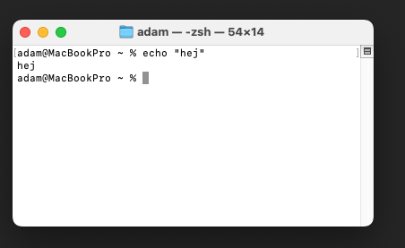
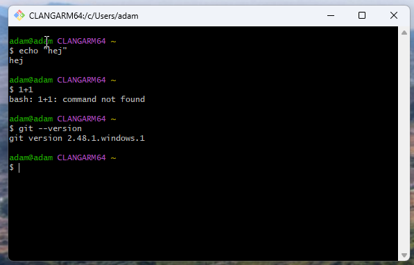
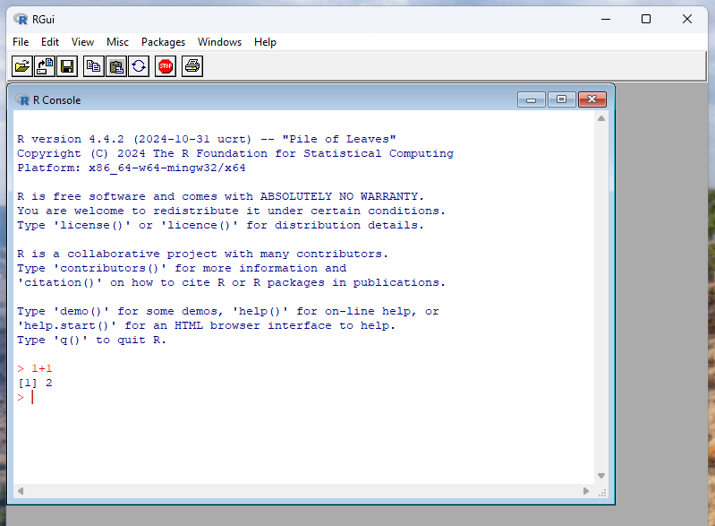
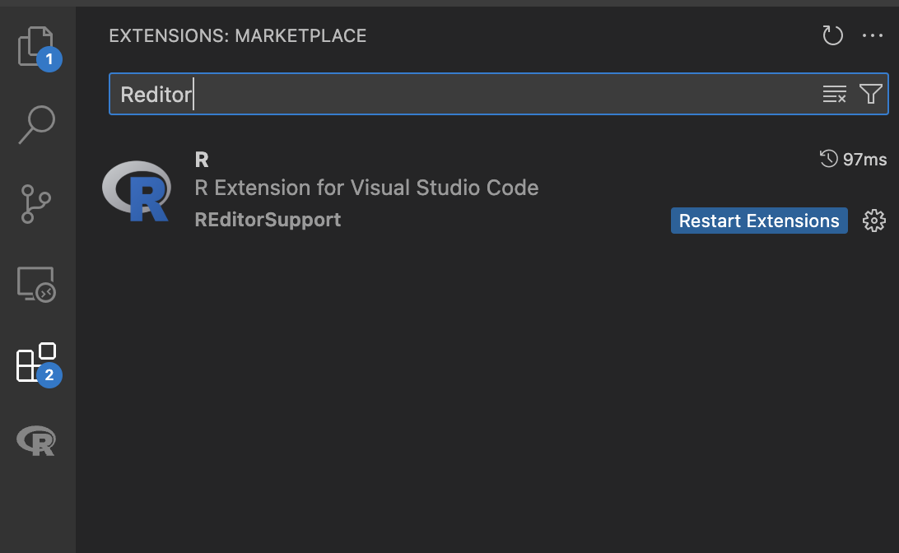
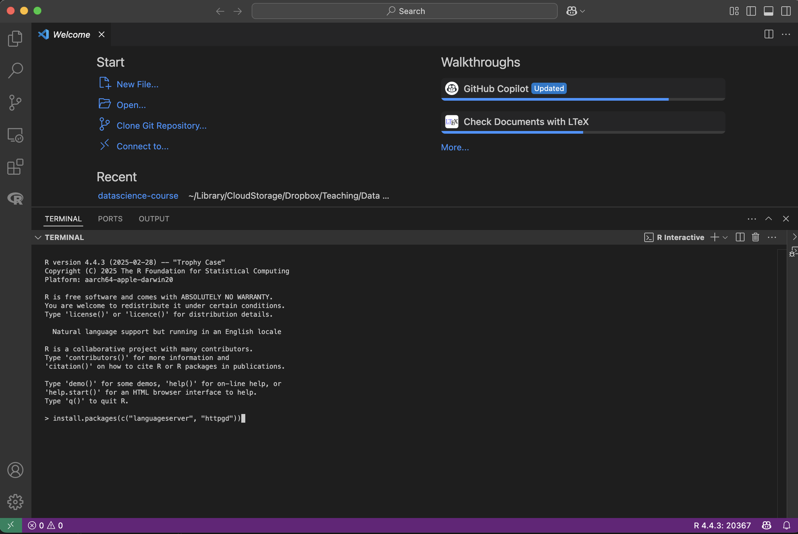

`PS0` is a required hand-in before lecture 2, but it is **not graded**.

The point is simple:

- get `R`, Git, and `VS Code` working on your own computer,
- make sure `VS Code` can actually talk to `R`,
- make sure you can receive a GitHub Classroom assignment, edit files, and push changes.

Note that your hand-in of PS0 happens in a GitHub Classroom repository. The invite link is on Athena.

Need help getting your setup working? There will be `PS0` office hours on **26/3, 14:00-15:00 on Zoom**.

## What you need to hand in

Your `PS0` GitHub Classroom repository should contain:

- a completed `answers.md`,
- a `setup_report.txt` file created by running `check_setup.R`,
- at least one commit pushed to GitHub after you edited the files.

The files `answers.md` and `check_setup.R` are already included in the starter repository. You just need to clone the repo, update the files, commit, and push.

## Completion checklist

Before lecture 2, you should have:

1. installed `R`, Git, and `VS Code`,
2. installed the `VS Code R` extension,
3. installed the `R` packages `languageserver` and `httpgd`,
4. created or fixed your GitHub account,
5. accepted the `PS0` GitHub Classroom assignment,
6. opened the assignment repo in `VS Code`,
7. ran `Rscript check_setup.R`,
8. edited `answers.md`,
9. committed and pushed your changes.

## How to read the commands in this handout

When you see a code block like this:

```bash
git status
```

you should type that command in a terminal.

On macOS, the built-in Terminal looks roughly like this:



On Windows, use **Git Bash** rather than PowerShell for these instructions unless you are comfortable translating commands. This is the Git Bash terminal:

{width=600px}

# Required software

## R

::: {.panel-tabset}

### Windows

Go to [CRAN](https://cran.r-project.org), click **Download R for Windows**, then install the latest base version of `R`.

You can open the basic `R` app once just to confirm that the installation worked.

{width=600px}

### macOS

**Homebrew (recommended)**

If you do not already have [Homebrew](https://brew.sh/), install it first. At the time of writing, that means running:

```bash
/bin/bash -c "$(curl -fsSL https://raw.githubusercontent.com/Homebrew/install/HEAD/install.sh)"
```

If the installer says `Password:` or asks for your password, type your normal computer login password and press Enter.

You will **not** see any characters appear while you type the password. That is normal.

```bash
brew install --cask r
```

**Manual install**

Download the latest macOS installer from [CRAN](https://cran.r-project.org).

### Linux

```bash
sudo apt update
sudo apt install r-base
```

:::

## VS Code

::: {.panel-tabset}

### Windows

Install `VS Code` from the [download page](https://code.visualstudio.com/download).

By default, `VS Code` may use PowerShell as the integrated terminal. I recommend switching that to **Git Bash**:

1. open the command palette with `Ctrl+Shift+P`,
2. search for `Terminal: Select Default Profile`,
3. choose `Git Bash`.

### macOS

**Homebrew (recommended)**

```bash
brew install --cask visual-studio-code
```

**Manual install**

Download `VS Code` from <https://code.visualstudio.com/download>.

### Linux

Follow the [official Linux instructions](https://code.visualstudio.com/docs/setup/linux#_install-vs-code-on-linux).

:::

## Git

::: {.panel-tabset}

### Windows

Install Git from [git-scm.com](https://git-scm.com/download/win). Use the default settings unless you know why you want something else.

After install, open **Git Bash** and run:

```bash
git --version
```

It should look roughly like this:

{width=600px}

### macOS

**Homebrew**

```bash
brew install git
```

**Alternative**

```bash
xcode-select --install
```

### Linux

```bash
sudo apt update
sudo apt install git
```

:::

After Git is installed, set your name and email in a terminal:

```bash
git config --global user.name "Your Name"
git config --global user.email "your.email@example.com"
```

Use the same email as on your GitHub account if possible.

# VS Code and R

## Install the VS Code R extension

Install the [VS Code R extension](https://marketplace.visualstudio.com/items?itemName=REditorSupport.r).

With `VS Code` open:

- open **Extensions**,
- search for `R`,
- install the extension from `REditorSupport`.

{width=600px}

## Install the required R packages

Open an `R` terminal in `VS Code` and run:

- open the command palette with `Ctrl/Cmd+Shift+P`,
- run `R: Create R Terminal`,
- then run:

```r
install.packages(c("languageserver", "httpgd"))
```

If `R` asks you to **select a CRAN mirror**, type `1` and press Enter to choose `0-Cloud [https]`, or choose another number for a nearby mirror.

On some computers the mirror-selection window opens **behind** `VS Code`, so if nothing seems to happen after you run `install.packages(...)`, check whether a small popup window is waiting for you in the background.

These two packages matter immediately:

- `languageserver` helps `R` talk to `VS Code`,
- `httpgd` lets `VS Code` display plots cleanly.

{width=600px}

# GitHub and GitHub Classroom

## Create or fix your GitHub account

If you do not already have a GitHub account, create one at <https://github.com/>.

[GitHub Education](https://github.com/education) is recommended because it gives you free access to some student benefits, including better access to Copilot, but it is not required for completing `PS0`.

## Accept the PS0 assignment

Use the GitHub Classroom link provided in class or on the course page.

Then:

1. sign in to GitHub if you are not already signed in,
2. if GitHub Classroom asks for permission to access your account, approve it,
3. click **Accept assignment**,
4. wait a few seconds while GitHub Classroom creates your personal `PS0` repository,
5. click the link to open that repository on GitHub.

That repository is your `PS0` hand-in repo.

## Open the assignment repo in VS Code

The simplest route is:

1. on the GitHub repository page, click the green **Code** button,
2. make sure **HTTPS** is selected,
3. copy the repository URL,
2. in `VS Code`, open the command palette with `Ctrl/Cmd+Shift+P`,
3. run `Git: Clone`,
4. paste the repository URL,
5. choose a local folder,
6. open the cloned repo in a new `VS Code` window.

If `VS Code` or Git asks you to sign in to GitHub during cloning, complete that login flow in your browser and then return to `VS Code`.

After cloning, the repository should contain at least:

- `answers.md`
- `check_setup.R`

If you are on Windows and want to see what the cloning flow looks like, here is a short screen recording:

<video controls playsinline width="800">
  <source src="win-cloning-ps0.mov" type="video/quicktime">
</video>

If you are completely stuck on cloning, downloading the ZIP is an acceptable short-term fallback for getting the files onto your computer, but you should still get Git working before lecture 2.

# Run the smoke test

Open a terminal in the root of your `PS0` assignment repo and run:

```bash
Rscript check_setup.R
```

If everything is working, the script should:

- print a short success message,
- create a file called `setup_report.txt`.

If it fails, read the error message. Usually the problem is one of:

- `R` is not installed correctly,
- Git is not on your `PATH`,
- `languageserver` or `httpgd` is missing,
- you are not running the command from the correct folder.

# Finish the hand-in

## Edit `answers.md`

Open `answers.md` in your `PS0` repo and fill in the requested fields.

Keep it short. This is just a setup check.

## Commit and push

From the root of your `PS0` repo, run:

```bash
git status
git add answers.md setup_report.txt
git commit -m "Complete PS0"
git push
```

If Git tells you that your name or email is missing, go back to the Git setup step and configure them.

# If something breaks

Do not spend three hours debugging in silence.

1. read the error message carefully,
2. try the official docs or installation page for the tool,
3. search the exact error message,
4. ask an `LLM` for help, if you can paste the exact error,
5. Look for guidance here: <https://happygitwithr.com/>

# Other useful tools to explore on your own (optional)

Nothing below is required for `PS0` or before lecture 2.

## SSH

SSH is short for "secure shell". It is a program used to connect to servers in a secure (encrypted) manner. SSH uses *public key cryptography* where a pair of keys is needed to communicate securely. One key in the pair is called the **private key**. This key should be kept secure and never shared with anyone. The second part is the **public key**. You share this part with the servers and services you want to communicate with. When connecting, SSH then uses the private key (stored on your computer only) to encrypt a message that can be verified with the public key. Even though the server does not have access to the private key, it knows that only the holder of that key can have sent the message.

### Generating a key pair

```bash
ssh-keygen -t ed25519 -C "your_email@example.com"
```

Press Enter to accept the default file location. When prompted, enter a passphrase/password (your terminal will not show characters as you type). I recommend you pick a 5-6 words long passphrase (for example from here <https://strongphrase.net/>) and to store it in a password manager (or write it down on paper).

SSH will place the keypair in two files, the public key gets the file ending `.pub`. If you do not change the default location, the files are places in a folder called `.ssh` in your home folder. On Mac that is `/Users/<username>/.ssh`, on Windows, Git Bash should have created a home folder for you with the path `C:\Users\<username>` and if you ran ssh from within Git Bash it should have created an .ssh folder at `C:\Users\<username>\.ssh`.

You now have everything you need to connect to servers and use GitHub over SSH. You will however have to enter the passphrase each time you use your key. To save the passphrase on your computer, so that you only need your computer password you can use SSH Agent.

### Connecting to GitHub over SSH

To use SSH with GitHub you first need to add your public key to your GitHub profile, under the ["SSH and GPG keys"](https://github.com/settings/keys) settings page. There, you should see a green button saying "New SSH Key". Click it, give your key a name (only relevant once you have many keys and want to remember which is which) then enter the public key into the text box under *Key*.

How do you access your newly created public key? If you did not change anything, the `ssh-keygen` command saved the public key inside a text file called `id_ed25519.pub` in a folder called `.ssh` located in your home folder. Because it starts with a `.`, the `.ssh` folder counts as a "system" folder and is hidden. Easiest way to access it is from a Shell Terminal. You can try the following shell command to automatically copy the key to your clipboard:

```bash
pbcopy < ~/.ssh/id_ed25519.pub
```

If it works, simply paste the key into the GitHub text box with Ctrl/Cmd+V. But some computers will not support `pbcopy`. An alternative is to open a terminal and run `explorer ~/.ssh` on Windows or `open ~/.ssh` on Mac to open the `.ssh` folder in Explorer/Finder. From there you can open the `id_ed25519.pub` file in VS Code and copy the key.

A third option is to run:

```bash
cat ~/.ssh/id_ed25519.pub
```

which will print the public key to your terminal for you to copy manually. Be careful though and make sure you copy the whole key and nothing but the key. The SSH key should look something like:

```
ssh-ed25519 AAAAC3NzaC1lZDI1NTE5AAAAINv0cIh+5va7jISfgq/cAAUJwo2OK5yTOvr4zx9CHfYp your_email@example.com
```

Finally, when you have added your key to your GitHub account and pressed save, you can test that everything works by running:

```bash
ssh -T git@github.com
> Hi adamaltmejd! You've successfully authenticated, but GitHub does not provide shell access.
```

That is what you see if everything works. If not, try to read the error message and debug. The [official documentation](https://docs.github.com/en/authentication/connecting-to-github-with-ssh/adding-a-new-ssh-key-to-your-github-account) could be helpful, or try Google. If it works, you can now clone repositories using SSH rather than `https`.

## Adding your SSH key to the SSH agent
The passphrase gives the key additional security and will be required each time you use the key, this might become a bit annoying after a while. You achieve both security and convenience by storing the passphrase in your computer's `ssh agent`. This way, you will just need your computer's admin password instead. With the help of the agent, you will only have to enter it when you set up a new computer. On Mac and Linux it is simple to get the SSH agent working, but the Windows instructions are a bit more complicated unfortunately.

::: {.panel-tabset}

### Windows

Each time you start a new Git Bash session you need to make sure that the ssh-agent is running, or else it will not be available. One way to autorun ssh-agent when Git Bash starts is to use a startup script. This is what [GitHub recommends](https://docs.github.com/en/authentication/connecting-to-github-with-ssh/working-with-ssh-key-passphrases#auto-launching-ssh-agent-on-git-for-windows). You need to edit a file called `.profile` that is located in your home directory. Each time you start a new Bash shell, bash will run this file. The easiest way to create the file is to open it in VS Code from the terminal. Open a new Git Bash window and type `code .profile` to open the file `.profile` in VS Code (and create it if it did not already exist). You will most likely see an empty file. Add the following code to the file and save:

```bash
env=~/.ssh/agent.env

agent_load_env () { test -f "$env" && . "$env" >| /dev/null ; }

agent_start () {
    (umask 077; ssh-agent >| "$env")
    . "$env" >| /dev/null ; }

agent_load_env

# agent_run_state: 0=agent running w/ key; 1=agent w/o key; 2=agent not running
agent_run_state=$(ssh-add -l >| /dev/null 2>&1; echo $?)

if [ ! "$SSH_AUTH_SOCK" ] || [ $agent_run_state = 2 ]; then
    agent_start
    ssh-add
elif [ "$SSH_AUTH_SOCK" ] && [ $agent_run_state = 1 ]; then
    ssh-add
fi

unset env
```

Now, open a new Git Bash terminal and if everything works you should not get any errors or warning messages. Then, run `ssh-add -l` to check if your keys are loaded. If the agent had not started, you will get an error.

### MacOS / Linux

```bash
eval "$(ssh-agent -s)"
ssh-add ~/.ssh/id_ed25519
```

:::

You can verify that the agent has access to your key by running `ssh-add -l` (`-l` for list). If you need more help, GitHub has a nice guide for how to [generate an SSH keypair](https://docs.github.com/en/authentication/connecting-to-github-with-ssh/generating-a-new-ssh-key-and-adding-it-to-the-ssh-agent).

## Programming Language interpreters (and Stata)

This section covers installing R, Python, and Julia. Throughout the course, we will focus on R because it currently has the best (in my humble opinion) data science toolkit, though Python and Julia are close behind.

One goal of this course is to help you view programming languages (and statistical software like Stata) as tools, each with different strengths. By the end, you will hopefully feel a bit more comfortable switching between languages—or even learning new ones—when the situation calls for it. You will be able to do everything we do in class in R, but I have provided instructions for Python and Julia too if you would like to experiment with those languages on your own.

### Python

::: {.panel-tabset}

#### Windows

Python can be installed from the [Microsoft Store](https://apps.microsoft.com/detail/9nrwmjp3717k?hl=en-US&gl=US). After installation, verify it by opening Powershell and running `python`.

#### macOS

**Homebrew (recommended)**

```bash
brew install python
```

**Manual install**

Download the latest Python 3.x installer from [Python's official site](https://www.python.org/downloads/macos/). Run the `.pkg` installer and follow the prompts.

#### Linux

```bash
sudo apt update
sudo apt install python3 python3-pip
```

:::

### Julia

Julia is an up-and-coming scientific programming language with very promising functionality. It employs several modern programming paradigms and recently passed the 1.0 milestone so it should be more stable to use nowadays. Still not that commonly used in Economics, though I think it's growing in popularity quite fast among macroeconomists, and will for sure replace Matlab sooner or later. This book is a great resource for learning how to do macro in Julia: <https://julia.quantecon.org/intro.html>.

::: {.panel-tabset}

#### Windows

Julia can be installed from the [Microsoft Store](https://www.microsoft.com/store/apps/9NJNWW8PVKMN). You can launch a Julia interpreter by running `julia` in Powershell or by starting the app.

#### macOS

**Homebrew (recommended)**

```bash
brew install julia
```

**Manual install**

As described on [julialang.org](https://julialang.org/downloads/), run:
```bash
curl -fsSL https://install.julialang.org | sh
```

#### Linux

As described on [julialang.org](https://julialang.org/downloads/), run:
```bash
curl -fsSL https://install.julialang.org | sh
```

:::

### Stata

Stata is proprietary software, but still often used by Economists. You probably know some Stata from your previous courses and may be more comfortable continuing to use it for tasks it does well (such as estimation and inference). In that case you probably already have Stata installed. If you have never used Stata, I would not recommend starting now, but if you wish to do so, you can find the install instructions on the [Stockholm University website](https://www.su.se/utbildning/it-f%C3%B6r-studenter/licenser-och-program/stata-se-1.445814?open-collapse-boxes=collapseCollapsible1730983659344_861617).

## Alternative IDEs

### RStudio

RStudio is the most commonly used editor for working in R. It is great for R in particular and also data science in general, but it lacks many features and extendability when compared to VS Code. However, you might still prefer it for its easy of use with R especially.

::: {.panel-tabset}

#### Windows

**RStudio:** Download and install RStudio from the [official download page](https://posit.co/download/rstudio-desktop/). Accept the default settings during install.

#### macOS

**Homebrew (recommended)**

```bash
brew install --cask rstudio
```

**Manual install**

Download [RStudio Desktop for macOS](https://posit.co/download/rstudio-desktop/) and install by opening the `.dmg` file and dragging **RStudio** into your Applications folder.

#### Linux

Download the `.deb` package from [RStudio's download page](https://posit.co/download/rstudio-desktop/) and run:
```bash
sudo apt install ./rstudio-*.deb
```

:::

### Positron

Positron might be the perfect combination of VS Code and R. It is actually built upon the open-source parts of VS Code but tailored specifically to R users. If you want to try it you need to download and install it from [Posit's website](https://positron.posit.co/).
